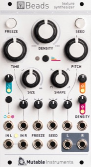

[TOC]

## Key data

*Texture synthesizer*

Parameter    | Value
-------------|------
Width        | 14HP
Depth        | 25mm
+12V current | 100mA
-12V current | 10mA
Lifetime     | 02/21 to 12/22
Modulargrid  | [Link](https://www.modulargrid.net/e/mutable-instruments-beads)
Processor    | STM32H743VIT6
Codec        | PCM3060

## Original printed manual

[PDF download](downloads/beads_quickstart.pdf)

## Features

### Audio acquisition

* Stereo I/O with automatic level detection.
* Manual override of the level detection.
* Automatic mono/stereo switching through patch cable detection.
* Recording time: 4s (48kHz 16-bit, stereo) to 32s (24kHz µ-law, mono).
* Four quality modes, with different tone and reverb characters:
 - 48kHz 16-bit
 - 32kHz 12-bit with Clouds emulation
 - 24kHz 12-bit with a hi-fi dry signal path
 - 24kHz µ-law with cassette emulation
* The **FREEZE** button and the gate input freezes the content of the recording buffer, allowing you to dive into its sonic details.
* Auto-saving of the **FREEZE** buffer.

### Granular synthesis

Three grain generation modes:

* **Latched** (continuous), with a periodic or randomized rate, tracking V/O.
* **Gated**, with bursts of grains triggered by the press of the **SEED** button or an external gate.
* **Clocked**, with randomization or division of an external clock or trigger signal.

Four grain parameters:

* **TIME**. Temporal position within the buffer.
* **SIZE**. Grain duration from 0.03 to 4 seconds, forward or backward playback.
* **SHAPE**. Morphing between four key shapes of the grain envelope: solid rectangular, snappy decay, smooth bell, or reversed.
* **PITCH**. With V/O tracking.
 
### Attenurandomizers

Available for each of the four parameters of a grain, sampled each time a grain is started:

* Direct CV control.
* CV control of the amount of gaussian randomization.
* Internal randomization with an independent, uniform or peaky, random source.

### Delay

* Control of both the base delay clock rate (**DENSITY**), and its multiplication (**TIME**), with optional random taps.
* Tap tempo with the **SEED** button or an external signal.
* Enveloping of delay repeats, with the **SHAPE** setting.
* Pitch shifting of the delayed signal, controlled by **PITCH**.

### Signal flow

* Feedback path delay: 1 sample.
* Independent knobs for feedback, dry/wet amount, and reverb amount.
* CV input assignable to each of these three parameters, or to variable combinations of them.
* When unpatched, the R output is summed to the L output.
* Optional generation of a gate signal on the R output.

### Specifications

* All inputs: 100k impedance.
* Audio codec: 24kHz, 32kHz or 48kHz, 24-bit.
* 16-bit CV capture.
* Processing rate: audio-rate for the **SEED** and **FREEZE** inputs, 4kHz for the CV inputs.
* Latency: 0.25ms.
* CV input range: +/- 8V for grain parameters, +/- 5V for density (with V/O tracking) and assignable CV.
* Internal processing: 32-bit floating point.
