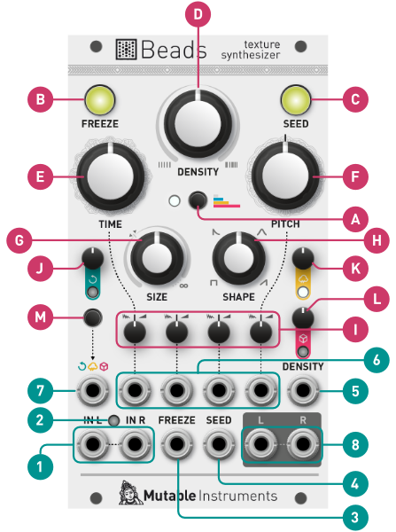
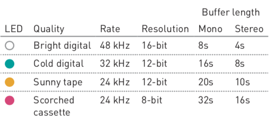
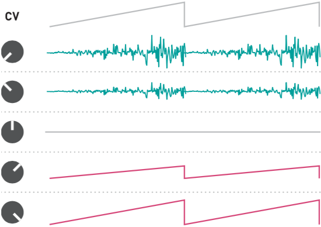
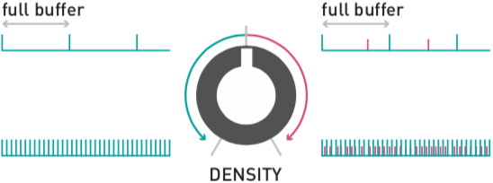
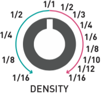
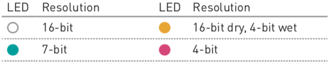

> ## Oops!
> 
> In an older printed version of this manual, in the *Patch ideas* section, the > **TIME** parameter is incorrectly referred to as **POSITION**.

## Installation

Beads requires a **-12V/+12V** power supply (2x5 pin connector). The red stripe of the ribbon cable (-12V side) must be oriented on the same side as the “Red stripe” marking on the module and on your power distribution board.
The module draws **100mA** from the +12V rail, and **10mA** from the -12V rail.

* * *

## Beads in a nutshell

One way of picturing how Beads operates is to imagine a tape loop, on which incoming audio is continuously recorded.

Every time you request a grain to be played (in reaction to a trigger, a button press, periodically, or randomly), **a new replay head positions itself along the tape**.

If this replay head doesn’t move, the audio will be played back at the original pitch and speed, but if it moves closer to, or further away from the record head, the signal will be replayed at a different speed and pitch. This replay head has its **own amplitude envelope**, and it will leave the tape once the envelope has reached a null amplitude.

Now imagine up to **30 replay heads** flying along the tape. Imagine you can stop the incoming audio from being record- ed on the tape so that all these little replay heads can freely move along and gather sounds. And there’s a **reverb**...

> Beads does not use tape, but RAM. In this manual we use computer-science terminology and refer to this virtual piece of tape as a **recording buffer**.

* * *

## Recording quality and audio input

Recording quality is chosen with the selector button **[A]**.

* The **Cold digital** setting most accurately reproduces the sonic character of the late Mutable Instruments Clouds.
* The **Sunny tape** setting runs the dry audio signal at a bright and clean 48kHz.
* The **Scorched cassette** setting emulates wow and flutter.

Beads operates in **mono or stereo** depending on whether one, or both, of the audio inputs **(1)** are patched.

When patch cables are inserted or removed, Beads monitors for five seconds the level of the incoming signal and **adjusts the input gain** accordingly, from +0dB to +32dB. The input level LED **(2)** blinks during this adjustment process. The input gain is **chosen to leave some** headroom, but in case of big level changes, a limiter kicks in.

One can manually restart the gain adjustment process by pressing and holding the audio quality selector button **[A]** for one second. Holding this button **[A]** while turning the feedback knob **[J]** allows manual gain adjustments.
The manually-set gain is memorized and applied until a long press on **[A]** re-enables automatic gain control.

The **FREEZE** latching button **[B]** and the corresponding gate input **(3)** disable the recording of the incoming audio signal in the buffer. Otherwise, **Beads** records continuously!

If **FREEZE** remains engaged for more than 10 seconds, the content of the buffer is backed up, and will be restored the next time the module is powered on.

Beads will not switch between stereo and mono operation, or change the recording quality, while **FREEZE** is engaged.

* * *

## Grain generation

### Latched

Latched grain generation is enabled by holding the **SEED** button **[C]** for four seconds, or by pressing the **FREEZE** button **[B]** while the **SEED** button **[C]** is being held. This is also the default setting when the module is powered on.

The **SEED** button remains illuminated, and its brightness is slowly modulated to indicate that latching is enabled.

In this mode, the grains are generated continuously, at a rate set by the **DENSITY** knob **[D]** and modulated by the **DENSITY** CV input **(5)**.

At 12 o’clock, no grains are generated. Turn **DENSITY** CW and grains will be generated at a **randomly modulated rate**, or CCW for a **constant generation rate**. The further you turn, the shorter the interval between grains, reaching at the extreme the period of a C3 note.

### Clocked

When latched grain generation is enabled, and when a signal, such as a clock or sequence, is patched into the **SEED** input **(4)**, the **DENSITY** knob **[D]** is repurposed as a divider or probability control. At 12 o’clock, no grains are generated. Turn CW to increase the probability (from 0% to 100%) that a grain is triggered by the external signal. Turn CCW to increase the division ratio, from 1/16 to 1.

### Gated and triggered

Disable latched grain generation with a short press on the **SEED** button **[C]**.

Grains will then be generated only when the **SEED** button is held, or when a gate signal patched in the **SEED** input **(4)** is high. The **DENSITY** knob **[D]** controls the repetition rate of grains. When **DENSITY** is at 12 o’clock, only a single grain will be played at each press of the **SEED** button, or at each trigger sent in the **SEED** input **(4)**.

> When grain density reaches audio rates, the **DENSITY** CV input **(5)** applies exponential FM on this rate, with a scale of 1V/octave

## Grain playback control

Four parameters control **at which buffer position, pitch, and with which duration and envelope** the grains are replayed.

More precisely, these parameters and their respective modulations are read **once, whenever a grain starts**, and remain unchanged throughout the duration of the grain. If a parameter then changes, it will only impact the next grain.

For example, turning the **PITCH** knob will create a trail of grains with different pitches, rather than change, in lock-step, the pitch of all the grains that are currently playing.

**E. TIME** controls if the grain replays the most recent (fully CCW) or oldest (fully CW) audio material from the recording buffer – shifting the replay heads further apart from the record head.

**F. PITCH** controls the transposition, from -24 to +24 semi- tones, with virtual notches at selected intervals.

**G. SIZE** controls the duration and playback direction of the grain. At the 11 o’clock position, a very short (30ms) grain is played. Turn CW to increase grain duration up to 4s. Turn CCW to play a reversed grain, lasting up to 4s.

Turning **SIZE** fully clockwise (∞) generates never-ending grains acting as delay taps. Please refer to the **Beads as a delay** section.

**H. SHAPE** adjusts the amplitude envelope of the grain. Fully CCW creates clicky, rectangular envelopes, while fully CW provides envelopes with slow attacks reminiscent of reversed grains (Please note, however, that the envelope shape is independent of the playback direction).

**I. Attenurandomizers** for the **TIME, SIZE, SHAPE** and **PITCH** parameters. They control the amount of external CV modu- lation on the corresponding parameters, or repurpose the CV input **(6)** as a randomization or *spread* control.

## Attenurandomizers

When a cable is patched into the corresponding CV input
**(6)**, turning the attenurandomizer **[I]** CW from 12 o’clock **increases the amount of external CV modulation**. Turning it CCW increases the **amount of CV-controlled randomization**.

With no CV patched into an input, the attenurandomizer controls the amount of randomization from an **independent internal random source** with a peaky (12 o’clock to fully CCW) or uniform (12 o’clock to fully CW) distribution. The random values from the peaky distribution are clustered towards the middle, with extreme values being infrequently generated.

## Patch ideas

* Patch a ramp-down LFO, or a decaying linear envelope into the **TIME** CV input for "scrubbing" the buffer, or a segment of it, at whichever speed the LFO rate or envelope time is set to. Timestretching time!
* The **PITCH** CV input tracks V/O when the attenurandomizer is turned fully CW: one can sequence a melody of grains or even play them from a keyboard.
* Patch a fast arpeggiated sequence into the **PITCH** CV input to create chords: each grain will be played at a randomly chosen note of the arpeggio.
* Sequence slices of sound (or phonemes from a recording of speech) by patching the CV output of a sequencer into **TIME**, and its gate output into **SEED**.

* * *

## Mixing and audio output

**J. Feedback**, that is to say the amount of output signal mixed with the input signal and fed back into the processing chain. Each quality setting employs a different feedback amplitude limiting scheme typical of the medium it emulates – from clean brickwall-limiting to grungy tape saturation.

**K. Dry/wet** balance.

**L.** Amount of **reverb**. Modeled on the acoustics of Thoreau’s cabin, or of a strip-mall spa.

The LED under each of these knobs indicates the amount of
modulation they receive from the assignable CV input **(7)**.

Press the button **[M]** to select to which of these 3 destinations the CV input **(7)** is assigned. Or hold this button and turn the knobs **[J]**, **[K]** and **[L]** to individually adjust the amount of CV modulation.

**8. Audio output.** While the recording buffer can be mono or stereo, Beads’ signal processing chain is always stereo. If the R output is left unpatched, both L and R signals are summed together and sent to the L output.

> If one of the grains’ parameters is randomized, or if the grains are generated at a random rate, their pan position will also be randomized.

Hold the button **[M]** and press the **SEED** button **[C]** to enable (or disable) the generation of a grain trigger signal on the R output. A patch cable will have to be inserted in the R output for this to work without affecting the L output!

* * *

## Beads as a delay

Setting the grain **SIZE [G]** knob fully clockwise (∞) **turns Beads into a delay or beat slicer**. Effectively, only one grain remains active, forever, continuously reading from the tape.

The base delay time (and slice duration) can be manually controlled, tapped, or set by an external clock.

### Manual control

If the SEED input **(4)** is left unpatched, and if the **SEED** button **[C]** is latched (slowly fading in and out), the delay time is freely controlled by the **DENSITY** knob **[D]** and CV input **(5)**.

At 12 o’clock, the base delay time corresponds to the **full buffer duration**. Turn the knob further away to shorten the delay time up to **audio rates**, for flanger or comb-filtering effects. From 12 o’clock to fully CW, the delay will have an additional, unevenly spaced, tap.

### Clocked or tap-tempo control

If an external clock is patched into the **SEED** input **(4)**, or if you rhythmically tap the **SEED** button, the base delay time will be set as the interval between the taps or clock ticks.

The **DENSITY** knob **[D]** selects a subdivision of this duration. Turn the knob further away from 12 o’clock to use shorter subdivisions. From 12 o’clock to fully CCW, only **binary subdivisions** will be used. From 12 o’clock to fully CW, a wider variety of ratios are available.

### Delaying or slicing

When **FREEZE [B]** is not engaged, Beads **operates** as a delay. The **TIME** knob **[E]** selects the actual delay time, as a multiple of the base delay time set by **DENSITY** and/or by the external clock or taps.

When **FREEZE [B]** is engaged, a slice from the recording buffer is continuously looped. The duration of a slice is equal to the base delay time. The **TIME** knob **[E]** selects which slice is played.

The **SHAPE** knob **[H]** applies a tempo-synchronized envelope on the repeats. For normal operation, turn it fully CCW.

**PITCH [F]** applies a classic rotary-head pitch-shifting effect on the delayed signal. At 12 o’clock, the pitch-shifter is bypassed.

**Slow random LFOs** are internally routed to the attenurandomizers **[I]**.

* * *

## Beads as a granular wavetable synth

When both audio inputs **(1)** are left unpatched, and at the end of a period of ten seconds, **Beads** loses patience and granularizes a collection of internally stored **buffers of raw waveforms** from Mutable Instruments **Plaits’** wavetable model.

The **feedback** control **[J]** selects which one of these 8 banks of waveforms is played.

The **dry/wet** control **[K]** adjusts the balance between the continuous oscillator signal, and the granularized signal.

The **FREEZE** button **[B]** halts the envelope of the grains, and stops the generation of new grains.

The **audio quality** selector **[A]** selects the output resolution.

Finally, the **PITCH** CV input always acts as a 1 V/octave CV input affecting the root note of the grains, irrespectively of the position of the **PITCH** attenurandomizer.

The **PITCH** attenurandomizer always controls the amount of pitch randomization of the grains.

* * *

## Common issues

### Loud pops/clicks

Only on one channel? Reacting to changes on the **DENSITY** knob or to presses on **SEED**? Read that section again:

> Hold the button **[M]** and press the **SEED** button **[C]** to enable (or disable) the generation of a grain trigger signal on the R output. A patch cable will have to be inserted in the R output for this to work without affecting the L output!

### Background hiss/noise

You might experience high background noise in the following situations:
* The patch cable connected to Beads' input is not connected to any module on the other end.
* The sound source connected to Beads is muted, or is sending notes intermittently, with a long gap between them (typically, several seconds).

In both cases, Beads' automatic gain control circuit is hard at work pushing the gain in order to recover a signal from the silence, effectively amplifying faint background noise. In these situations, it is recommended to disable automatic gain control:

> Holding this button **[A]** while turning the feedback knob **[J]** allows manual gain adjustments. The manually-set gain is memorized and applied until a long press on **[A]** re-enables automatic gain control.

### Feedback does not appear to work

You might not hear feedback because:

* **TIME** is high, so it takes a long time for the feedback to build up.
* **TIME** is randomized, so the grains are randomly taken from a segment of the buffer not affected yet by feedback.
* The grains are too sparse, so what is fed back is not a continuous stream of sound.
* The interplay of the different settings causes the output signal to have a low amplitude, requiring a high amount of feedback.
* The attenurandomizers are set to extreme values and the material generated by the module is already too chaotic and messy to yield any effect.

To check that the feedback knob is working as intended, try these settings:

* **DRY/WET** fully clockwise, **SIZE** at 12 o'clock and **DENSITY** at 9 o'clock (so the grains are overlapping, heard and produce a continuous sound).
* **SHAPE** at 2 o'clock (to get a smooth grain envelope).
* **TIME** fully CCW (so the feedback doesn't take a lot of time to build-up).
* **PITCH** at 11 or 1 o'clock.
* Attenurandomizers at 12 o'clock.

Each grain will be pitch-shifted and then fed-back, creating a kind of very inharmonic chord.

The feedback is also very noticeable when **SIZE** is fully CW (delay mode).

* * *

## Advanced topics

###  Firmware update procedure

**If you think your module is behaving strangely, updating the firmware is certainly not the right thing to do.**

Unplug all CV inputs/outputs from the module. Connect the output of your audio interface/sound card to the **IN L** input **(1)**. Set the **TIME** knob **[E]** to an intermediate position. Power on your modular system with the **FREEZE** illuminated push-button **(B)** pressed.

Make sure that no additional sound (such as email notification sounds, background music etc.) from your computer will be played during the procedure. Make sure that your speakers/monitors are not connected to your audio interface - the noises emitted during the procedure are aggressive and can harm your hearing. On non-studio audio equipment (for example the line output from a desktop computer), you might have to turn up the gain to the maximum.

When you are all set, play the firmware update file into the module. While the module receives data, the recording quality LED **[A]** will act as vu-meter (lit in yellow when the signal level is optimal). Try adjusting the **TIME** knob to adjust gain. When the end of the audio file is reached, the module automatically restarts - if it is not the case, please retry the procedure from the beginning.

In case the signal level is inadequate, all LEDs will blink in red. Press the button **[B]** and retry with a higher gain. If this does not help, please retry the procedure from another computer/audio interface, and make sure that no piece of equipment or software effect (equalizer, automatic gain control, FX processor) is inserted in the signal chain.
