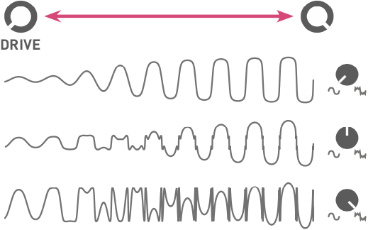

##  Installation

Blades requires a **-12V/+12V** power supply (2x5 pin connector). The red stripe of the ribbon cable (-12V side) must be oriented on the same side as the "Red stripe" marking on the board. The module draws **150mA** from the **-12V** rail and **140mA** from the **+12V** rail.

## Controls

The same set of controls is provided for both filters.

**A. Cutoff frequency**, from 8 Hz to 18 kHz.

**B. Resonance.** Goes up to self-oscillation.

**C.** Amount of **gain** and **distortion** or **wavefolding** applied to the input signal. A gain of 0dB is achieved with the knob at 11 o’clock. This knob also acts as an offset control for the **DRIVE** CV input **(3)**.

**D. Response of the drive circuit**, continuously variable between round soft-clipping, and a two-stage wavefolder.

**E. Filter input level** indicator LED.

**F. Filter response.** Continuously variable between low-pass, band-pass, and high-pass. When the filter is self-oscillating, with no input signal, this adjusts the phase of the sine-wave produced by the filter.

**G. Filter routing.** This knob controls the signal routing (single, parallel or series) between the two filters.

**H. Attenuverters** for the two filters’ frequency and resonance CV inputs, and for the **ROUTING** CV input.

**I. Filter cutoff coupling.** When this button is pressed and illuminated, filter 2’s cutoff frequency is set relatively to filter 1’s cutoff frequency. For example, when filter 2’s **FREQUENCY** knob is at 12 o’clock, both filters share the same cutoff frequency. With the knob past (or before) 12 o’clock, filter 2’s cutoff frequency will follow filter 1’s, but transposed up (or down).

## Inputs and Outputs

**1. CV inputs** for filter mode, cutoff frequency, resonance and filter routing.

**2. V/OCT input**. Controls the cutoff frequency according to the 1 V/octave scale.

**3. Drive CV input.** If no patch cable is inserted in this input, a 2V voltage is applied to the drive circuit. This is why a moderate, but non-null, gain is obtained when the DRIVE knob [C] is fully turned counter-clockwise.

**4. DC-coupled signal input.**

**5. Individual filter output.**

**6. Main output.** Carries a blend of filter 1 and filter 2’s outputs, depending on the **ROUTING** knob and CV.

## Controlling the signal path

The **ROUTING** knob **[G]** acts as a dual crossfader.

Firstly, it controls which proportion of filter 1 and filter 2’s output is sent to the **MAIN** output **(6)**: only filter 1 when turned fully CCW, only filter 2 when turned fully CW, and a mix of both filters at 12 o’clock.

Secondly, it also controls which proportion of filter 1’s input and filter 1’s output is sent to filter 2’s input (provided filter 2’s **IN** is left unpatched). As a result, the following filter configurations can be obtained:

* Single: the **MAIN** output carries the output of filter 1.
* Parallel: the **MAIN** output carries a mix of filter 1 and filter 2’s outputs, and both filters process the same signal from filter 1’s input.
* Series: the **MAIN** output carries the output of filter 2, which processes filter 1’s output.

If you patch your own signal source into filter 2’s input, then the **ROUTING** control simply acts as a crossfader between filter 1 and 2’s outputs.

## Tips and patch ideas

* Patch filter 2’s output into filter 1’s **FREQUENCY** CV input and vice-versa for some chaotic effects.

* Use filter 1 in self-oscillation as an oscillator (possibly with feedback from its own output to its **FREQUENCY** input to bend its waveform). Use filter 2 to wavefold and filter this raw waveform.

* When a filter self-oscillates, and thus behaves as a sine oscillator, its phase can be modulated through the **MODE** CV input. This allows the synthesis of metallic tones reminiscent of FM. Try modulating **MODE** through a VCA, for CV-controlled adjustment of phase-modulation depth.

* With the two filters in series, both set to a low-pass response, the module can be used as a voltage-con- trolled distortion with pre- and post- tone controls.

* Set filter 1 to a mild **DRIVE**, low **FREQUENCY** and **RESO**, and choose the high-pass response. The **ROUTING** knob now acts as a dry/wet control, for whatever function filter 2 performs.

* The intermediate responses between LP and BP, or BP and HP, have a shelving shape. This can turn **Blades** into a useful tool for EQ-ing and spectrally coloring signals.

* Since **Blades**’ signal path is DC-coupled you can also use it to process CV signals: use **FREQUENCY** for portamento, **RESO** to add overshoot and wiggles. **DRIVE** lets you control the signal amplitude or even its shape.
