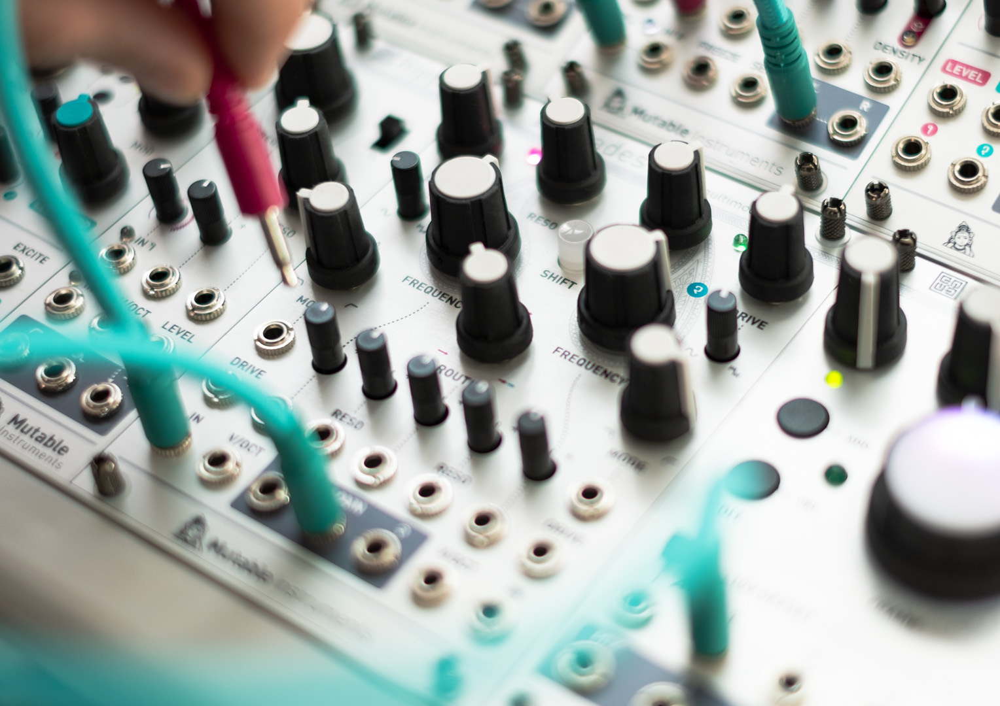

## A dual multimode filter...

A CV-controlled **overdrive circuit** capable of wavefolding.

A clean **12dB/octave multimode filter** self-oscillating cleanly across the audio range.

Times two. And this could have stopped here.

## For all the in-betweens...

What sets Blades apart is that options commonly presented as multiple choices (low-pass or high-pass? serial or parallel?) are presented here **as a continuum**, ready to be explored at the twist of a knob or with a CV.

The filter response is continuously variable between low-pass, band-pass and high-pass, and delivers intermediate shelving responses, for more nuanced spectral coloring.

A dual crossfader circuit allows the routing between the two filters to smoothly vary from **single** to **parallel** to **series**.

## And more...

Originally thought as a complex filter, Blades turns out to be capable of much more:

* A **dual distortion** with spectral color control?
* An **oscillator mixer** with crossfading, wavefolding, and enough filtering to clean up the mess?
* A **voice**, using one filter as an oscillator, then distorting, folding it and filtering it with the second filter?
* A **complex oscillator** capable of FM, PM and AM?

