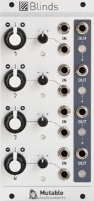

[TOC]

## Key data

*Quad VC-Polarizer*

Parameter    | Value
-------------|------
Width        | 12HP
Depth        | 25mm
+12V current | 70mA
-12V current | 70mA
Lifetime     | 06/16 to 04/22
Modulargrid  | [Link](https://www.modulargrid.net/e/mutable-instruments-blinds)

## Original printed manual

[PDF download](downloads/blinds_quickstart.pdf)

## Features

### A hub for your modulations

* Scale, invert and offset up to four modulation signals.
* Mix up to four CVs or audio sources.
* Multiply (ring-modulate) two audio sources, with adjustable carrier rejection.
* "who can do more can do less": each channel can be used as a plain VCA.

### Specifications

* All inputs DC-coupled.
* All inputs handle audio-rate signals.
* Input impedance: 100k for all inputs.
* CV offset range: +/- 5V.
* Gain scale: linear, a +5V CV translates to a gain of 1.
* Gain range: +/- 2.

## Revisions and variants

### 2021

Hardware revision (identified as *2021. v6*) with minor manufacturability improvements, such as dimensions of PCB pads and holes.
