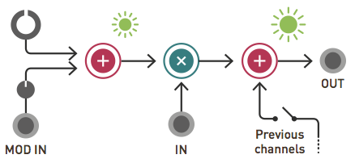
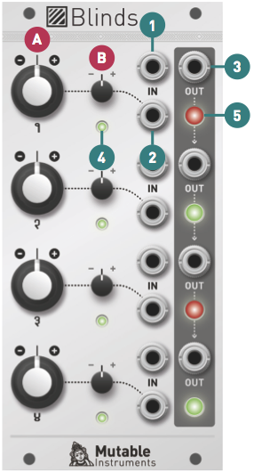

## Installation

Blinds requires a **-12V/+12V** power supply (2x5 pin connector). The red stripe of the ribbon cable (-12V side) must be oriented on the same side as the "Red stripe" marking on the board. The module draws 70mA from the -12V rail and 70mA from the +12V rail.

Current consumption can reach 90mA on either rail depending on the color and brightness of the LEDs.

## Overview and signal flow

Blinds is a 4-channel voltage-controlled signal polarizer. Each channel consists of a polarizer circuit, also known as a four-quadrant multiplier. This circuit acts like a VCA, except that a negative control voltage will cause the output signal to be inverted, instead of being silenced. Blinds' outputs are daisy-chained, allowing adjacent groups of 2, 3, or all 4 channels, to be mixed together.

## Controls, inputs and outputs

**A. Channel polarity and gain.** At 12 o'clock, the channel is muted. Turn clockwise to amplify, turn counter-clock- wise to amplify and invert.

**B. Modulation attenuverter.** Adjusts the amount and polarity of modulation from the modulation input (2), i.e. how much, and in which direction, the channel polarity and gain will wiggle around the central value set by A.

**1. Signal input.** Blinds' inputs are DC-coupled and accept both audio and CV signals. This input receives +5V when no patch cable is inserted.

**2. Modulation input.** This input is also DC-coupled. When audio-rate signals are present on both the signal and modulation input, Blinds works as a pure ring-modulator.

**3. Signal output.** When no patch cable is plugged into an output, the signal from this channel is routed to the next channel. For example, when no patch cable is patched into output 1, output 2 will contain the sum of channel 2 and channel 1. If nothing is patched into outputs 1, 2 and 3, then output 4 will contain the sum of all four channels.

**4. Gain and polarity indicator.** The color corresponds to the polarity (green = positive, red = negative), the bright- ness to the gain.

**5. Output level and polarity indicator.**

## Random bits

### Output equation

The following equation describes the operation performed by each channel:

Where **Vout** is the output voltage, **Vin** the input voltage, **Vmod** the control voltage, **BigKnob** and **SmallKnob** the position of the big and small knobs, represented as a number between -1 and 1 (0 being the 12 o'clock position).

Because **Vin** is normalized to +5V, when nothing is patched into **Vin**, this equation becomes:

In this case, the big knob controls an offset between -5V and +5V, and the small knob a gain between -1 and +1. In other word, each channel of Blinds can be used as an attenuverter with offset control circuit.

### Use as a ring modulator

A ring modulator is an imperfect four-quadrant multiplier realized with a diode ring circuit. Because it is based on a bipolar VCA circuit, Blinds realizes a purer sounding version of ring-modulation, very close to the mathematical ideal of signal multiplication. Don't worry though, the familiar sounds of bells, american metaphysical circuses and Daleks are still there!

When Blinds is used as a ring modulator, with audio rate signals going in both inputs, the big knob controls a very interesting parameter: carrier rejection (how much of the unmodulated signal will "bleed" on top of the ring-modulated signal).

### Zeroing a channel

Because of mechanical backlash in the construction of the potentiometer, the vertical mark on the panel might not be perfectly aligned with the white pointer of the knob when a channel has zero offset. In addition, some envelope generators or LFO might have a residual "bleed" voltage - they sometimes sit a few mV below 0 after their release. Trust your ears and the LEDs when zeroing a channel!
