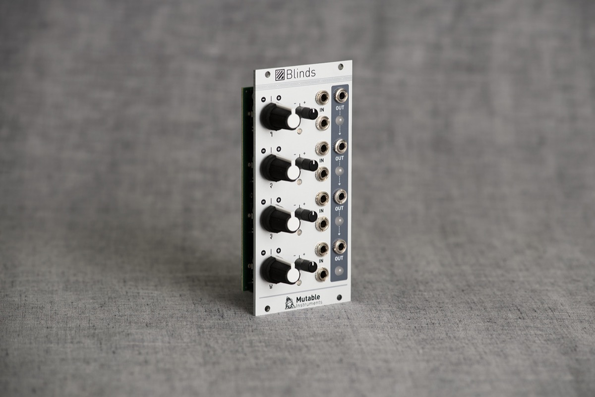
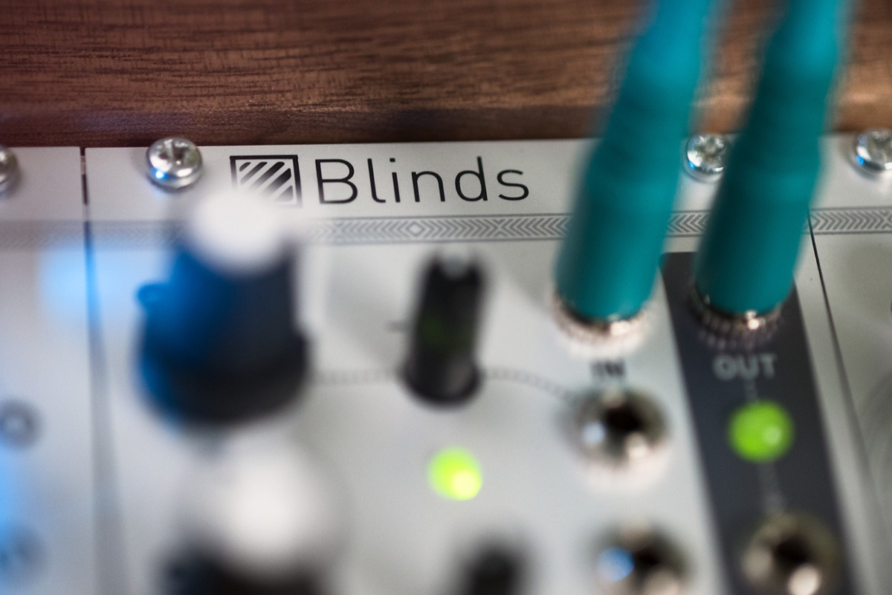

## Remote-controlled Shades

Blinds is a 4-channel voltage-controlled signal polarizer.

Each channel consists of a **polarizer circuit**, also known as a four-quadrant multiplier. This circuit acts like a VCA, except that a negative control voltage will cause the output signal to be inverted, instead of being silenced.

Blinds' outputs are **daisy-chained**, allowing adjacent groups of 2, 3, or all 4 channels, to be mixed together.

