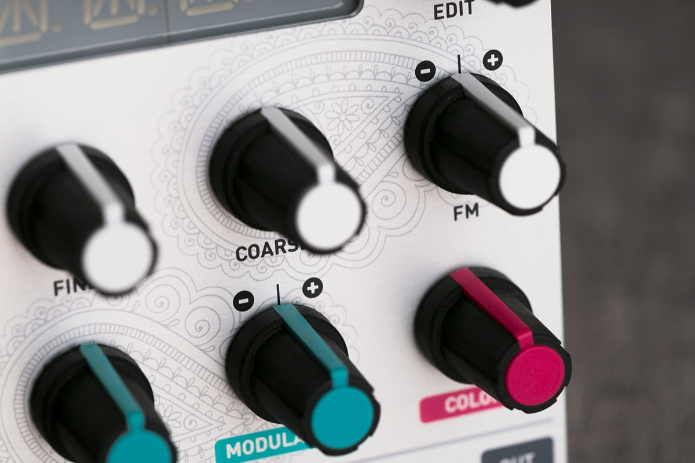
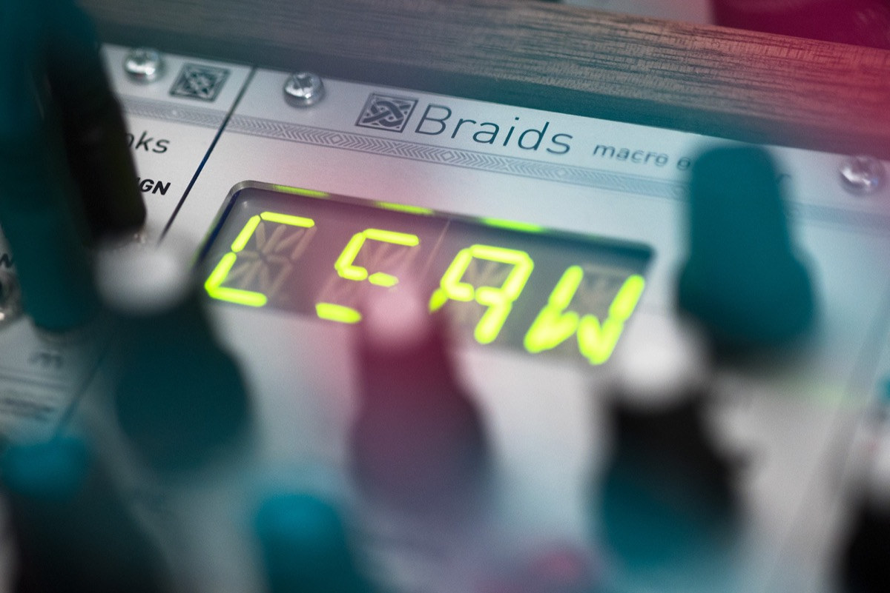

## An atlas of waveform generation techniques

Braids is a voltage-controlled monophonic digital sound source.

Sound source... like an oscillator? Not really.

Most of the timbres it generates are so complex that approaching them with a classic analog modular setup would require a full case of oscillators, filters, VCAs, waveshapers and ring-modulators – that's why we call it a macro-oscillator – intricate digital synthesis algorithms wrapped in oscillator's clothes.

## 2 Knobs to Rule Them All

Each algorithm is controlled by two continuously variable parameters, **TIMBRE** and **COLOR**, both of them voltage controllable.

Instead of being directly assigned to the intricate details of the synthesis algorithm, they work as **meta-parameters** going through all the sweet spots.

Very often, these parameters simultaneously affect several dimensions of timbre, creating very complex movements which would be hard to generate with a traditional setup.

