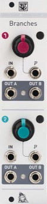

[TOC]

## Key data

*Dual Bernoulli Gate*

Parameter    | Value
-------------|------
Width        | 6HP
Depth        | 25mm
+12V current | 10mA
-12V current | 1mA
Lifetime     | 02/15 to 12/21
Modulargrid  | [Link](https://www.modulargrid.net/e/mutable-instruments-branches)
Processor    | ATMega88p @ 8 MHz

## Original printed manual

[PDF download](downloads/branches_quickstart.pdf)

## Features

### Liven up your patches

* Randomly skip steps in a sequence, triggers in a rhythmic pattern.
* Dispatch rhythmic events to two instruments or sub-patches.
* A building block for large generative patches.
* An abrasive digital noise source at audio rates!

### Specifications

* Gate inputs: 100k impedance, 0.6V threshold.
* CV inputs: 100k impedance, +/- 5V.
* Outputs: +5V for the HIGH level.
* Response time: 15µs.

## Revisions and variants

An initial batch of 250 units was made by a dubious CM in the US, only a small fraction of which has been sold. The next batches were made in France at the end of 2014.

### 2014

Hardware revision labelled "v4" with the following differences:

* Green PCB.
* Thonkiconn jacks.
