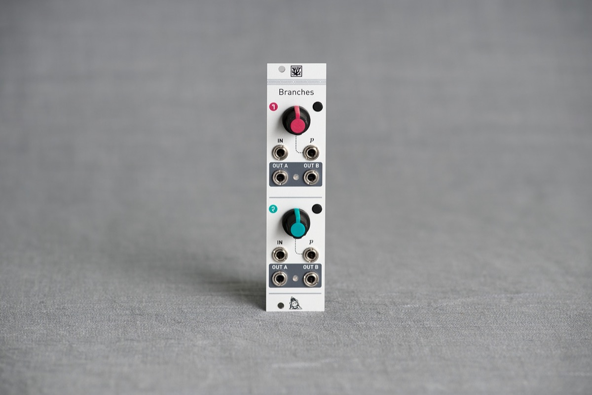

## Either/or

A Bernoulli gate takes a logic signal (trigger or gate) as an input, and routes it to either of its two outputs according to a random coin toss.

Branches packs two such gates in a small 6-HP panel. The knob and CV input on each channel controls the probability of routing the gate to either outputs, from 100% output A, 0% output B; to 0% output A, 100% output B.

