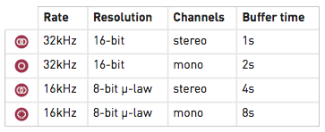

## Overview

Clouds is a granular audio processor. It creates textures and soundscapes by combining multiple overlapping, delayed, transposed and enveloped segments of sound taken from an audio recording buffer.

Clouds differs from other granular Eurorack modules in that it focuses on the real-time processing of audio sources from your modular system itself, rather than the playback of pre-recorded samples from a storage device. It rewards the freezing, fragmentation and dissolution of the unexpected instant, rather than the careful planning of what might very well not come.

## Installation

Clouds is designed for Eurorack synthesizer systems and occupies 18 HP of space. It requires a **-12V/+12V** supply (2x5 pin connector), drawing 10mA from the -12V rail and 120mA from the +12V rail. The red stripe of the ribbon cable must be oriented on the same side as the "Red stripe" marking on the printed circuit board.

## About Granular synthesis

Clouds continuously records the incoming audio into a short amount of sample memory. While recording time can reach up to 8s by reducing the audio quality setting, you ought to feel very guilty every time you think of this as "tape" - think of it as a space, a room. Using this recorded audio data, the module synthesizes a sonic texture by playing back short (overlapping) segments of audio (also known as "grains") extracted from it.

Clouds allows you to control:

-   From which part of the buffer the grains are taken.
-   How long the grains are.
-   At which speed/pitch the grains are replayed.
-   How much overlap there is between the grains (density).
-   Whether the distribution of grains in time is constant or random.
-   Which envelope curve is applied to the grains - giving the impression of a "rough" or "smooth" texture. In addition, to create textures with a "blurry" feel, a diffuser (network of all-pass filters - like a reverb without tail) can be applied.

The module plays grains continuously, at a rate determined by the **DENSITY** and **SIZE** settings. A trigger input is also present, to explicitly instruct the module to start the playback of a new grain. The maximum number of concurrent grains is quite large - between 40 and 60. This specificity brings Clouds closer to the roots of granular synthesis, and allows the synthesis of varied textures even from basic waveforms - there's indeed many more dimensions to granular synthesis than keeping a playback pointer moving through a SD-card sample!

It is possible, at any time, to **FREEZE** the audio buffer from which the grains are taken - In this case, the incoming audio is no longer recorded. Somehow, Clouds is the exact opposite of a sampler: by default, the module always samples the audio it receives, except when it is in the frozen state.

## Front panel

### Controls

**A.** **FREEZE** button. This latching button stops the recording of incoming audio. Granularization is now performed on the last few seconds of audio kept in memory in the module.

**B**. **Blending parameter/Audio quality** button. Selects which of the blending parameters is controlled by the **BLEND** knob and CV input, or selects one of the four audio quality settings.

**C**. **Load/Save** button. See the "Advanced topics" section.

**D**. Grain **POSITION**. Selects from which part of the recording buffer the audio grains are played. Turn the knob clockwise to travel back in time.

**E. F.** Grain **SIZE** and **PITCH** (transposition). At 12 o'clock, the buffer is played at its original frequency.

**G.** Audio **INPUT GAIN**, from -18dB to +6dB.

**H.** Grain **DENSITY**. At 12 o'clock, no grains are generated. Turn clockwise and grains will be sown randomly, counter-clockwise and they will be played at a constant rate. The further you turn, the higher the overlap between grains.

**I.** Grain **TEXTURE**. Morphs through various shapes of grain envelopes: square (boxcar), triangle, and then Hann window. Past 2 o'clock, activates a diffuser which smears transients.

**J.** **BLEND** knob. This multi-function knob is described in the *Blending parameters* section.

**K.** Indicator LEDs. They work as an input vu-meter. When **FREEZE** is active, they monitor the output level. Soft-clipping occurs when the last LED is on. They can also indicate the quality setting (red), the function assigned to the **BLEND** knob (green), or the value of the four blending parameters (multicolor).

### Inputs and outputs

All CV inputs are calibrated for a range of +/- 5V. Voltages outside of this range are tolerated, but will be clamped.

**1.** **FREEZE** gate input. When the input gate signal is high, stops the recording of incoming audio, just as latching the **FREEZE** button would do.

**2.** **TRIGGER** input. Generates a single grain. By moving the grain **DENSITY** to 12 o'clock, and sending a trigger to this input, Clouds can be controlled like a micro-sample player. An LFO or clock divider (or even a pressure plate) can thus be used to sow grains at the rate of your choice.

**3. 4.** Grain **POSITION** and **SIZE** CV inputs.

**5.** Grain transposition (**PITCH**) CV input, with V/Oct response.

**6.** **BLEND** CV input. This CV input can control one of the following functions depending on the active blending parameter: dry/wet balance, grain stereo spread, feedback amount and reverb amount.

**7. 8.** Stereo audio input. When no patch cable is inserted in the right channel input, this input will receive the signal from the left channel.

**9. 10.** Grain **DENSITY** and **TEXTURE** CV inputs.

**11. 12.** Stereo audio output.

## Blend parameters

The **BLEND** knob can control one of these four settings:

-   Dry/wet balance.
-   Stereo spread (amount of random panning/balance applied to the grains).
-   Feedback amount.
-   Reverberation amount.

To select which parameter is controlled by the **BLEND** knob and the **BLEND** CV input, press the **Blend parameter/Audio quality** button. The current parameter is temporarily indicated by a green LED.

When turning the **BLEND** knob, the color of the four status LEDs temporarily shows the value of the four blending parameters (from black when the parameter is set to its minimum value to green, yellow and then red for the maximum value).

It could happen that the position of the knob does not match the value of the parameter - the curse of multi-function knobs! If this is the case, turning the **BLEND** knob clockwise (resp. counterclockwise) causes a small increase (resp. decrease) in the value of the parameter, and turning it further causes larger changes, until the value progressively catches up with the knob's position.

There are a few things worth knowing about these settings:

-   All settings are automatically saved, and will be restored the next time the module is powered on.
-   Strange things happen when **FREEZE** is enabled. Because feedback/layering can no longer occur in the recording buffer (hey, it's frozen...), we route the output signal through delays and all-pass filters, and let the feedback build-up occur in this extra recording space - giving the sound a very reverb-like nature.

* * *

## Advanced topics

### Audio quality

Hold the **Blend parameter/Audio quality** button for one second, then press it repeatedly to choose a recording quality. The current quality setting is indicated by a red LED.

Note that Clouds' 8-bit is a lovely flavour of 8-bit: µ-law companding. It sounds like a Cassette, or a Fairlight - less hiss, more distortion.

### Saving and loading buffers

Up to 4 frozen audio buffers can be saved and reloaded. Along with the audio data itself, the quality settings and the processing mode are saved with it. To save the recording buffer in permanent memory:

1.  Hold the **Load/Save** button for one second.
2.  Press the **Blend parameter/Audio** quality button repeatedly to select one of the 4 memory slots. The selected slot is indicated by a blinking red LED.
3.  Press the **Load/Save** button to confirm.

To load a recording buffer from permanent memory:

1.  Press the **Load/Save** button.
2.  Press the **Blend parameter/Audio quality** button repeatedly to select one of the 4 memory slots. The selected slot is indicated by a blinking green LED.
3.  Press the **Load/Save** button to confirm.

If you press the **Load/Save** button by mistake, do not press any button for a few seconds and the module will return to its normal state.

### Tips and tricks

-   If you need a noise source to randomize grain position or pitch, you could do worse than reusing one of the audio outputs. It's certainly not white noise, but it's random enough...
-   Scratch and caress a sound by using a contact microphone or a touch strip to trigger grains and modify playback **POSITION**.
-   Very dense clouds sound the best when at least one parameter (pitch or position) receives random modulations. Otherwise, the many identical "echoes" created by the repeating grains will sound like a very resonant feedback comb filter.
-   Raw material like sawtooth or sine waves sound very good, especially with heavy random modulation. A fun exercise is to recreate the classic THX sound with a random source and a VCA.
-   Send a very fast sequence of 3 or 4 notes to the V/O input, so that each grain (if sown randomly) randomly picks one of those notes. The result? A chord!
-   Experiment with capturing many small fragments of sound by sending short pulses to **FREEZE** while a complex patch is being played through the audio input!

### Calibration procedure

To calibrate the unit:

1.  Disconnect all CV inputs.
2.  Connect the note CV output of a well-calibrated keyboard interface or MIDI-CV converter to the V/OCT input.
3.  Press the Load/save button, and while you hold it down, press the **Blend parameter/Audio quality** button. The first 2 LEDs will blink in orange.
4.  Play a C2 note, or send a 1V voltage from your CV source.
5.  Press the **Load/Save** button. The four LEDs will blink in orange.
6.  Play a C4 note, or send a 3V voltage from your CV source.
7.  Press the **Load/Save** push-button.
8.  Calibration is done!

###  Firmware update procedure

Unplug all CV inputs/outputs from the module. Connect the output of your audio interface/sound card to the **IN L** input. Power on your modular system with the **FREEZE** push-button pressed. The **FREEZE** LED will blink.

Make sure that no additional sound (such as email notification sounds, background music etc.) from your computer will be played during the procedure. Make sure that your speakers/monitors are not connected to your audio interface - the noises emitted during the procedure are aggressive and can harm your hearing. On non-studio audio equipment (for example the line output from a desktop computer), you might have to turn up the gain to the maximum.

When you are all set, play the firmware update file into the module. While the module receives data, the bargraph will show the signal level. Signal reception is optimal when two or three LEDs are lit. You can use the **IN GAIN** knob to boost or reduce the gain. When the end of the audio file is reached, the module automatically restarts - if it is not the case, please retry the procedure.

In case the signal level is inadequate, the LEDs will blink in red. Press the **FREEZE** push-button and retry with a higher gain. If this does not help, please retry the procedure from another computer/audio interface, and make sure that no piece of equipment (equalizer, FX processor) is inserted in the signal chain.

* * *

## Common issues

### The module just lets the original audio pass through

(and turning the knobs has no audible effect)

This is because the **DRY/WET** balance is set to fully dry.

The **BLEND** knob is not a dry-wet setting! It is a multi-function knob that can control dry/wet balance, feedback, random panning and reverb.

Press the button **B** until the first LED is lit, then adjust **BLEND** to reach a different dry/wet balance.
