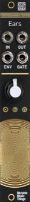

[TOC]

## Key data

*Contact microphone*

Parameter    | Value
-------------|------
Width        | 4HP
Depth        | 25mm
+12V current | 5mA
-12V current | 5mA
Lifetime     | 09/16 to 03/22
Modulargrid  | [Link](https://www.modulargrid.net/e/mutable-instruments-ears)

## Original printed manual

[PDF download](downloads/ears_quickstart.pdf)

## Features

### Ears for your modular

* Built-in contact microphone soldered right under the front panel, turning the panel and your entire case into a microphone.
* Increasingly spaced ridges on the panel, generating sonically interesting pulses or impulse combs when rubbed. Strike, pick or scratch digital resonators like Rings, Elements or the 4ms SMR.
* High-quality amplification stage suitable for external contact microphones, electro-acoustic instruments like guitars, or plain line-level signals.

### Extending the Mikrophonie

Compared to the Mikrophonie, Ears has additional outputs:

* Envelope follower, translating the decaying amplitude profile of a tap into an envelope CV.
* Gate detector, translating taps into gate signals.
* Envelope follower and gate detector can process external signals.

### Specifications

* Audio amplifier with 1M input impedance, up to 40dB of gain.
* External input bypassing the built-in contact microphone.
* Envelope follower with 3 preset attack and release times (adjustable by jumper).
* Gate detector with 3 preset sensitivity levels (adjustable by jumper) and +8V gate output.
* Three indicator LEDs: amplifier clipping (red), envelope follower level (white), gate detector activity (orange).

## Revisions and variants

A rare version of the module (30 units) has a different pattern on the panel, meant to be "scratched" with a plectrum.

