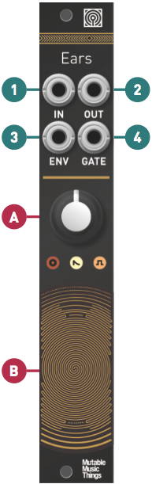

## Installation

Ears requires a **-12V/+12V** power supply (2x5 pin connector). The ribbon cable connector must be aligned so that the red stripe of the ribbon cable (-12V) is on the same side of the module's power header as the "Red stripe" marking on the board. The module draws 5mA from both the +12V and the -12V supply rails.

## Controls, inputs and outputs

**A.** Gain control, 0 to +40dB. This large gain ranges covers everything - from the amplification of line-level instruments, to the magnification of tiny sonic details captured by external contact microphones.

**B.** Contact microphone. Scratch, tap, rub, brush... to your heart's delight.

**1.** Hi-Z Audio input. Amplifies an external source. Patching a cable here disconnects the contact microphone.

**2. Audio output.** The red LED indicates clipping.

**3. Envelope CV output.** The white LED indicates the envelope CV level.

**4. Gate output.** Emits +8V when the envelope exceeds a threshold. The activity of this output is indicated by the orange LED.

## Envelope follower and gate detector settings

The jumpers at the back of the module adjust the response of the envelope follower and gate detector.

The last setting, corresponding to the longest time or higher voltge, is obtained by removing the jumper.
