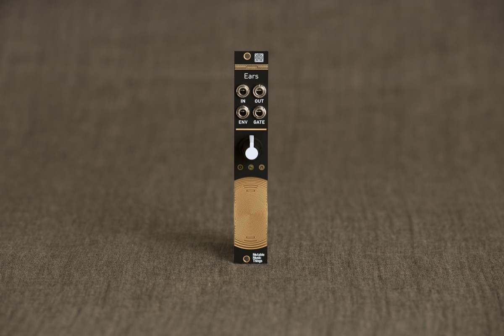
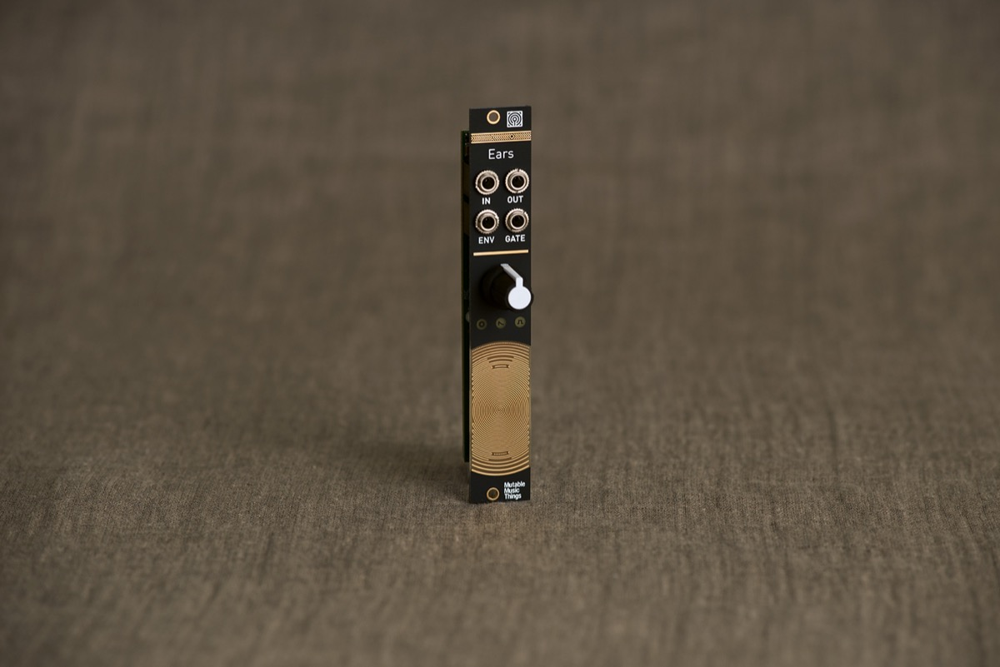
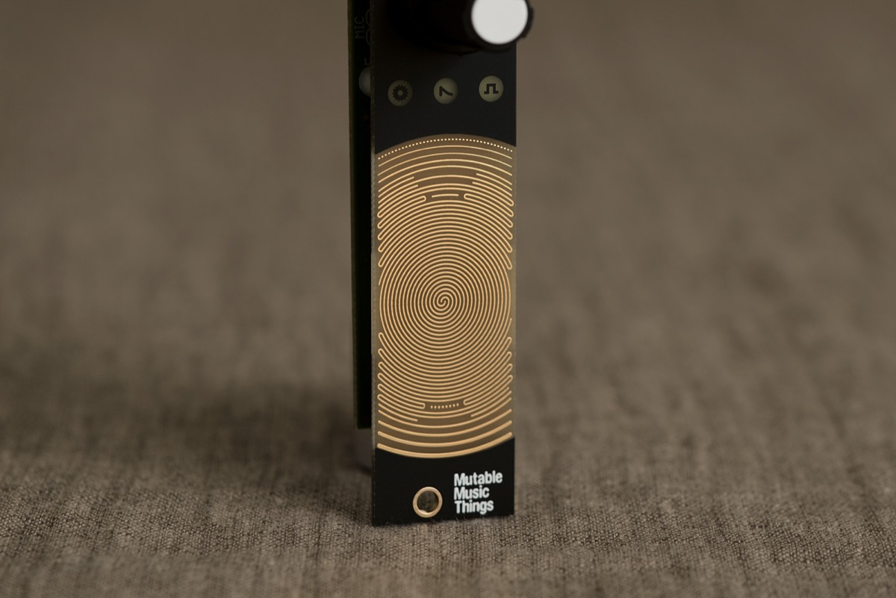
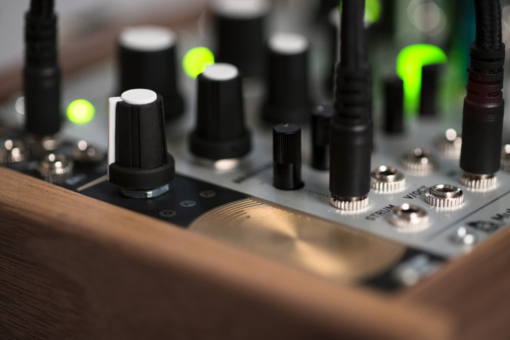

## I can hear you...

Ears is Mutable Instruments' take on Tom Whitwell's open-source [Mikrophonie](http://musicthing.co.uk/modular/?page_id=973) module – a contact microphone and amplifier.

A large palette of organic, physical sounds can be generated by scratching, tapping, and more generally collecting any kind of acoustic waves surrounding your modular case – even speaker feedback.

With its built-in envelope follower and gate detector, it can also be the gateway between external audio sources and your modular system.

