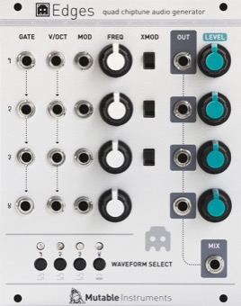

[TOC]

## Key data

*Quad chiptune audio generator*

Parameter    | Value
-------------|------
Width        | 20HP
Depth        | 25mm
+12V current | 70mA
-12V current | 20mA
Lifetime     | 08/13 to 10/16
Modulargrid  | [Link](https://www.modulargrid.net/e/mutable-instruments-edges)
Processor    | ATXMega32A4U @ 32 MHz

## Original printed manual

[PDF download](downloads/edges_quickstart.pdf)

## Features

### 3 Square/pulse generators

* Aliasing-free digital synthesis, based on a 4 MHz digital timer.
* 5 preset duty cycles settings, from 50% to 95%, or CV-controlled PWM.

### 1 Noise and triangle generator

* 48kHz, 12-bit DAC without reconstruction filter for a raw sound.
* Triangle, bitcrushed sine, steppy NES triangle or various flavours of LSFR noise.

### Advanced features

* Optional semitone quantizer on the pitch CV input.
* Per-channel mini step sequencer (8 steps) – perfect for creating rapid fire arpeggios. When the sequencer is active, the GATE input works instead as a CLOCK input.

### Specifications

* Input impedances: 100k.
* CV acquisition: 4kHz, 12-bit.
* Channel 1 to 3: 4MHz, 1-bit.
* Channel 4: 48kHz, 12-bit.

## Revisions and variants

### 2014

Hardware revision labelled "v2" with the following differences:

* 2x5 power connector (originally 2x8).
* Built-in 5V regulator.
* Thonkiconn jacks.
* Frequency potentiometers have no center detent.
* Milky, diffused LEDs (originally clear).
* An octal DAC (originally quad) allows the FM inputs to be acquired separately from the main V/O input, and processed in software. In particular, this allows its repurposing as a PWM input for channels 1-3.
