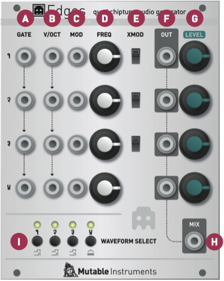
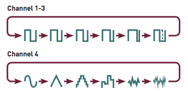
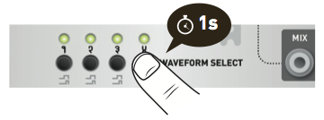
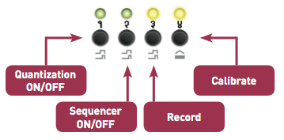

## Overview

Edges is a bank of four voltage-controlled digital oscillators - 3x square wave channels and 1x LFSR noise or triangle channel - an architecture inspired by the music synthesis circuitry of classic 8-bit consoles and home computers. For a more faithful reproduction of these classic sounds, the square waves are generated using digital logic (timers / counters) rather than DSP techniques, and are thus free of aliasing artifacts. Each voice is equipped with a gate input, allowing it to be toggled on/off without the need for an external VCA. The 4 channels have individual outputs and are sent to a built-in mixer. Finally, a simple polyphonic sequencer allows each channel to play arpeggios or trills.

## Installation

Edges is designed for Eurorack synthesizer systems and occupies 20 HP of space. It requires a **-12V/+12V** / +5V supply (2x8 connector), consuming 25mA from the **-12V/+12V** rails and 45mA from the +5V rail. The red stripe of the ribbon cable must be oriented on the same side as the "Red stripe" marking on the printed circuit board.

## Controls, inputs and outputs

**A1 .. A4. GATE**: Channel gate input. When the sequencer is off, this input acts as a binary VCA - the channel is off when the signal is 0V; on when the signal exceeds a 0.7V threshold. When the sequencer is active, the channel is always on, and this input acts as a clock input, to step through the sequence. The gate inputs are normalled. For example, if you connect a jack on channel 2's gate, it will be used for channels 3 and 4 unless a jack is connected in one of their gate inputs.

**B1 .. B4. V/OCT**: Channel frequency input. Just like the **GATE** inputs, these are also normalled across all channels. This can be used, for example, to transpose a chord or polyphonic sequence from a single note CV.

**C1 .. C4. MOD**: Channel frequency modulation input. This input serves the same purpose as the V/OCT input (and is summed to it); but is not normalled from one channel to the other.

**D1 .. D4. FREQ**: Channel frequency control, spanning 6 octaves.

**E1 .. E3. XMOD**: This switch enables a special digital cross-modulation effect. From top to bottom:

1.  Channel 1 to Channel 2 hard sync.
2.  Channel 1 x Channel 2 ring modulation.
3.  Channel 1 x Channel 3 ring modulation.

**F1 .. F4. OUT**: Channel individual output. When a jack is plugged in this output, the corresponding channel is removed from the global mix.

**G1 .. G4**: Channel volume control, for the mixer. Not that this potentiometer does not affect the individual outputs' levels (they are always at full level).

**H. MIX**: Mixer output.

**I. WAVEFORM SELECT**: Press these switches to cycle through the various waveshapes available on each channel. Hold a switch to modify the quantization/sequencing/calibration options of the corresponding channel (see the "Channel options" section).

**LED 1..4**: They indicate the status of each channel's gate input.

## Waveforms

For channel 1, 2, and 3, the waveshapes are all square waves with 50%, 66%, 75%, 87%, 95% pulse or CV controlled pulse width.

With this last option:
* Channel 4's frequency input doubles as a PWM control (early revision of the module).
* The FM input is repurposed as a PWM CV input (most recent revision of the module).

For channel 4, the waveshapes are sine, triangle, NES triangle (with 16 loudness levels), sample-and-hold noise, NES LSFR 1 (long cycle) and NES LSFR 2 (short cycle). LSFRs are linear feedback shift registers - a digital technique for creating cyclic noise patterns.

## Settings mode

Hold one of the 4 **WAVEFORM SELECT** switches to modify this channel's options. Leds 3 and 4 will blink.

Press 1 to enable/disable semitone quantization on this channel. Led 1 indicates whether the quantizer is enabled.

Press 2 to enable/disable the sequencer. Led 2 indicates whether the sequencer is enabled. Hold any one of the 4 **WAVEFORM SELECT** switches to exit the settings mode.

## Recording a sequence

Hold one of the 4 **WAVEFORM SELECT** switches to select the channel in which you want to record a sequence. Leds 3 and 4 will blink.

Press 3 to start recording. Led 1 lights on to indicate the active step (step 1). Set the **FREQ** control on the selected channel to the desired note; or enter a note from your CV keyboard or through your MIDI-CV interface. Press the second switch to continue to the next step. Set the **FREQ** control on the selected channel to the desired note for the second step. Press the third switch to continue, etc. To stop recording, press the currently active step. For example, to record a 6 step sequence:

1.  Press 3 to start recording. The sequencer starts at step 1.
2.  Set CV
3.  Press 2
4.  Set CV
5.  Press 3
6.  Set CV
7.  Press 4
8.  Set CV
9.  Press 1
10. Set CV
11. Press 2
12. Set CV
13. Press 2 again (to indicate that you don't want to add a new step). You are done with recording. If you wanted to continue the sequence, you would have pressed 3, set a CV, press 4, set a CV, and press 4 (the sequence length is limited to 8 steps).

## Calibration

Edges' is digitally calibrated. Please follow this procedure to calibrate all channels:

1.  Unplug all jacks connected to the **GATE**, **V/OCT** and **FM** inputs.
2.  Set all the **FREQ** potentiometers to their central position.
3.  Connect the note **CV** output of a well-calibrated keyboard interface or MIDI->CV converter to the first channel's **V/OCT** input. Because all **V/OCT** inputs are normalled, this signal will also be available for calibrating the other channels.
4.  Hold the channel 1 **WAVEFORM SELECT** switch until LEDs 3 and 4 blink. Press switch 4 (calibration).
5.  The LEDs show this pattern: \*\*oo, to indicate that you need to play a C2 note (CV equal to 1V). Once the note has been played, press switch 4 to continue.
6.  The LEDs show this pattern: \*\*\*\*, to indicate that you need to play a C4 note (CV equal to 3V). Once the note has been played, press switch 4 continue. The channel is now calibrated.
7.  Repeat the steps 4/ 5/ 6/ 7/ by holding the channels 2, 3 and 4 **WAVEFORM SELECT** switches.
