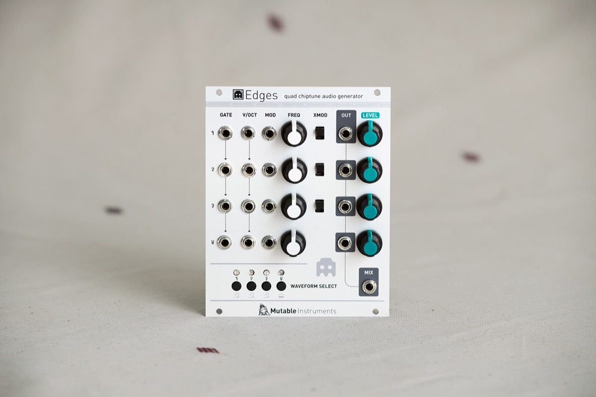
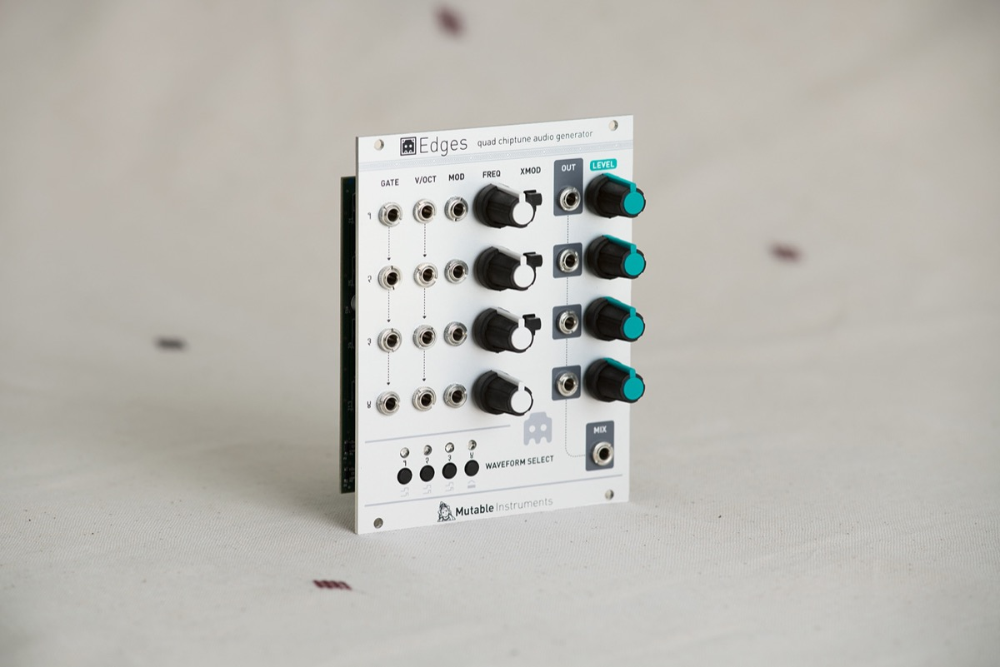
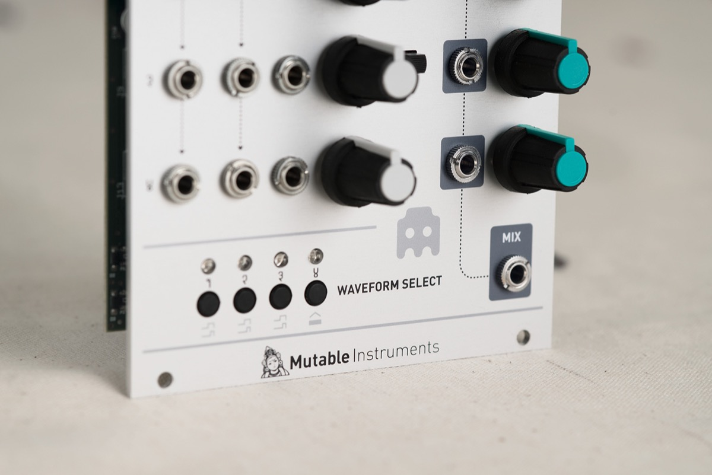

## 4 channels of digital logic bliss, with love from the 8-bit era

Enough with the analog, warm and organic.

Edges is a module strictly focused on the straight lines, sharp edges, and clinical harsh modulations of digital logic.

Its architecture is loosely based on classic 8-bit console soundchips, providing 4 simple voltage-controlled voices. Each voice consists of a digital oscillator with two pitch CV inputs and a coarse pitch knob, with a gate input allowing the voice to be turned on/off without the need for an external VCA. The 4 channels are sent to an onboard mixer – making Edges easy to use for chord generation or heavy drone synthesis applications.

