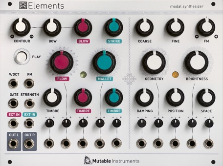

[TOC]

## Key data

*Texture synthesizer*

Parameter    | Value
-------------|------
Width        | 34HP
Depth        | 25mm
+12V current | 130mA
-12V current | 10mA
Lifetime     | 01/15 to 01/22
Modulargrid  | [Link](https://www.modulargrid.net/e/mutable-instruments-elements)
Processor    | STM32F405RGT6 @ 168 MHz
Codec        | WM8731

## Original printed manual

[PDF download](downloads/elements_quickstart.pdf)

## Features

### Excitation signal generator

* Three generators with mixer: bowing noise, blowing noise, percussive impulses.
* Envelope contour for bowing and blowing.
* Bowing noise generator: particle-like scratching noise with 2-pole low-pass filter.
* Blowing noise generator: granular pitched noise with wavetable-like scanning between various tone colors.
* Percussive impulse generator: interpolates through a collection of impulsive excitations – including sampled sticks, brushes and hammers, and models of damped mallets, plectrums, or bouncy particles. 2-pole low-pass filter and pitch control.

### Modal resonator

* Internally uses 64 zero-delay feedback state variable filters.
* Coarse, fine and FM frequency controls.
* Geometry: Interpolates through a collection of structures, including plates, strings, tubes, bowls.
* Brightness. Specifies the character of the material the resonating structure is made of – from wood to glass, from nylon to steel.
* Damping. Adds damping to the sound – simulates a wet material or the muting of the vibrations.
* Position. Specifies at which point the structure is excited.
* Space. Creates an increasingly rich stereo output by capturing the sound at two different points of the structure, and then adds more space through algorithmic reverberation.

### Designed for Eurorack

* All exciter and resonator parameters have a dedicated CV input with attenuverter.
* Strength input, for amplitude control of the exciter section.
* Frequency control through a V/O input controlling the main resonator frequency, and an FM input.
* Two audio inputs: one pre-envelope and diffuser, the other patched straight to the resonator.
* Stereo audio output, with adjustable width/reverberation. It is also possible to output the raw exciter signal on one channel, and the raw resonator signal on the other.

### Specifications

* Input impedances: 100k.
* CV range: +/- 8V. CVs outside of this range are simply clipped.
* Audio input level: calibrated for modular (10 Vpp).
* Audio acquisition and restitution: 16-bit, 32kHz.
* Internal computations on 32-bit floating point numbers.

## Revisions and variants

### 2021

Hardware revision labelled "v0.3" with minor manufacturability improvements, such as dimensions of PCB pads and holes.
