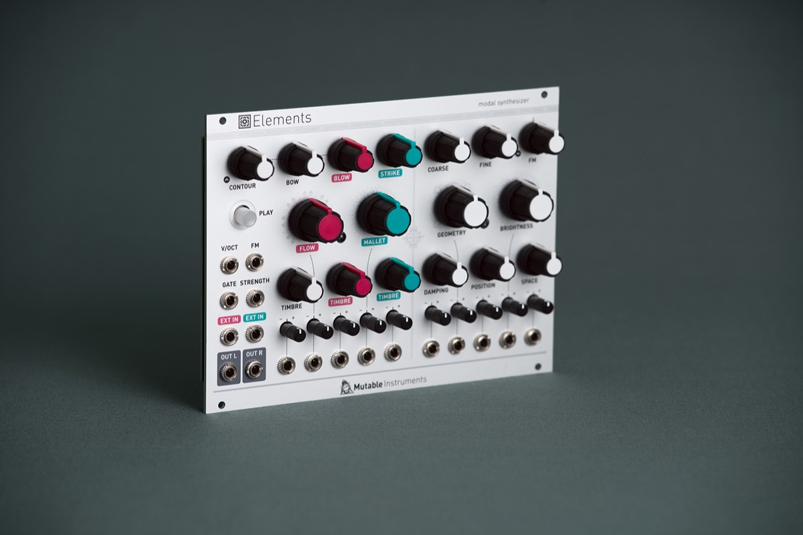

## Concrete sounds for abstract music, abstract sounds for musique concrète

Elements is a full-blown synthesis voice based on modal synthesis – an under-appreciated flavour of physical modelling synthesis with a strange and abstract feel.

Elements combines an exciter synthesis section generating raw, noisy sounds characteristic of bowing (filtered friction noise), blowing (pitch-controlled granular noise), or striking (stick, mallet, hammer or brush sample playback... or bursts of synthetic impulsions).

These sources, or external audio signals, are processed by a modal filter bank – an ensemble of 64 tuned band-pass filters simulating the response of various resonant structures (plates, strings, tubes…) with adjustable brightness and damping. A stereo ambience reverberator adds depth and presence to the sound.

All parameters have a very meaningful and well-delimited impact on the sound. When designing Elements, great care has been taken in selecting parameter ranges and control curves, producing a large palette of sounds – often beyond physical realism – but always well controlled and stable. The "dark spots" of noise and feedback are reached gradually, and they do still react to controls. The module is deliberately menu- and switch-free – what you dial/patch is what you hear!

