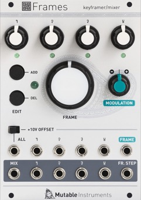

[TOC]

## Key data

*Keyframer/mixer*

Parameter    | Value
-------------|------
Width        | 18HP
Depth        | 25mm
+12V current | 90mA
-12V current | 30mA
Lifetime     | 03/14 to 06/21
Modulargrid  | [Link](https://www.modulargrid.net/e/mutable-instruments-frames)
Processor    | STM32F103CBT6 @ 72 MHz
DAC          | DAC124S085 (for internal CVs only)

## Original printed manual

[PDF download](downloads/frames_quickstart.pdf)

## Features

### An analog mixer...

4-channel voltage-controlled mixer based on the V2164 IC.

* 4 DC-coupled signal inputs.
* 1 global input, sent to all unconnected inputs, and normalized to a precision voltage reference (+5V or +10V).
* 4 DC-coupled channel outputs.
* 1 global mix output, collecting signals from all unpatched outputs, with a -6dB gain.

### ... under digital control

* 12-bit digital control of the gains for the 4 VCAs.
* Up to 20 keyframes, each keyframe storing VCA CVs for each channel.
* Per-channel easing curve selection: stepped (no interpolation), linear, accelerating, decelerating, sine, bouncy.
* Per-channel CV/VCA response selection, from linear to logarithmic.

### Specifications

* CV input impedance: 100k.
* Audio input impedance: 100k (25k for the global input in some configurations due to normalling).
* Fastest modulation rate: 15kHz.
