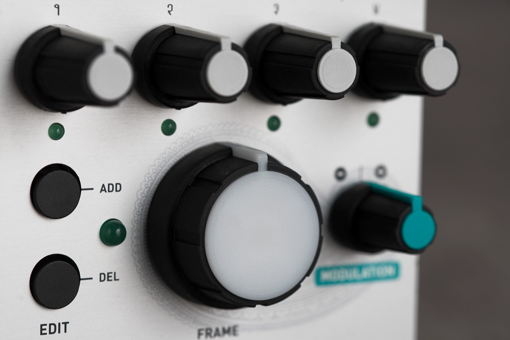

## Mix, attenuate, morph, dispatch, animate. With the big glowing knob

The heart of Frames is a 4-channel VCA and mixer under tight digital control.

Through flexible input/output mixing and normalling options, it can be patched to serve the following purposes (among others):

* 4-channel attenuator/VCA.
* 4-channel mixer.
* 4-channel programmable CV source.
* Quadraphonic signal dispatcher.

But what makes Frames truly unique is the way in which channel gains/CV levels can be controlled, using a technique inspired by computer animation.

Frames allows up to 20 configurations of the 4 gain knobs to be stored and recalled throughout the course of its big Frame knob.

By rotating this knob (or sending a CV to the Frame modulation input and adjusting its amount with the attenuverter), the configurations are morphed into one another.

With a bit of patching and imagination, Frames can also be repurposed as a 4-channel sequencer, a multi-stage envelope generator or a trajectory generator for quadraphonic panning...

