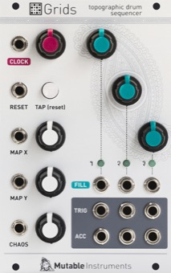

[TOC]

## Key data

*Topographic drum sequencer*

Parameter    | Value
-------------|------
Width        | 16HP
Depth        | 25mm
+12V current | 25mA
-12V current | 1mA
Lifetime     | 08/13 to 03/21
Modulargrid  | [Link](https://www.modulargrid.net/e/mutable-instruments-grids)
Processor    | ATMega328p @ 20 MHz

## Original printed manual

[PDF download](downloads/grids_quickstart.pdf)

## Settings reference card

[PDF download](downloads/grids_settings_reference_card.pdf)

## Features

### Clocking

* Internal clock with a 40 to 240 BPM range.
* Beat indicator / Tap tempo button (reconfigurable as a reset button).
* External clock input, with selectable resolution (24, 8 or 4 ppqn).
* Pattern reset trigger input.

### Drum pattern generator

Based on a compressed representations of drum patterns and their variations.

* X/Y (pattern selection) knobs with CV inputs.
* Pattern complexity/density knobs for channels 1, 2, 3, with CV inputs.
* Pattern randomization knob with CV input (reconfigurable as a swing control for the internal clock).
* 3 output channels (BD, SD, and HH/percussion).
* 3 additional outputs, configurable as Accent/Clock/Reset or per-channel accent.
* Outputs can be either triggers or gates.

### Specifications

* Input impedances: 100k.
* CV acquisition: 8-bit, 1kHz.
* Output level: +5V.
* Clock resolution and processing latency: 120µs.
* Worst case jitter < 0.5% at 120 BPM.

## Revisions and variants

### 2014

Hardware revision labelled "v0.2" with the following differences:

* 2x5 power connector (originally 2x8).
* Built-in 5V regulator.
* Milky, diffused LEDs (originally clear).
