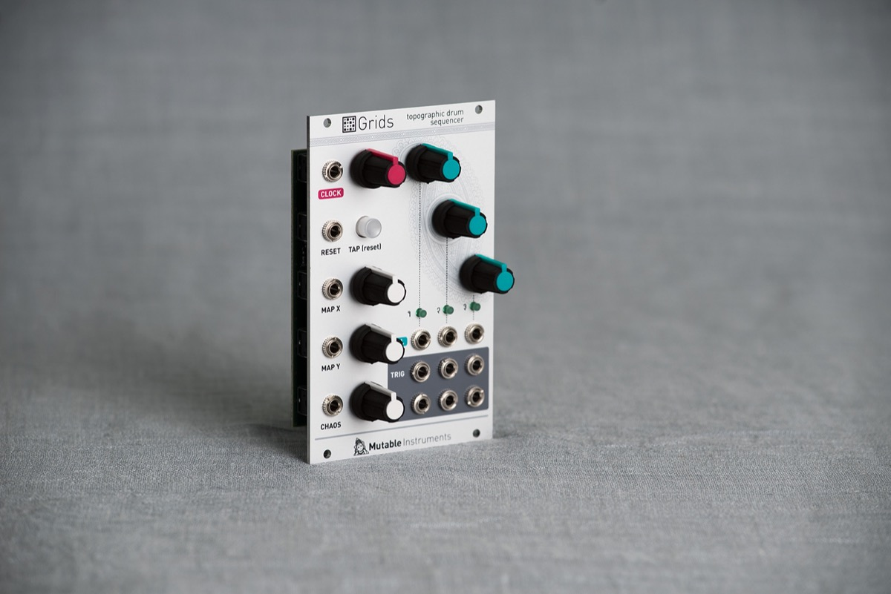
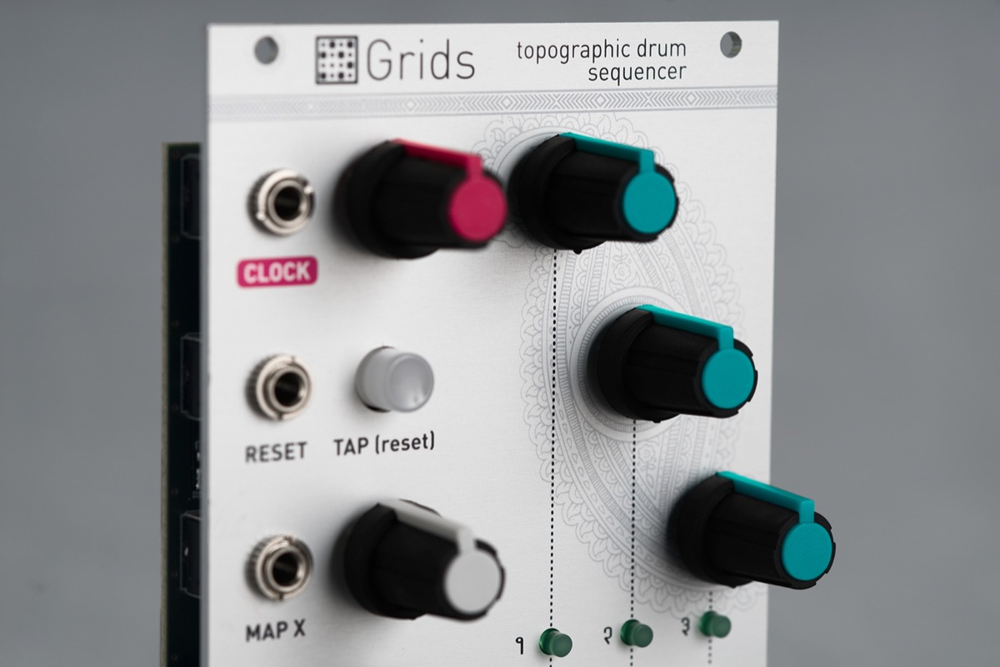

## Your drum section will never be the same again...

Take the user interface of an euclidean sequencer, a healthy dose of machine learning and graph algorithms, megabytes of drum loops, hours of intensive computations and you've got a drum pattern generator like no other.

Grids' "brain" is a map of the typical drum patterns used in (mostly electronic) music, laid out by similarity, trained on a large corpus of drum loops. The module can smoothly interpolate and navigate from one pattern to the other, at the whim of a knob move or a CV.

But Grids' knowledge of drum patterns goes far beyond what would be achieved with presets – given a position in the map, thousands of variations can be intuitively generated by controlling the "event density" of each of the 3 channels (bd, sd, hh) – gradually moving from a sparse backbone to a deliciously rich pattern with ghost notes, rolls and fills.

## ... especially when modulated by a noise source!

Add CV-control on these parameters and you can add subtle or drastic variations to the drum pattern. If you don't want to waste a noise source or S&H for that, Grids has its own internal source of randomness that can unpredictably spice the pattern, in an always meaningful way.

Building the rhythmic foundation of your tracks with Grids is fun, surprisingly intuitive, with modulation and variations possibilities that will rapidly make you forget x0x-style sequencers.

