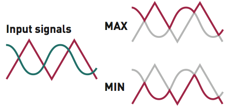
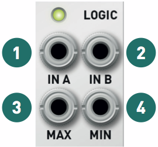

## Installation

Kinks requires a **-12V/+12V** power supply (2x5 pin connector). The ribbon cable connector must be aligned so that the red stripe of the ribbon cable (-12V) is on the same side of the module's power header as the "Red stripe" marking on the board. The module draws 25mA from both the +12V and -12V supply rails.

**Important notice:** with long bus-boards and in the vicinity of a transmitter, Kinks' analog noise generation circuit can receive radio transmissions. The range of frequencies concerned by this quirk all carry digital modulations, indistinguishable from white noise.

## SIGN section

This section consists of a precision inverter, a half- and a full-wave rectifier.

**1.** Signal input.

**2.** Inverted output. Besides the typical CV applications (invert the direction of an envelope or LFO), inverters are useful for creating interesting waveforms from VCO outputs. For example, invert the sine output of a classic analog VCO, and mix it with its sawtooth (or triangle) output. This is equivalent to attenuating the fundamental frequency of the sawtooth (or triangle) waveform, creating a more nasal sound.

**3.** Half-wave rectified output. The negative half of the signal is clipped to 0V. This can add many harmonics to audio signals.

**4.** Full-wave rectified output. The negative half of the signal is inverted. On symmetric waveforms like a sine or a triangle, this doubles the frequency of the signal ("octaver" effect). Another interesting application is to pre-process a random signal before sending it to a quantizer or digital VCO - some of these don't handle negative CVs!

The monitoring LED indicates the amplitude and polarity of the input signal.

## LOGIC section

Remember what a logic **OR** gate does: its output is at a high level (for example +5V) whenever one of the two inputs is at a high level. One could express this rule differently: the output is the greatest (maximum) of the two inputs. This is exactly what an analog OR circuit (also called a maximum or peaks circuit) does: it takes the maximum of its two input voltages. When these voltages are digital signals (for example with a low level of 0V and a high level of 5V), this circuit does the same thing as a digital OR gate.

Similarly, the analog **AND** circuit extracts the minimum of the two inputs (the troughs in the graph of the two input signals).

**1, 2.** Signal inputs, normalized to 0V.

**3.** Analog OR signal (maximum, peaks).

**4.** Analog AND signal (minimum, troughs). The monitoring LED indicates the amplitude and polarity of the sum of the two input signals. A few interesting observations:

-   Since the inputs are normalized to 0V, if you patch a cable into only one of the inputs, **MAX** will output the positive half of the waveform, and **MIN** will output the negative half of the waveform.
-   You can of course use these for manipulating digital triggers, gates or clocks.
-   With audio-rate signals, the resulting waveforms have the same kind of inharmonic partials and side-bands one would obtain with a ring-modulator.
-   A classic "Buchlaesque" application is to combine various AD envelopes or triangle LFOs to create very complex shapes.
-   Another interesting patch is to use a slow LFO to clip a triangle or sine wave - creating a PWM-like effect.

## S&H and noise section

On each trigger received on the **TRIG** input, the output voltage takes the value of the input voltage and holds this voltage... until a new trigger is received on the **TRIG** input.

**1.** Signal input, normalized to the white noise generator.

**2.** Trigger input. Requires a signal with sharp rising edges (clock/gate/trigger generator, square LFO or VCO).

**3.** Noise generator output.

**4.** Sample and hold output.

The monitoring LED indicates the amplitude and polarity of the output signal.

It is important for the trigger input signal to have a sharp rising edge: the module is sensitive to the slope of the signal, not to its value. It is not possible to use slow sine or triangle LFOs to trigger the S&H (such signals can of course be sampled through the **IN** input to turn them into mad staircases). The trigger signal can go to up 10kHz: try patching a high-pitched square VCO to the **TRIG** input to add aliasing to an audio signal sent to **IN** ("bitcrushing").

Since the circuit is analog, it cannot hold indefinitely its output voltage. The output voltage very slowly decreases towards 0 at a rate smaller than 0.8mV (one cent) per second.

Sending a clock or trigger to the **TRIG** input, with no signal patched into the **IN** input generates a stepped random signal. The output level is calibrated such that more than half of the time, the output value is between -2V and +2V ; and it very, very rarely goes below -5V or above +5V.

The **NOISE** output can of course be used independently of the S&H circuit.
