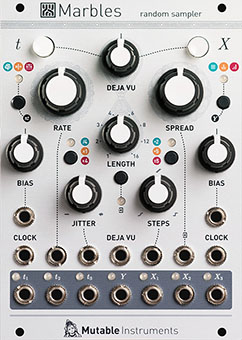

[TOC]

## Key data

*Random sampler*

Parameter    | Value
-------------|------
Width        | 18HP
Depth        | 25mm
+12V current | 80mA
-12V current | 20mA
Lifetime     | 03/18 to 04/22
Modulargrid  | [Link](https://www.modulargrid.net/e/mutable-instruments-marbles)
Processor    | STM32F405RGT6 @ 168 MHz
DAC          | DAC8164

## Original printed manual

[PDF download](downloads/marbles_quickstart.pdf)

## Features

### Random gate generator

#### Master clock

* Internal clock with adjustable rate (with V/O CV input), or division/multiplication of an external clock.
* Range selection button further multiplying or dividing the clock by 4.
* Rhythm follower/predictor to lock onto uneven clock divisions or rhythmic patterns.
* Adjustable jitter (knob and CV), going from perfect tracking to completely erroneous – but always preserving the overall tempo.

#### Two-channel random rhythm generator

* Three gate outputs: *t2* is the main output carrying the jittery clock, *t1* and *t3* are the complementary random rhythm output.
* Three generative models, with CV-controlled bias parameter increasing the density of notes on one channel or the other:
	1. Random routing of each clock pulse to either outputs, following a coin toss.
	2. Selection of a random division factor for one output, and the reciprocal factor for the other.
	3. Generation of random kick/snare patterns using a process similar to [Grids](../grids).
* Adjustable gate duration, from short triggers to full length. Gate duration can be randomized.

### Random voltage generator

* 3 outputs, either clocked by the 3 outputs of the random gate generator, or by a common external clock.
* Distribution control: **SPREAD** control, scanning between constant, bell-shaped, uniform or discrete distributions; and **BIAS** control biasing the generated voltage towards the bottom or top of the voltage range.
* Adjustable range: 0 to +2V (for melodies), 0 to +5V, -5V to +5V.

#### Quantized or smooth... CV Post-processor

* The **STEPS** parameter controls the steppiness/quantization of the output voltages.
* Turn this knob clockwise and a progressive quantizer is applied to the voltages - progressively reducing the probability of hitting a note outside of the scale, then making accidentals less likely, then giving more weight to the root and fifth - and at the extreme yielding only octaves.
* If steppy is not your thing, turn counterclockwise to increasingly slew the output voltages to the point that the module produces smooth, continuous curves.

#### Programmable quantizer

* 6 programmable scales.
* Scales are programmed by playing a short jam in the target scale: **Marbles** learns which notes are more prominent than others.

#### Output diversity

* The three outputs can all follow the settings dialed on the control panel, or react in different and opposite ways. The turn of a knob can completely push your patch towards a new direction!

### Random looping and shuffling

* **DEJA VU** parameter increasing the probably of re-playing past material to the point that the generated output forms a loop... then increasing the probability of randomizing the order of this loop.
* The **DEJA VU** control applies to the random rhythm, the random voltages, or to both, or neither of them.
* Adjustable loop length from 1 to 16 steps.

### External CV processing

* An external CV can be recorded in the **DEJA VU** loop in place of internal random voltages.
* All transformations performed by the random voltage generator (looping, shuffling, spreading, transposition, quantization, lag-processing) can be performed on external voltages.
* TLDR: live remixing of external sequences!

### Specifications

* Analog random source.
* All inputs: 100k impedance, DC to 3.2kHz.
* Maximum input clock rate: 1kHz for the ***t*** Section, 8kHz for the ***X*** section.
* 32kHz refresh rate.
* 14-bit DAC with accurate software calibration - error below 1mV.
* 12-bit CV capture.
* Output levels: -5V to +5V for CVs  (largest setting), 0V to +8V for gates.
* Input CV range: -5V to +5V.
* Front panel with Computer Modern labels, just like on your calculus textbook.
