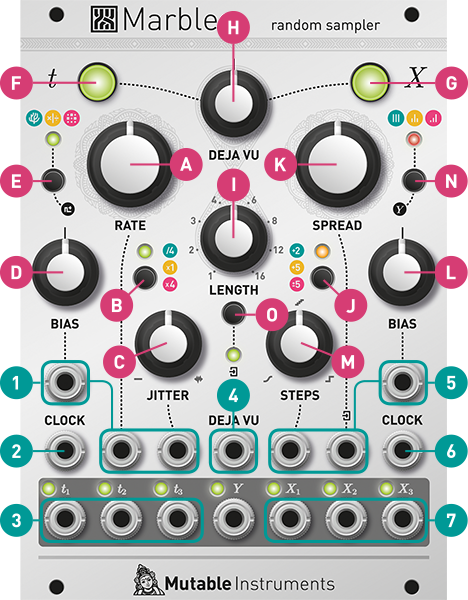
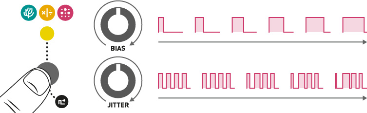

## Installation

Marbles requires a **-12V/+12V** power supply (2x5 pin connector). The red stripe of the ribbon cable (-12V side) must be oriented on the same side as the “Red stripe” marking on the module and on your power distribution board.
The module draws **80mA** from the +12V rail, and **20mA** from the -12V rail.

## Marbles' recipe for random music

1. Start with a **clock** – generated internally or divided/multiplied from an external clock signal.
2. If required, add some **jitter** to it, from slight humanization to complete chaos.
3. Split this randomized clock into two streams of random triggers to generate two **contrasting rhythmic patterns** complementing the main clock.
4. Generate three **random voltages** in sync with the rhythmic patterns obtained at the previous step.
5. Transform the random voltages to **spread them further apart, or concentrate them** around a specific voltage.
6. Add a pinch of **lag-processing** to obtain smooth random modulations... or **quantization** to get random tunes.

Steps **1 to 3** are handled by the left half of the module, the random rhythms being generated on the outputs labelled **t**. In your Eurorack system such duties might have been performed by modules like Grids and Branches.

Steps **4 to 6** are handled by the right half of the module, the random voltages being generated on the outputs labelled **X**. A large number of modules would be necessary to patch this functionality: a triple noise source and sample&hold, waveshapers, quantizers, and lag processors.

And now let’s take it further: what if everything the module did could be controlled by a slowly evolving or lockable loop, like with Music Thing’s Turing Machine? That’s what the **DEJA VU** section is for.

Time to dive into the details!

## *t* Generator

The **t generator** produces random gates by generating a jittery master clock (which is output on ***t2***) and deriving from it two streams of random gates which are output on ***t1*** and ***t3***.

**A. Clock rate.** 120 BPM at 12 o’clock.

**B. Clock range.** Divides or multiplies the clock rate by 4.

**C. Amount of randomness in the clock timing** - perfectly stable, then simulating an instrumentalist lagging and catching up, then... complete chaos.

**D. Bias.** Controls whether gates are more likely to occur on ***t1*** or ***t3***. Several methods are available for splitting the master clock into ***t1*** and ***t3***, selected by the button **[E]**:

  1. A coin is tossed at every pulse of ***t2***, to decide whether the pulse is passed to ***t1*** or ***t3***. **BIAS** controls the fairness of the coin toss.
  2. ***t1*** and ***t3*** are generated by respectively multiplying and dividing ***t2*** by a random ratio. Turn the **BIAS** knob fully clockwise or counter-clockwise to reach more extreme ratios.
  3. the triggers alternate between ***t1*** and ***t3***, following the same kind of regularity as kick/snare drum patterns.

**1. BIAS, RATE** (with V/O scaling) and **JITTER** CV inputs.

**2. External clock input.** The clock signal patched in this input replaces the internal clock. In this case, the **RATE** knob and CV input are re-purposed as a division/multiplication control, and the jitter setting is applied to the external clock.

**3. Gate outputs.**

Hold the button **[E]** and turn **BIAS** to adjust the gate length from 1% to 99%, or **JITTER** to adjust the gate length randomization (from deterministic to completely random). Only ***t1*** and ***t3*** are affected by this. ***t2*** has a constant 50% duty cycle.

## DEJA VU section

Whenever the module needs to make a random choice (for instance, to decide on the amount of jitter to apply on the next tick of its clock, or to generate a random voltage for one of its outputs), it queries the **DEJA VU** section. The **DEJA VU** section either recyles a previously generated random choice, or samples fresh random data from a hardware random source.

**F. G.** These buttons control whether the **DEJA VU** settings apply to the **t or X** section (or neither, or both). For example, the module can generate a non-repeating sequence of voltages locked to a looping rhythm (**t** enabled, **X** disabled); or cycle through the same sequence of voltages on an ever-changing rhythm (**t** disabled, **X** enabled).

**H. Probability of re-cycling random decisions/voltages** from the past:

* From 7 o’clock to 12 o’clock, this probability goes from 0 (completely random) to 1 (locked loop).
* At 12 o’clock, the module is thus stuck in a loop, because it never generates fresh random data. In this case, the illuminated pushbuttons [F] and [G] blink.
* From 12 o’clock to 5 o’clock, the probability of randomly jumping within the loop goes from 0 to 1.
* At 5 o’clock, the module thus plays random permutations of the same set of decisions/voltages.

**I. Loop length.** Lengths of 5, 7, 10 and 14 can be obtained by setting the knob between the graduations printed on the panel.

**4. DEJA VU CV input.**

## *X* Generator

The X generator generates **three independent random** voltages output on ***X1***, ***X2*** and ***X3***. They are clocked by the three outputs from the **t** section, or by a common external clock.

**J. Output voltage range.** 0 to +2V, 0 to +5V or -5 to +5V.

**K. Probability distribution** width and shape. Turning counter-clockwise from 12 o’clock, the voltages are increasingly concentrated near the center of the range. Fully counter-clockwise, a constant voltage is output. At 12 o’clock, they follow a bell curve - more likely to occur near the center but able to reach the extremes. At 2 o’clock, they occupy the entire voltage range with equal probability. Past this point, extreme values become more likely. Fully clockwise, only the minimum and maximum voltages are possible, turning ***X1***, ***X2*** and ***X3*** into random gates.

**L. Distribution bias.** Skews the distribution towards low or high voltages. Think of this as the probabilistic equivalent of an offset: it does not shift the voltage down or up, but biases the decision towards the bottom or top of the voltage range.

In the illustration below, the pink histogram represents the distribution of possible output voltages: the tallest bar corresponds to the most likely outcome. The teal oscillogram is an example of
output voltage sequence.

**M. Horizontal and vertical “steppiness”** of the generated voltages. At 12 o’clock, generates the typical S&H steps. Turn CCW to generate smoother edges, then random linear segments, then smooth random curves. Turn CW to quantize the generated voltages to a scale, then to progressively strip the scale of its notes until only the root note remains.

**N. Controls how the outputs** ***X1***, ***X2*** **and** ***X3*** **react** to the settings dialed on the knobs **[K]**, **[L]** and **[M]** – allowing you to obtain different flavors of random voltages from the 3 outputs. Diversity is fun!

 All channels follow the settings on the control panel.

 ***X2*** follows the control panel, while ***X1*** and ***X3*** take opposite values. For example, if STEPS is turned fully CW, ***X1*** and ***X3*** will be smooth while ***X2*** is quantized to the root note and its octaves.

 ***X3*** follows the control panel, ***X1*** reacts in the opposite direction, and ***X2*** always stays in the middle (steppy, unbiased, bell-curve).

**O. External processing mode**.

**5. STEPS, SPREAD** and **BIAS** CV inputs.

**6. External clock input.** When patched, all three outputs follow the same external clock, as opposed to being clocked by the three outputs from the t section.

**7. CV outputs.**

## Sampling external CVs with the *X* generator

Press the button **[O]** to enable the external processing mode. In this mode, the module samples the voltage present on the **SPREAD CV** input **(5)** whenever a random value is needed for one of the **X** outputs.

A couple of interesting notes about external CV processing:

* **BIAS** **[L]** acts as a transposition control, shifting voltages up and down, and **SPREAD** **[K]** controls the range of this transposition.
* When no patch cable is inserted in the ***X*** section's clock input **(6)**, the three **X** output will contain the same melody, but with some notes frozen/sustained on outputs 1 and 3 – because each output is sampled at its own pace.
* When the channel diversity setting **[N]** is set to the first (green) position, and the module is externally clocked, and an external CV is fed to the module, you'd expect all 3 outputs to carry the same voltage, right? That's right, but that would be boring... In this particular configuration, the module switches to a shift-register mode in which ***X2*** carries ***X1***'s voltage shifted by one clock tick, and ***X3*** carries ***X2***'s voltage shifted by one clock tick.
* All outputs follow the value of the **STEPS** **[M]** knob. Always. Irrespectively of the channel diversity setting **[N]**.
* Because some sequencers do not exactly change their output CVs at the same time as they send their gate signals, **Marbles** tolerates up to 3ms of difference between the transitions.

## *Y* Generator

The Y generator, by default, is a **smooth, full-range (-5V to +5V), random source** that is clocked at **1/16** the rate of ***X2***. These settings can be modified by holding the button **[N]** and adjusting **RATE** (division factor relative to ***X2***, from **1/64** to **1**), **SPREAD**, **BIAS** and **STEPS** while the button is held. The ***Y*** output is never affected by the **DEJA VU** settings.

## STEPS quantizer

The **STEPS** knob progressively eliminates notes from a chromatic scale: first to reveal an interesting scale, then to mask all notes except the most salient ones in this scale. The example below is for a C-major scale (first factory preset).

### Selecting a scale

Hold the voltage range button **[J]** for 2 seconds and repeatedly press it to select a scale. The color of the blinking LED and the rate of blinking indicates the active scale. Six memory slots are available for recording scales. They are pre-programmed with scales rooted in C (0V).

### Programming a scale

1. Connect the CV and Gate outputs of a keyboard or MIDI interface to the **SPREAD (5)** and **CLOCK (6)** inputs respectively.
2. Hold the external processing mode button **[O]** for 2 seconds. The LED above the scale selection button **[J]** blinks and indicates the active scale. This scale is going to be reprogrammed!
3. Play a little jam in the scale you want to program. Fifty notes, or more, is the recommended length.
4. Press the button **[O]** when done.

The module analyzes your jam to measure how frequently each note occurs. The least frequently played notes will be the first to be eliminated when **STEPS** is turned clockwise from 12 o’clock. The most frequently played note will be the last one to remain when **STEPS** is at 5 o’clock.

**Note:** it is also possible, at step 3, to play the scale in ascending order, instead of a long melody. In this case, the module will not know the relative importance of each note of the scale, and the gradual scale “carving” will not be performed: turning the **STEPS** button from 12 o’clock to 5’clock will not modify the scale.

One can take advantage of the way the module counts notes to program several subsets of the same scale along the course of the **STEPS** knob. For example if we play :

**C D E F G A B C D F G A C F G C G C**

We'll get, right after 12 o'clock, **C D E F G A B** ; then **C D F G A** (least frequent notes E and B are eliminated) ; then **C F G** (less frequent notes D and A eliminated) ; then **C G** (F is the next to be eliminated) ; then **C** (which is the most frequent note in the fragment).

### Resetting a scale to a factory default

1. Hold the external processing mode button **[O]** for 2 seconds to enter the scale recording mode. The LED above the scale selection button **[J]** blinks and indicates the active scale. This scale is going to be reprogrammed!
2. Hold the external processing mode button **[O]** for 2 seconds. The currently active scale is reprogrammed to its factory data.

## Tips and tricks

* If **DEJA VU** is past 12 o’clock and the loop length is set to 1, the outputs remain frozen in the same state.
* If **DEJA VU** is around 11 o’clock, the loop will slowly mutate.
* The **DEJA VU** knob has a “virtual notch” at 12 o’clock - even if it is not exactly at 12 o’clock, you will still get a perfectly non-random loop.
* Once a sequence is looping, it is still possible to alter it with **SPREAD/BIAS** to map it to a different range of voltages.
* Once a sequence is looping, a rapid double press on the **DEJA VU** buttons reseeds it.
* When the X section is not externally clocked, ***X1***, ***X2*** and ***X3*** are rhythmically independent from each other, each output changing its voltage at its own pace. Setting the loop **LENGTH** to 3 (for example), will cause each output to go through a 3-note sequence independently from the other, creating polyrhythmic effects.
* Self-patching is a rewarding technique with Marbles! In particular, the ***Y*** output provides a useful slow modulation source for randomizing the other parameters of the module.

## Advanced topics

###  Firmware update procedure

Unplug all CV inputs/outputs from the module. Connect the output of your audio interface/sound card to the **RATE** CV input. Set the **RATE** knob **(A)** to an intermediate position. Power on your modular system with the **t** section **DEJA VU** illuminated push-button **(F)** pressed.

Make sure that no additional sound (such as email notification sounds, background music etc.) from your computer will be played during the procedure. Make sure that your speakers/monitors are not connected to your audio interface - the noises emitted during the procedure are aggressive and can harm your hearing. On non-studio audio equipment (for example the line output from a desktop computer), you might have to turn up the gain to the maximum.

When you are all set, play the firmware update file into the module. While the module receives data, the **RATE** LED will act as vu-meter (lit in orange when the signal level is optimal). Try adjusting the **RATE** knob to adjust gain. When the end of the audio file is reached, the module automatically restarts - if it is not the case, please retry the procedure from the beginning.

In case the signal level is inadequate, all LEDs will blink in red. Press the button **(F)** and retry with a higher gain. If this does not help, please retry the procedure from another computer/audio interface, and make sure that no piece of equipment or software effect (equalizer, automatic gain control, FX processor) is inserted in the signal chain.
