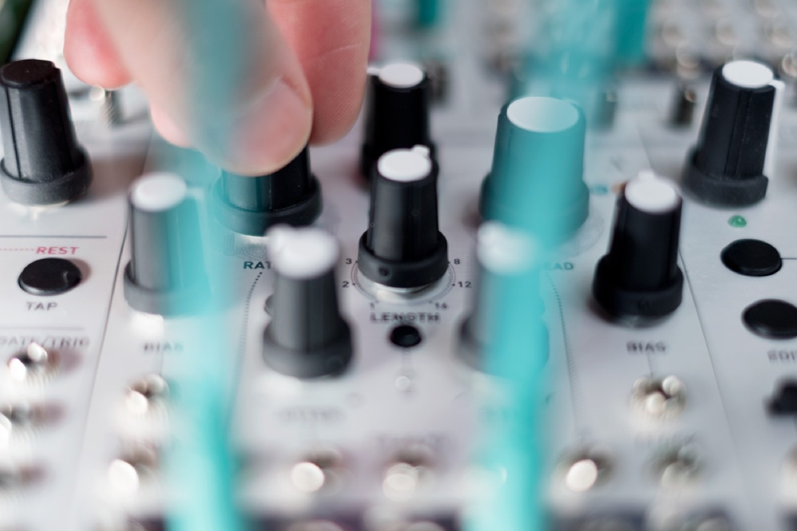

## Controlled chaos, repeatable randomness

Marbles is a **source of random gates and voltages**, which offers an extensive amount of (voltage) control on all the different flavors of randomness it produces.

The module gives the musician many different ways of **imposing structure on the random events** generated by the module: synchronization to external clocks, control of the repetition or novelty of the generated material, quantization of the voltages, or randomization of gates or voltages generated by traditional sequencers.

#### *t*: the random gate generator

Marbles either follows its own internal clock, or locks onto an adjustable multiplication/division of an external clock (or regular rhythmic pattern). This regular clock is perturbed by a process simulating an instrumentist playing along a click and trying to catch up on their errors - from perfect accuracy to complete chaos.

From this imperfect master clock, a **2-channel random rhythm** is generated, using one of the following processes: random coin toss (similar to [Branches](../branches)), random ratcheting, or random drum pattern generation (similar to a randomly modulated [Grids](../grids)).

#### *X*: the random voltage generator

This generator produces **3 channels of random voltages**, each of them clocked by the individual outputs of the *t* section, or by a common external clock signal.

Complete control on the distribution of the output voltages is provided: concentrated or spread-out, quantized or unquantized, smoothed or steppy, centered or biased towards a specific voltage. The same transformations can be performed on an external CV, for sample-and-hold or shift-register operation.

An **auxiliary slowly fluctuating random voltage** output (*Y*) is also available for self-patching fun!

## A feeling of déjà-vu...

Marbles remembers the history of every recent clock deviation, rhythm or voltage it has generated. The **DEJA VU** knob on the panel controls the probability of reusing past material instead of sampling fresh random data.

You are thus given control on the feeling of repetition and structure in the generated random voltages and rhythms. At the extreme, the module no longer generates any novel values and loops over the same pattern (or a random permutation of it). And of course, this (variably) random looping can be performed on external CVs!

