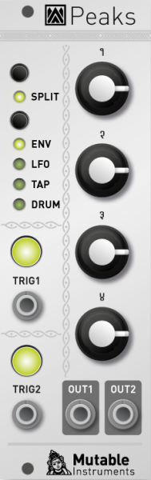

## Overview

Peaks is a two-channel, general-purpose, trigger processor: it translates incoming triggers or gates into envelopes, synchronized periodic modulations (LFO and tap-LFO), or drum signals. Peaks can also be directly "played" thanks to its two trigger buttons. Our goal with this module is to give you many different ways of modulating your patches in as little space as possible!

## Installation

Peaks is designed for Eurorack synthesizer systems and occupies 8 HP of space. It requires a **-12V/+12V** supply (2x5 connector), consuming 2mA from the -12V rail and 60mA from the +12V rail. The red stripe of the ribbon cable must be oriented on the same side as the "Red stripe" marking on the printed circuit board.

## Overview and controls

Peaks is a multi-function module, but the general rule is that cool things happen whenever a trigger is received. Its four main functions are:

-   **Envelope generator** - the gate/trigger input starts and holds the envelope.
-   **LFO** - the gate/trigger input resets the waveform cycle.
-   **LFO with tap-tempo synchronization** - the gate/trigger input sets the period of the LFO oscillations. Note that Peaks can "learn" irregular trigger sequences and lock onto them.
-   **Drum generator** - the gate/trigger input triggers the drum sound.

Peaks provides two channels of processing - each of them has a gate/trigger input jack, a gate/trigger button with an output indication LED, and an audio/CV output. Both channels provide the same function - the exception being channel 1's drum generator being a bass drum generator, and channel 2's drum generator being a snare drum/hi-hat generator.

Both channels can be "synchronized" (aka **twin** mode), in that they both share the same front panel controls - for example in ADSR envelope mode, the first knob will control both channel 1 and channel 2's attack time. This can be used not only to create duophonic patches (for which you actually want both channels to behave similarly), but also to obtain two synchronized outputs of the same LFO waveform with different phase shifts...

Another way of controlling the module is the **split** mode in which the potentiometers 1 and 2 control channel 1's settings; and the potentiometers 3 and 4 control channel 2's settings. This mode only gives access to the 2 most essential parameters of each function (for example attack and decay time for an envelope) - the other parameters being set to default "neutral" settings.

Finally, if breaking the *one knob per function* rule is not a taboo for you, an **expert** mode allows individual control of channel 1 and 2.

## Controls, inputs and outputs

The **split** button toggles between the **twin** (LED off) and **split** (LED on) modes. Hold it for a second to enter the **expert** mode. In this mode, the button toggles between channel 1 and 2. Hold it for a second to get back to normal operation.

The **FUNCTION** button cycles through the 4 main functions.

The 4 potentiometers modify the settings for the selected function. Please refer to the tables in the next section.

**TRIG 1&2** are channel 1 and 2's trigger inputs. The trigger threshold is 0.7V. Above each of these inputs is a switch that can be pressed to generate a trigger signal. The LED built into the switch shows the variations of the output signal.

Finally, **OUT 1&2** are channel 1 and 2's outputs.

## Parameters

**ENV** function, **twin & expert**:

-   Ch. 1&2 Attack
-   Ch. 1&2 Decay
-   Ch. 1&2 Sustain
-   Ch. 1&2 Release

**ENV** function, **split**: Dual A/D envelope generator

-   Ch. 1 Attack
-   Ch. 1 Decay
-   Ch. 2 Attack
-   Ch. 2 Decay

**LFO** function, **twin & expert**:

-   Ch. 1&2 Frequency
-   Ch. 1&2 Waveform (sine, linear slope, square, steps, random)
-   Ch. 1&2 Waveform variation (wavefolder for sine; ascending/triangle/descending balance for slope, pulse-width for square, number of steps, and interpolation method)
-   Ch. 1&2 Phase on restart

**LFO** function, **split**:

-   Ch. 1 Frequency
-   Ch. 1 Waveform
-   Ch. 2 Frequency
-   Ch. 2 Waveform

**TAP** function, **twin & expert**:

-   Ch. 1&2 Amplitude
-   Ch. 1&2 Waveform
-   Ch. 1&2 Waveform variation
-   Ch. 1&2 Phase on restart

**TAP** function, **split**:

-   Ch. 1 Waveform
-   Ch. 1 Waveform variation
-   Ch. 2 Waveform
-   Ch. 2 Waveform variation

**DRUM** function, **twin & expert**:

-   Ch. 1&2 Base frequency
-   Ch. 1&2 Frequency modulation ("Punch" for BD, "Tone" for SD)
-   Ch. 1&2 High-frequency content ("Tone" for BD, "Snappy" for SD)
-   Ch. 1&2 Decay

**DRUM** function, **split**: The original 808 sweet spot!

-   Ch. 1 BD Tone
-   Ch. 1 BD Decay
-   Ch. 2 SD Tone
-   Ch. 2 SD Snappy

## For advanced users only

### Four more things

Hold the FUNCTION button for one second (it starts blinking). Peaks now provides four alternative functions instead of envelope/LFO/tap LFO/drum generation. These functions are:

-   Mini step-sequencer (4-step in twin mode, 2-step in split mode)
-   Trigger delay/shaper
-   Trigger stream randomizer
-   Digital drum synth

### Parameters

Alternative **ADSR** function, **twin & expert**: 4-step minisequencer. Each knob controls a step. Channel 1 is clocked by **TRIG 1** and reset by **TRIG 2**. Channel 2 is clocked by **TRIG 2**:

-   Ch. 1&2 Step 1
-   Ch. 1&2 Step 2
-   Ch. 1&2 Step 3
-   Ch. 1&2 Step 4

Alternative **ADSR** function, **split**: Dual 2-step minisequencer. Knobs 1&2 control channel 1's steps, knobs 3&4 channel 2's steps. There is no reset, and each channel has its clock.

-   Ch. 1 Step 1
-   Ch. 1 Step 2
-   Ch. 2 Step 1
-   Ch. 2 Step 2

Alternative **LFO** function, **twin & expert**:

-   Ch. 1&2 Pre-delay
-   Ch. 1&2 Gate duration
-   Ch. 1&2 Delay
-   Ch. 1&2 Number of repeats

Alternative **LFO** function, **split**:

-   Ch. 1 Delay
-   Ch. 1 Number of repeats
-   Ch. 2 Delay
-   Ch. 2 Number of repeats

Alternative **TAP** function, **twin & expert**:

-   Ch. 1&2 Probability that an incoming trigger is processed
-   Ch. 1&2 Probability that the trigger is regenerated after the delay
-   Ch. 1&2 Delay time
-   Ch. 1&2 Jitter

Alternative **TAP** function, **split**:

-   Ch. 1 Acceptance/regeneration probability
-   Ch. 1 Delay
-   Ch. 2 Acceptance/regeneration probability
-   Ch. 2 Delay

Alternative **DRUM** function, **twin & expert**:

-   Ch. 1&2 frequency
-   Ch. 1&2 FM intensity
-   Ch. 1&2 FM and AM envelope decay time (the FM envelope has a shorter decay than the AM envelope, but the two values are tied to this parameter)
-   Ch. 1&2 Color. At 12 o'clock, no modification is brought to the oscillator signal. Turn right to increase the amount of noise (for snares). Turn left to increase the amount of distortion (for 909 style kicks).

Alternative **DRUM** function, **split**:

-   Ch. 1 BD presets morphing
-   Ch. 1 BD presets variations
-   Ch. 2 SD presets morphing
-   Ch. 2 SD presets variations

##  Firmware update procedure

Connect the output of your audio interface/sound card to the **TRIG1** input. Power on your modular system with Peaks' **TRIG1** button pressed. The **split**, **TRIG1**, and **TRIG2** LEDs will blink.

Make sure that no additional sound (such as email notification sounds, background music etc.) from your computer will be played during the procedure. Make sure that your speakers/monitors are not connected to your audio interface - the noises emitted during the procedure are aggressive and can harm your hearing. On non-studio audio equipment (for example the line output from a Desktop computer), you might have to turn up the gain to the maximum.

When you are all set, play the firmware update file into the module. The LEDs show a cyclic pattern and periodically flash upon receiving a valid block of data. The unit reboots after the last packet has been received.

In case the signal level is inadequate or too high, the procedure will stop and the LEDs will blink alternatively. Press the **TRIG1** button and retry from the start of the update file.
