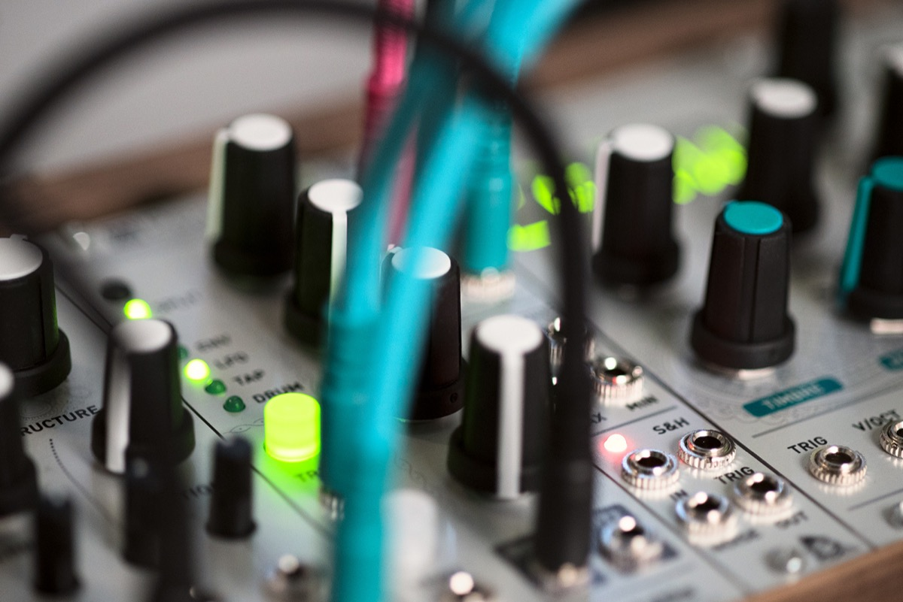

## A swiss-army knife for percussive patches

Peaks provides 4 different functions in a small 8-HP package: ADSR, LFO / Tap tempo LFO, and drum synth.

Their common point? They are all about generating an audio or CV signal in response to a trigger, and are all focused on rhythmic works.

Peaks is a dual-channel module – making it very useful for duophonic patches or for controlling/synthesizing the kick/snare rhythmic backbone of a patch.

