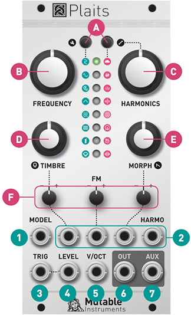
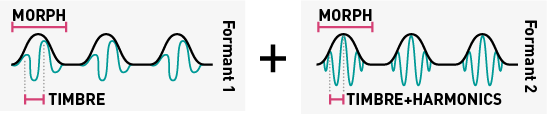
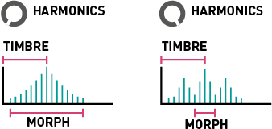
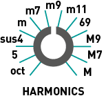
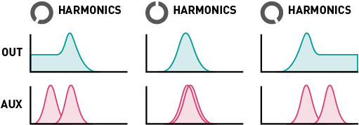

## Installation

Plaits requires a **-12V/+12V** power supply (2x5 pin connector). The red stripe of the ribbon cable (-12V side) must be oriented on the same side as the “Red stripe” marking on the module and on your power distribution board.
The module draws **50mA** from the **+12V** rail, and **5mA** from the **-12V** rail.

## Front panel

### Controls

**A. Model selection buttons** and LEDs displaying the active model. Each button cycles through a bank of 8 models. The second bank is focused on noisy and percussive sounds.

**B. Coarse frequency control.** By default, it covers a range of 8 octaves, but it can be narrowed down to 14 semitones (refer to the **FREQUENCY** knob range section).

**C. D. E. Model-dependent tone controls.** Their actual function varies from model to model. In general, **TIMBRE** sweeps the spectral content from dark/sparse to bright/dense, **MORPH** explores lateral timbral variations and **HARMONICS** controls the frequency spread or the balance between the various constituents of the tone.

**F. Attenuverters** for the **TIMBRE**, **FM** and **MORPH** CV inputs. When the corresponding CV input is left unpatched and the trigger input **[3]** is patched, the attenuverter adjusts the modulation amount from the internal decaying envelope generator. When unplugging a CV input, and if the trigger input is patched, remember to reset the attenuverter to 12 o’clock if you do not want the internal envelope to take over!

### Inputs and outputs

**1. Model selection CV input.** When this CV input is modulated, two LEDs are lit: the steadily lit LED indicates the current model, and the slowly blinking LED indicates the central value, which would be obtained with a CV of 0V and which is still modifiable with the buttons **[A]**.

Note that when the trigger input **[3]** is patched, model changes occur only whenever a trigger is received.

**2. CV inputs** for the timbre, frequency, morph and harmonics parameters.

**3. Trigger input.**  Serves four percussive purposes:

- Triggers the internal decaying envelope generator.
- Excites the physical and percussive models.
- Strikes the internal low-pass gate (unless the **LEVEL** CV input **[4]** is patched).
- Samples and holds the value of the **MODEL** CV input.

**4. Level CV input.** Opens the internal low-pass gate, to simultaneously control the amplitude and brightness of the output signal. Also acts as an accent control when triggering the physical or percussive models.

**5. V/Oct CV input.** Controls the fundamental frequency of the sound, from -3 to +7 octaves relative to the root note set by the coarse frequency knob **[B]**.

**6. 7. Outputs.** The **AUX** output carries a variant, sidekick, or by-product of the main signal produced on **OUT**.

## Settings

### Adjusting the internal LPG and envelope

Hold the first button **(A)** and:

* Turn the **TIMBRE** knob to adjust the response of the LPG, from VCFA to VCA.
* Turn the **MORPH** knob to adjust the ringing time of the LPG and the decay time of the internal envelope.

The value of both settings are represented by 4 yellow LEDs.

### Adjusting the **FREQUENCY** knob range

Hold the second button **(A)** and turn the **HARMONICS** knob to adjust the range of the **FREQUENCY** knob. The first 8 settings correspond to **C0 +/- 7** semitones, **C1 +/- 7** semitones, and so on. The last setting, with all LEDs lit, corresponds to the **full 8-octave range** from C0 to C8.

After having turned the **HARMONICS**, **TIMBRE** or **MORPH** knob to adjust a setting, the position of the knob might no longer match the original value of the corresponding parameter. When this happens, the response curve of the knob is modified to account for this discrepancy, until the position of the knob and the parameter perfectly line up again!

## Synthesis models

Virtual-analog synthesis of classic waveforms.

**HARMONICS:** detuning between the two waves.

**TIMBRE:** variable square, from narrow pulse to full square to hardsync formants.

**MORPH:** variable saw, from triangle to saw with an increasingly wide notch (Braids’ `CSAW`).

**AUX:** sum of two hardsync’ed waveforms, the shape of which is controlled by **MORPH** and detuning by **HARMONICS**.

A **narrow pulse** or **wide notch** results in **silence**! Use this trick if you want to silence one of the two oscillators, to get a variable square or variable saw.

* * *

An asymmetric triangle processed by a waveshaper and a wavefolder. Sounds familiar? That's the same signal processing chain as in [Tides](../tides), when it runs at audio rate!

**HARMONICS:** waveshaper waveform.

**TIMBRE:** wavefolder amount.

**MORPH:** waveform asymmetry.

**AUX:** variant employing another wavefolder curve, as available in [Warps](../warps).

* * *

Two sine-wave oscillators modulating each other's phase.

**HARMONICS:** frequency ratio.

**TIMBRE:** modulation index.

**MORPH:** feedback, in the form of operator 2 modulating its own phase (past 12 o’clock, rough!) or operator 1’s phase (before 12 o’clock, chaotic!).

**AUX:** sub-oscillator.

**Note:** turn **MORPH** fully CCW to get the same range of sounds as Braids' **WTFM**. Turn **MORPH** fully CW to recreate the same sounds as Braids' **FBFM**. A gentler palette equivalent to Braids' **FM** is found with **MORPH** at 12 o'clock.

* * *

Simulation of formants and filtered waveforms through the multiplication, addition and synchronization of segments of sine waves.

**HARMONICS:** frequency ratio between formant 1 and 2.

**TIMBRE:** formant frequency.

**MORPH:** formant width and shape. This controls the shape of the window by which a sum of two synchronized sine oscillators is multiplied.

**AUX:** simulation of filtered waveforms by windowed sine waves – a recreation of Braids’ `Z***` models. **HARMONICS** controls the filter type (peaking, LP, BP, HP), with smooth variation from one response to another.

* * *

An additive mixture of harmonically-related sine waves.

**HARMONICS:** number of bumps in the spectrum. Starts with one big bump, and progressively adds ripples around it.

**TIMBRE:** index of the most prominent harmonic. This control is somewhat similar to the cutoff frequency of a band-pass filter.

**MORPH:** bump shape – from flat and wide to peaked and narrow. This control is somewhat similar to the resonance of a band-pass filter.

**AUX:** variant including only the subset of harmonics present in the drawbars of a Hammond organ (frequency ratios of 1, 2, 3, 4, 6, 8, 10 and 12).

* * *

Four banks of 8x8 waveforms, accessed by row and column, with or without interpolation.

**HARMONICS:** bank selection. 4 interpolated banks followed by the same 4 banks, in reverse order, without interpolation.

- Bank A: harmonically poor waveforms obtained by additive synthesis (sine harmonics, drawbar organ waveforms).
- Bank B: harmonically rich waveforms obtained by formant synthesis or waveshaping.
- Bank C: wavetables from the Shruthi-1 / Ambika, sampled from classic wavetable or ROM playback synths.
- Bank D: a joyous semi-random permutation of waveforms from the other 3 banks.

**TIMBRE:** row index. Within a row, the waves are sorted by spectral brightness (except for bank D which is a mess!).

**MORPH:** column index.

**AUX:** low-fi (5-bit) output.

* * *

Four-note chords, played by virtual analogue or wavetable oscillators. The virtual analogue oscillators emulate the stack of harmonically-related square or sawtooth waveforms generated by vintage string&organ machines.

**HARMONICS:** chord type.

**TIMBRE:** chord inversion and transposition.

**MORPH:** waveform. The first half of the knob goes through a selection of string-machine like raw waveforms (different combinations of the organ and string "drawbars"), the second half of the knob scans a small wavetable containing 16 waveforms.

**AUX:** root note of the chord.

* * *

A collection of speech synthesis algorithms.

**HARMONICS:** crossfades between formant filtering, SAM, and LPC vowels, then goes through several banks of LPC words.

**TIMBRE:** species selection, from Daleks to chipmunks. How does it work? This parameter either shifts the formants up or down independently of the pitch; or underclocks/overclocks the emulated LPC chip (with appropriate compensation to keep the pitch unchanged).

**MORPH:** phoneme or word segment selection. When **HARMONICS** is past 11 o'clock, a list of words can be scanned through by turning the **MORPH** knob or by sending a CV to the corresponding input. One can also patch the trigger input **[3]** to trigger the utterance of a word, use the **FM** attenuverter to control the intonation and the **MORPH** attenuverter to control speed.

**AUX:** unfiltered vocal cords’ signal.

* * *

A swarm of 8 enveloped sawtooth waves.

**HARMONICS:** amount of pitch randomization.

**TIMBRE:** grain density.

**MORPH:** grain duration and overlap. When this setting is fully CW, the grains merge into each other: the result is a stack of eight randomly frequency-modulated waveforms.

**AUX:** variant with sine wave oscillators.

To get a nice "supersaw" waveform, try a moderate amount of pitch randomization and grain density, with full grain overlap.

* * *

Variable-clock white noise processed by a resonant filter. The cutoff frequency of the filter is controlled by the **FREQUENCY** knob and the **V/OCT** CV input. This allows proper tracking!

**HARMONICS:** filter response, from LP to BP to HP.

**TIMBRE:** clock frequency.

**MORPH:** filter resonance.

**AUX:** variant employing two band-pass filters, with their separation controlled by **HARMONICS**.

* * *

Dust noise processed by networks of all-pass or band-pass filters.

**HARMONICS:** amount of frequency randomization.

**TIMBRE:** particle density.

**MORPH:** filter type – reverberating all-pass network before 12 o’clock, then increasingly resonant band-pass filters.

**AUX:** raw dust noise.

* * *

For your own pleasure, a mini-Rings! Please refer to the [Rings manual](../rings/manual/) for more information about modulated/inharmonic string synthesis, and modal resonators.

When the **TRIG** input is not patched, the string/resonator is excited by dust (particle) noise. Otherwise, the string is excited by a short burst of filtered white noise, or by a low-pass filtered click.

**HARMONICS:** amount of inharmonicity, or material selection.

**TIMBRE:** excitation brightness and dust density.

**MORPH:** decay time (energy absorption).

**AUX:** raw exciter signal.

Note that Plaits uses a less powerful processor than Rings, and is thus limited to 3 voices of polyphony in inharmonic string modeling mode, and 1 voice of polyphony with 24 partials in modal resonator mode. Plaits does not allow you to control the position of the excitation, which is set to 25% of the length of the string/bar/tube.

* * *

No fancy acronyms or patented technology here... Just behavioral simulation of circuits from classic drum machines! The drum machine emulated on **OUT** employs a bridged T-network excited by a nicely shaped pulse. As for the signal synthesized on **AUX**, it uses a frequency-modulated triangle VCO, turned into a sine with a pair of diodes, and shaped by a dirty VCA.

**HARMONICS:** attack sharpness and amount of overdrive.

**TIMBRE:** brightness.

**MORPH:** decay time.

Without any signal patched to the **TRIG** input, a continuous tone is produced. Not particularly useful, but its amplitude can still be modulated by the **MORPH** knob and CV input!

* * *

The drum machine emulated on **OUT** employs a bunch of bridged T-networks, one for each mode of the shell, excited by a nicely shaped pulse; plus some band-pass filtered noise. As for the signal synthesized on **AUX**, it is based on a pair of frequency-modulated sine VCO, mixed with high-pass filtered noise.

**HARMONICS:** balance of the harmonic and noisy components.

**TIMBRE:** balance between the different modes of the drum.

**MORPH:** decay time.

* * *

The recipe is similar for both **OUT** and **AUX**: a bunch of square oscillators generate a harsh, metallic tone. The resulting signal is mixed with clocked noise, sent to a HPF, then to a VCA. While **OUT** uses 6 square oscillators and a dirty transistor VCA, **AUX** uses three pairs of square oscillators ring-modulating each other, and a clean, linear VCA.

**HARMONICS:** balance of the metallic and filtered noise.

**TIMBRE:** high-pass filter cutoff.

**MORPH:** decay time.

* * *

    

The physical and drum models employ their own decay envelope and filter. The internal LPG is disabled for them:

* The **TRIG** input triggers the synthesis of the signal, but doesn't strike the LPG.
* When the **TRIG** input is patched, the **LEVEL** input works as an accent control.

* * *

## Advanced topics

### Calibration procedure

To calibrate the unit:

1.  Disconnect all CV inputs.
2.  Connect the note CV output of a well-calibrated keyboard interface or MIDI-CV converter to the **V/OCT** input. Leave all the other CV inputs unpatched.
3.  Press both buttons **(A)**. The first LED slowly blinks in green.
4.  Send a voltage of 1.000V to the **V/OCT** input.
5.  Press any button. The first LED now blinks in orange.
6.  Send a voltage of 3.000V to the **V/OCT** input.
7.  Press any button.

###  Firmware update procedure

Unplug all CV inputs/outputs from the module. Connect the output of your audio interface/sound card to the **MODEL** CV input. Set the **FREQUENCY** knob to 12 o'clock. Power on your modular system with the **left** model selection button **(A)** pressed.

Make sure that no additional sound (such as email notification sounds, background music etc.) from your computer will be played during the procedure. Make sure that your speakers/monitors are not connected to your audio interface - the noises emitted during the procedure are aggressive and can harm your hearing. On non-studio audio equipment (for example the line output from a desktop computer), you might have to turn up the gain to the maximum.

When you are all set, play the firmware update file into the module. While the module receives data, the first group of 4 LEDs will act as vu-meter (2 or 3 LEDs are lit when the signal level is optimal), while the remaining 4 LEDs represent which proportion of the current packet has been received. Try adjusting the **FREQUENCY** knob to adjust gain. When the end of the audio file is reached, the module automatically restarts - if it is not the case, please retry the procedure from the beginning.

In case the signal level is inadequate, all LEDs will blink in red. Press the button **(A)** and retry with a higher gain. If this does not help, please retry the procedure from another computer/audio interface, and make sure that no piece of equipment or software effect (equalizer, automatic gain control, FX processor) is inserted in the signal chain.

* * *

## Common issues

### The module makes odd clicking sounds

The module is set to the lowest frequency range. Check the *Adjusting the **FREQUENCY** knob range* section of this manual.

### The **TRIG** input does not work

The calibration procedure has been entered by mistake while the **TRIG** input was patched. Follow carefully the calibration procedure to re-calibrate the module.

### Two LEDs are lit, one of them blinking

When the module displays two LEDs, it means that it reads a non-zero voltage on the MODEL CV input. There are several reasons why the module would read a non-zero voltage on the MODEL CV input even if nothing is plugged into it:

1. The CV input circuitry is not working correctly because one supply rail is missing. 1. The symptom for a missing -12V supply is that the last red LED is always lit, and the module produces no sound.
2. The CV input circuitry is not operating in the same conditions as in the factory, because the -12V rail deviates from more than 5% from this voltage.
3. The calibration procedure has not been run correctly, or it has been entered by accident. The module will have "learnt" that a non-null voltage present on the input corresponds to 0V.

