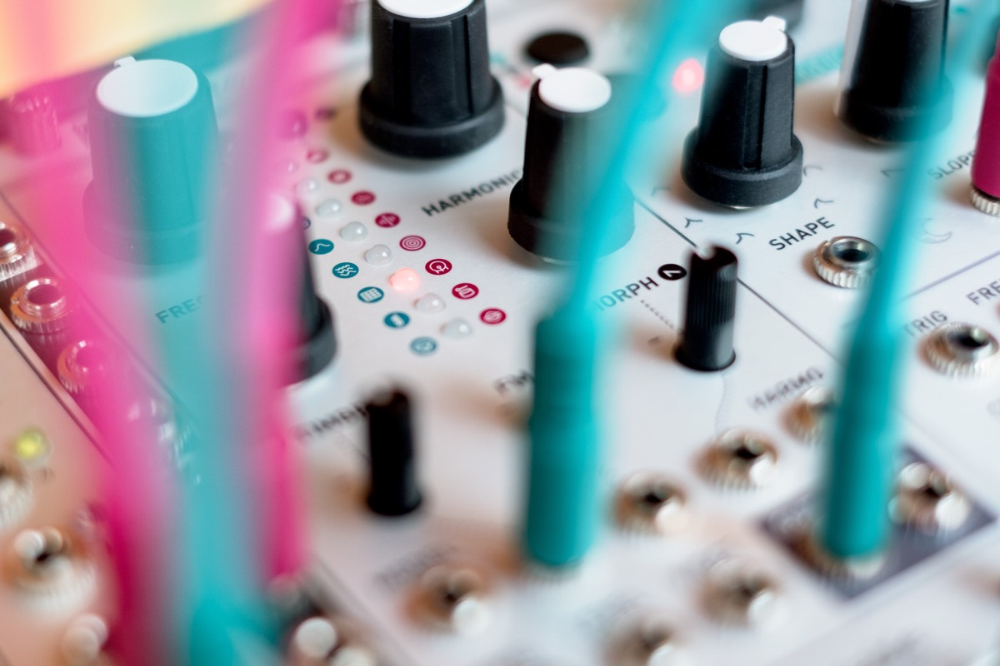

## Rebooting a classic

Plaits is the spiritual successor of Mutable Instruments' best-selling voltage-controlled sound source, Braids. Not just a mkII version: its hardware and software have been redesigned from scratch.

Just like its predecessor, it offers direct access to a large palette of easily tweakable raw sonic material, covering the whole gamut of synthesis techniques.

## Simplicity first

Gone are the screen, menu system, hidden settings, and the long list of somewhat redundant synthesis models.

Thanks to additional CV inputs, and to the use of three timbre-shaping parameters per model, Plaits is straightforward to use, and much closer to the ideal of one synthesis technique = one model. What were fragmented islands of sound in Braids are now part of a continuum of sounds.

## Ready for percussion

Patch a trigger generator or sequencer into Plaits' trigger input and instantly use the module as a percussive source thanks to its built-in virtual low-pass gate (LPG).

An internal D (decay) envelope generator is normalled to all unpatched CV inputs. Just turn the corresponding attenuverter to add pitch, timbre or morphing modulation. And if plucks and snappy hits are not your thing, patch your own envelope or CV source into the LPG CV input.

