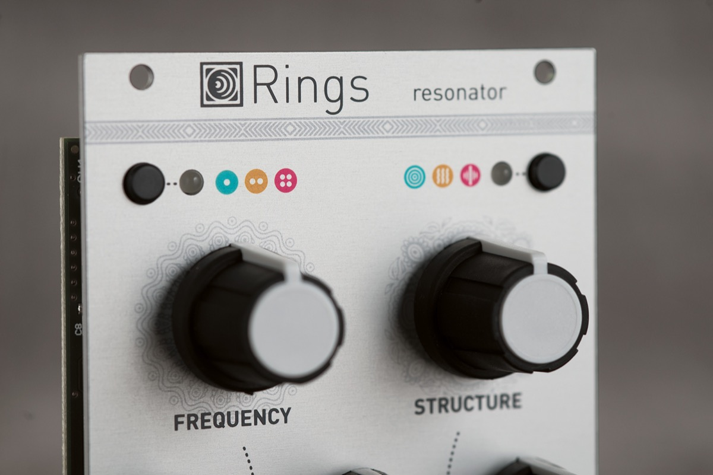
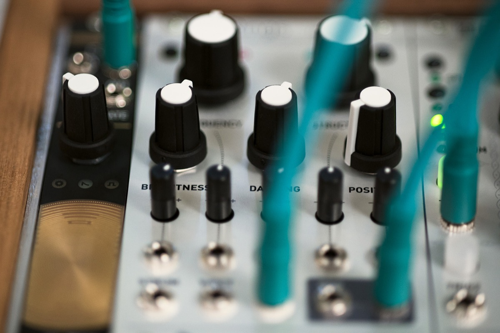

## The physical modelling building block

Rings brings physical modelling synthesis to your Eurorack system, from a more modular angle than Braids' models or Elements.

Instead of trying to be a complete instrument, Rings focuses on the key ingredient, the resonator, ready to be excited by envelope clicks, trigger pulses, granular noise or any other audio source produced by the rest of your system.

Three families of vibrating structures are simulated by the module, with CV control over their parameters:

* Strings, membranes and tubes as modelled by Elements' resonator section (modal synthesis).
* Strings coupled together and vibrating in sympathy, with controllable intervals between them.
* Strings with a variable amount of inharmonicity.

Rings can be configured so that each new note is played on its own virtual string, while the previously played note(s) still decay(s). This unique take on polyphony allows the module to play strummed chords.

