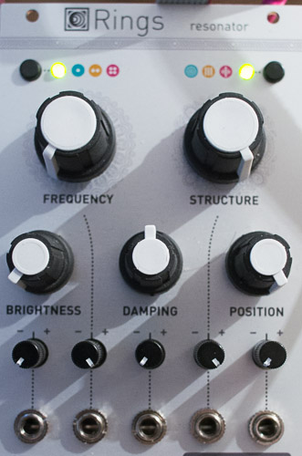

## Alternate modes

### 3-voice polyphony

Hold the polyphony button for a few seconds. This enables a 3 voice polyphonic mode in which the notes bounce between the ODD / EVEN outputs according to an 8-step rhythmic pattern (`O E E O E E O E`).

### Alternate resonator models

#### 2-op FM

aka **"It's still Bessel functions!"**

Hold the model selection button when modal synthesis is active (green).

* **STRUCTURE** = frequency ratio.
* **BRIGHTNESS** = FM index.
* **DAMPING** = FM index and amplitude decay.
* **POSITION** = Feedback path (no feedback at 12 o'clock).
* **IN** goes into an envelope follower changing FM index and output amplitude.

This is the same implementation of 2-op FM found in Plaits!

#### Western chords

Hold the model selection button when sympathetic strings model is active (orange).

The sympathetic strings are no longer tuned to perfect fifths or octaves, but instead, to chords.

**STRUCTURE** = chord.

#### Karplusverb

Hold the model selection button when non-linear string model is active (red).

This is similar to the original model, but with a reverb, the absorption and decay of which follow those of the string.

### Easter egg

**Disastrous peace**, an Organ/String machine synth, loosely based on the Roland RS-09

Adjust the knobs to match this picture:

Hold the model selection button for a few seconds. Note that the very same procedure should be used to leave the easter egg.

**Polyphony button** = chord size. From 10-note fat chords which cannot overlap because they eat all the polyphony voices... to 3-note chords which can overlap with the previous ones when they are retriggered. In other words, that's the maximum number of successive chords which can overlap - 1, 2 or 4.

**Model selection button** = FX. Long press to get a variation on the FX. Green = formant filter (less abrasive variant). Yellow = Rolandish chorus (Solinaish ensemble). Red = Caveman reverb (shinier variant).

* **FREQUENCY** = root note.
* **STRUCTURE** = chord type.
* **BRIGHTNESS** = scans through various registrations sorted by brightness. Each registration is a different mixture of octaves of square and sawtooth waves.
* **DAMPING** = decay time, then attack time. Drones continuously when turned fully clockwise.
* **POSITION** = FX amount.

The **STRUM** input triggers the envelope and allocates a new group of voices for the chord - and the previously played chord can still be heard if the "polyphony" setting is set to 2 or 4.

The **V/OCT** input controls the root note. If nothing is patched in the **STRUM** input, sudden changes on this input will also trigger the envelope / voice allocation.

**IN** is simply routed to the FX processor.
