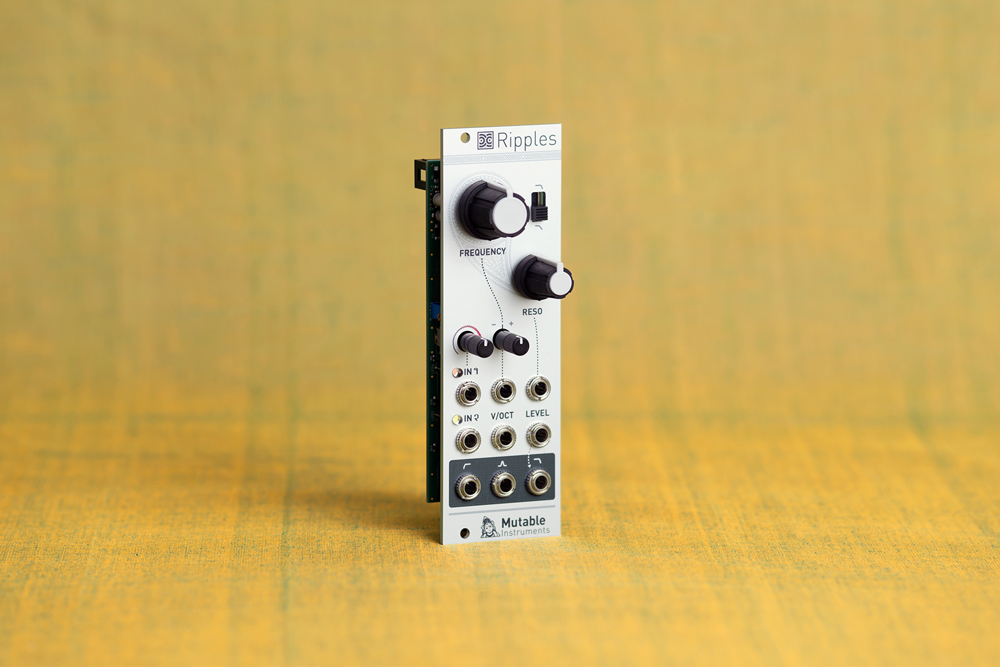
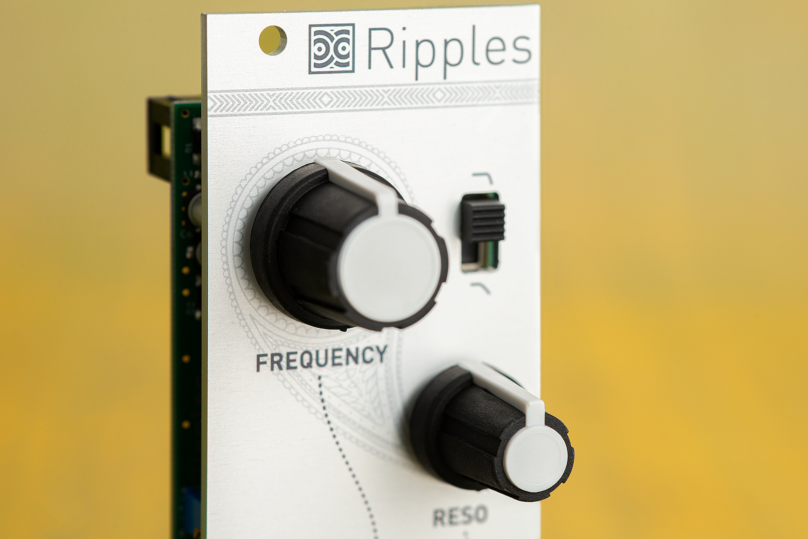

## It filters.

Ripples is a classic, big-sounding analog four-pole filter in a small 8-HP package. Over the years it has earned its reputation as a no-fuss, elegant choice.

Ripples has two input paths: one with a drive control, allowing the signal to be distorted (or providing enough gain for the processing of line-level signals), and the other totally transparent, preserving the clean-sounding character of the original version of the module.

Three filter modes are available: high-pass, band-pass, and low-pass. The slope (2 or 4 poles) of the band-pass and low-pass outputs is switchable.

Self-oscillation is available for all modes and produces a clean sine-wave on the low-pass output. Unlike many classic 4-pole designs, this filter does not suffer from "loudness drop" when resonance is increased. The resonance loudness compensation circuit bripples a slight tone coloration reminiscent of Japanese classics from the 80s, with a very round and *liquid* resonance.

The low-pass output goes through an internal VCA. This makes Ripples a good final stage module for an inexpensive, or space-constrained, subtractive synthesis synth voice.

