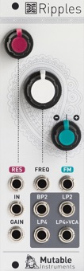

[TOC]

## Key data

*Liquid filter*

Parameter    | Value
-------------|------
Width        | 8HP
Depth        | 25mm
+12V current | 35mA
-12V current | 35mA
Lifetime     | 08/13 to 04/20
Modulargrid  | [Link](https://www.modulargrid.net/e/mutable-instruments-ripples)

## Original printed manual

[PDF download](downloads/ripples1_quickstart.pdf)

## Features

### A multimode filter

* 2-pole band-pass.
* 2-pole low-pass.
* 4-pole low-pass.
* 4-pole low-pass processed by an internal VCA - the perfect "end of subtractive chain" output!

### All the CV inputs you need

* Un-attenuated frequency CV, calibrated for 1V/Oct tracking of the self-oscillation tone over 4 octaves.
* Frequency CV with attenuverter.
* Resonance CV. Self oscillation starts at 4V. Control voltages above 5V are non-linearly compressed, for fine control of resonance overdrive.
* VCA level for the LP4>VCA output.

### Specifications

* Cutoff knob range: 18Hz to 18kHz.
* Fully analog, based on the V2164 low noise/distortion quad VCA chip, and LM13700 OTA for that extra bit of non-linearity.
* Frequency CV inputs impedance: 100k.
* Audio input impedance: 75k.
* Resonance and VCA CV input impedance: 30k.
* All CV inputs handle audio-rate modulations.

## Revisions and variants

### 2015

Hardware revision labelled "v4" with the following differences:

* Thonkiconn jacks.
* FM attenuverter has no center detent.
* Calibration trimmer soldered on the same side as the jacks, accessible from the side.
