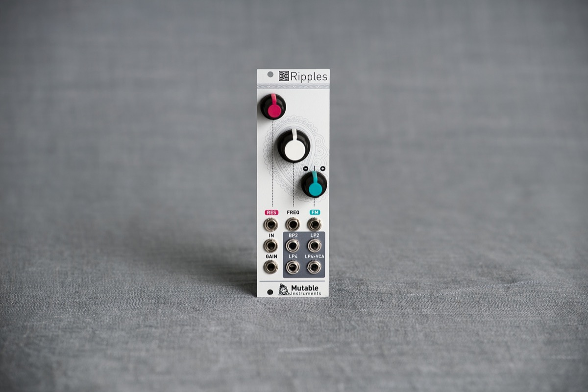

## There's a million fat-sounding Eurorack filters out there... but they don't all bring you lasagna at work.

Ripples delivers a classic, big-sounding analog four-pole filter in a small 8-HP package, continuing Mutable Instruments' lineage of warm and tasty filters started by the Shruthi SMR4 mkII and 4-Pole Mission.

3 filter modes are available: 2-pole band-pass, 2-pole low-pass, and 4-pole low-pass.

Self-oscillation is available for all modes and produces a clean sine-wave on the LP4 output. Unlike many classic 4-pole designs, this filter does not suffer from "loudness drop" when resonance is increased. The resonance loudness compensation circuit bripples a slight tone coloration reminiscent of the Roland SH/Jupiter filters, with a very round and "liquid" resonance.

The 4-pole low-pass output is additionally sent to a VCA. This makes Ripples a good final stage module for an inexpensive/space-constrained subtractive synthesis synth voice.

