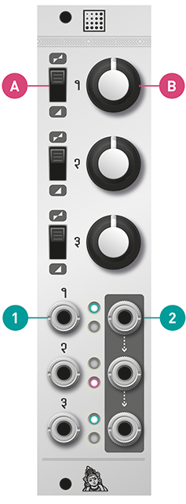
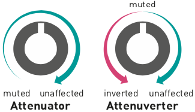

## Installation

Shades requires a **-12V/+12V** power supply (2x5 pin connector). The red stripe of the ribbon cable (-12V side) must be oriented on the same side as the “Red stripe” marking on the module and on your power distribution board.
The module draws **15mA** from both the **+12V** and **-12V** supply rails.

## Controls, inputs and outputs

Each of the 3 channels of Shades can act as an attenuator or attenuverter.

**A. Function selector** This switch configures the channel as an attenuator (lower position) or as an attenuverter (upper position).

**B. Attenuator/attenuverter** If the channel is configured as an attenutor, the gain ranges from 0 to 1. The signal is muted when the knob is turned fully counter-clockwise, and is passed without attenuation when the knob is turned fully clockwise.

If the channel is configured as an attenuverter, the gain ranges from -1 to +1. The signal is inverted when the knob is turned fully counter-clockwise, and is passed without attenuation when the knob is turned fully clockwise. When this knob is set at 12 o'clock, the signal is muted.

**1. Signal input.** When nothing is patched into this input, a constant voltage of +5V (or +10V) is sent to the attenuverter/attenuator. Thus, a constant voltage of adjustable level and polarity will be generated on the output. The three jumpers at the back of the module select which voltage is sent to each of the three inputs - +5V, +10V, or +0V (when the jumper is removed).

**2. Signal output** When no patch cable is plugged into an output, the signal from this channel is routed to the next channel. For example, when no patch cable is patched into output 1, output 2 will contain the sum of channel 2 and channel 1. If nothing is patched into outputs 1 and 2, output 3 will contain the sum of all three channels.

The turquoise (upper) LED indicates the intensity of the positive half of the signal, while the pink (lower) LED indicates the intensity of the negative half of the signal. Both LEDs have an equal intensity for a bi-polar signal without a DC offset.

## Patch examples

### Mixing

When output 1 is left unconnected, the signal on output 2 is the sum of channels 1 and 2. Channel 3 can be used for another purpose (attenuation, attenuversion, or constant CV generation).

When output 1 and 2 are left unconnected, the signal on output 3 is the sum of channels 1, 2 and 3.

### Offset generation

Because Shades' outputs are daisy-chained, the module can be used as an offset generator.

1. Leave channel 1's input and output unpatched.
2. Connect a CV source to channel 2's input.
3. Channel 2's output will contain a scaled and offset copy of the input signal. Use channel 1's knob to adjust the offset, and use channel 2's knob to adjust the amplitude and polarity of the CV.
