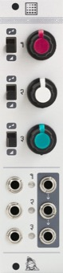

[TOC]

## Key data

*Attenuator/offset/mixer*

Parameter    | Value
-------------|------
Width        | 6HP
Depth        | 25mm
+12V current | 15mA
-12V current | 15mA
Lifetime     | 02/15 to 04/20
Modulargrid  | [Link](https://www.modulargrid.net/e/mutable-instruments-shades-)

## Original printed manual

[PDF download](downloads/shades1_quickstart.pdf)

## Features

### Useful in every patch

* Mix audio sources or CVs.
* Add offsets to CVs, or change their polarity.

### A companion for other modules

* Transpose the output of a sequencer without compromising V/O tracking.
* Attenuate/invert CVs sent to modules which do not have attenuverters on their CV inputs.
* Control with a knob parameters of other modules that are only accessible through CV inputs (like Just Friends' **RUN** or the Dixie's **PW**).

### Specifications

* Input impedance: 100k.
* All inputs DC-coupled.
* Low-distortion audio op-amps and thin film 0.1% resistors improve transparency in audio mixing applications, and allow exact unitary gains for precision summing of pitch CV signals.
* Stable and precise voltage reference, independent of power supply fluctuations.

## Revisions and variants

An initial batch of 250 units was made by a dubious CM in the US, only a small fraction of which has been sold. The next batches were made in France at the end of 2014.

### 2014

Hardware revision labelled "v3" with the following differences:

* Green PCB (originally black).
* Thonkiconn jacks.
