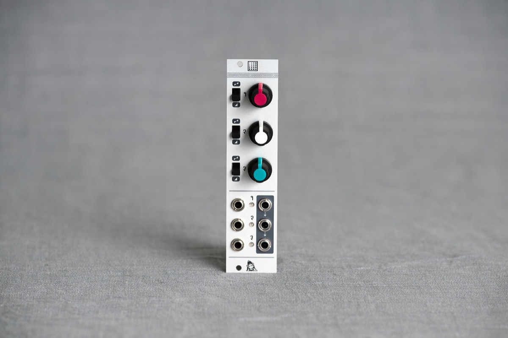
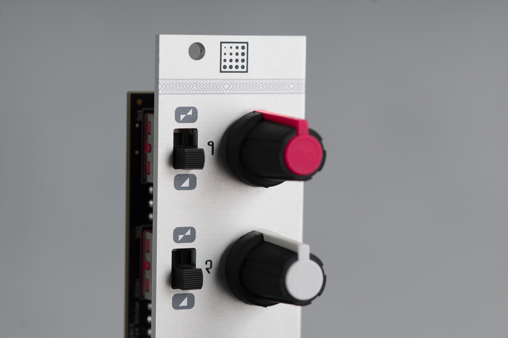

## The mixer/attenuverter that does not get in the way

Shades provides 3 channels of audio/CV processing which can be configured either as active attenuators or as attenuverters.

Unconnected inputs are normalized to an internal precision voltage reference, which can produce either a +5V or +10V constant voltage.

Shades' outputs are daisy-chained, allowing adjacent groups of 2 or 3 channels to be mixed together.

