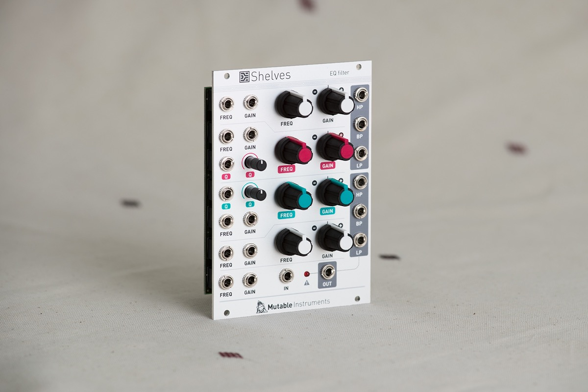

## Frequency-domain BILLY

Shelves brings to Eurorack modular systems something we are all very familiar with: the 4-band parametric EQ typically found in console channel strips. But this time, there's CV control!

The first band is a low-pass shelving filter, the fourth band a high-pass shelving filter, and bands #2 and #3 have full-blown parametric controls with bandwidth (Q) adjustment. All analog.

Shelves will provide a subtler spectral shaping and coloring than standard multimode filters. It is particularly useful in the feedback loop of effects or more generally in feedback patches in which the slightest tonal change has drastic consequences.

Or as a novel way of shaping sounds obtained by west-coast techniques. Or as a formant-ish filter. Or to emulate the body of instruments in the context of physical modelling patches...

Unlike console EQs, each band is not restricted to a narrow range of frequencies: it can be swept across the entire audio range, from 20 Hz to 20kHz – with unexpected phase cancellations or reinforcements when corrections compete in the same frequency range.

All parameters have direct CV control. Global frequency and cut/boost CV inputs allow simultaneous CV control of all channels.

