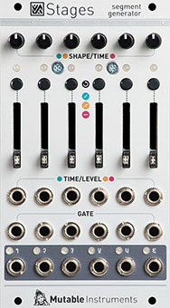

[TOC]

## Key data

*Segment generator*

Parameter    | Value
-------------|------
Width        | 14HP
Depth        | 25mm
+12V current | 80mA
-12V current | 20mA
Lifetime     | 03/18 to 07/22
Modulargrid  | [Link](https://www.modulargrid.net/e/mutable-instruments-stages)
Processor    | STM32F373RBT6 @ 72 MHz
DAC          | DAC8168

## Original printed manual

[PDF download](downloads/stages_quickstart.pdf)

## Features

### Flexible input/output layout

The module detects the presence of jacks on its gate inputs to group its segments: whether it is configured as a complex 6-stage envelope, or 6 individual envelopes, or 3+3, 2+4... depends simply on how you patch it. Dummy patch cables might come handy!

When used as a multi-segment envelope, a segment activation signal is produced on all secondary outputs - for example to trigger an external event when an ADSR envelope enters its decay, sustain or release stages.

In case more than 6 segments are required, up to six modules can be chained together thanks to a connector at the back of the module.

### Three segment types

* **Ramp** segments go from one voltage to another, in a CV-controlled amount of time, with an adjustable curve (accelerating, uniform, decelerating). They are the building block used for the attack, decay or release segments in envelopes... or for LFOs.
* **Hold** segments stay at a constant (but CV-controllable) voltage for a programmable amount of time. They serve as the sustain or hold segments in envelopes.
* **Step** segments glide to a target (CV-controllable) voltage, then stay at this voltage for a certain amount of time until a trigger is received. They are the main ingredient for step sequences, but also for building sequential switches or a sample-and-hold.

### Looping

A segment, or a group of segments, can loop on itself: if the last segment of the envelope is included in the loop, the loop lasts forever. Otherwise, the loop remains active while the gate is high, then continues past the last segment of the loop. These two behaviors allow the creation of self-looping envelopes (LFOs), or the sustain stage of a good old ADSR envelope!

### Single segment processing

Even when they aren't part of any group and don't receive any gate or trigger signals, individual segments can perform interesting functions: **Ramp** can loop on itself and turn into an LFO, **Hold** can delay a CV and **Step** can slew it.

Now patch a trigger signal: the self-looping **Ramp** turns into a tempo-synced LFO, the **Hold** segment becomes a pulse generator, the **Step** segment a sample-and-hold.

### Specifications

* CV output: from 0V to +8V. A negative CV down to -8V can be generated by a **Hold** or **Step** segment if this segment is CV modulated.
* Segment duration from 1ms to 16s.
* All inputs: 100k impedance, DC to 2kHz.
* 31.25kHz refresh rate.
* 16-bit CV capture, 14-bit CV generation with accurate software calibration. Error below 2mV.
