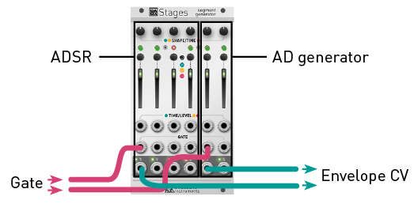
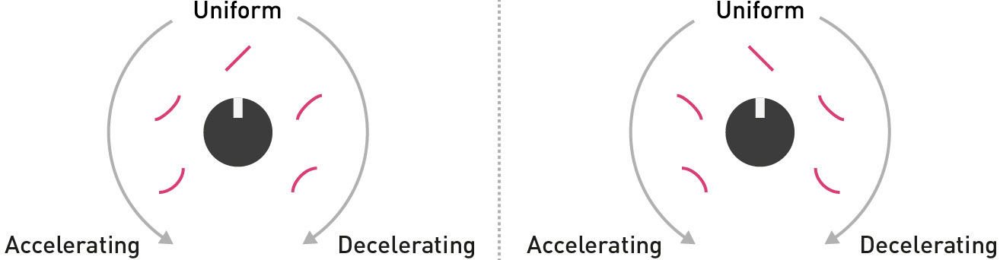
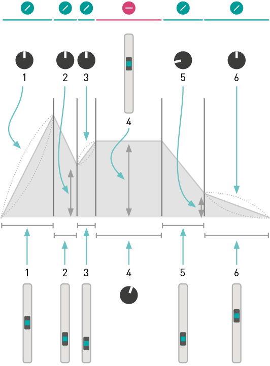

## Installation

Stages requires a **-12V/+12V** power supply (2x5 pin connector). The red stripe of the ribbon cable (-12V side) must be oriented on the same side as the “Red stripe” marking on the module and on your power distribution board.
The module draws **80mA** from the +12V rail, and **20mA** from the -12V rail.

## Chaining modules

Use the 3-pin cables provided with the modules to daisy-chain up to six modules together. Make sure your Eurorack system is powered off whenever you connect or disconnect units from the chain. Once several adjacent modules are linked, they behave collectively like a single **Stages** module which would have a larger number of segments.

## Grouping segments

Whether **Stages** behaves like six independent decay envelopes, or a single 6-segment envelope generator, or something in-between, depends on which of its **GATE** inputs are patched.

Inserting a jack in a **GATE** input marks the beginning of a group of segments. All unpatched segments at its right become part of this group. The first output of a group generates the envelope signal itself. The following outputs generate segment activity signals – ramps going from 8V to 0V whenever the corresponding segment is active.

In the illustration below, **GATE inputs 1 and 5 are patched**. The module behaves as:

* **A 4-segment envelope generator**, configured by segments 1 to 4, generating its envelope signal on output 1, and segment activity signals on outputs 2, 3, and 4.
* **An independent 2-segment envelope generator**, configured by segments 5 and 6, generating the envelope signal on output 5, and an end-of-attack signal on output 6.

What happens if only **GATE** input 5 is patched? Segments 5 and 6 act as a 2-segment envelope generator; and segments 1, 2, 3 and 4 are four independent free-running generators. Even if these four independent generators do not receive gates or triggers, looping can be enabled for them, turning them, for example, into four LFOs.

A few more examples:

* **No GATE input is patched**: Segments 1 to 6 are all independent, free running segments.
* **GATE inputs 1, 3 and 5 are patched**: Three independent 2-segment envelopes.
* **GATE inputs 1, 5 and 6 are patched**: One 4-segment envelope and two single-segment envelopes.
* **All GATE inputs are patched**: Six independent single-segment envelopes.

#### Tips

When building a patch, patch from right to left. For example, starting from a blank page, if you need an AD envelope, patch your gate signal into the **GATE** input of segment 5 – leaving you segments 1 to 4 for LFOs, utility functions... or other envelopes.

Self-patching is rewarding with **Stages**! For example, configure segment 1 as an independent, free running LFO to modulate other segments.

It is sometimes handy to use "dummy" patch cables (or just a jack with no cable attached to it). For example, if you have created a 6-segment envelope spanning segments 1 to 6, and if you want to change its shape to a classic 4-segment ADSR, patch a dummy cable into input 5 to "detach" segments 5 and 6 from the chain starting at segment 1.

#### Segment activity signals

The illustration below shows the signals produced on outputs 1 to 4, assuming the module is used as a 4-segment ADSR (segments 5 and 6 are used for other duties).

## Configuring segments

Press the button **[B]** to modify the action performed by a segment.

The output **smoothly ramps from one voltage to another**, then the next segment is activated. The ramping time is controlled by the slider **[C]** and the CV input **[1]**. The shape of the curve is controlled by the potentiometer **[A]**, from accelerating, through uniform, to decelerating.

The following illustration shows how these shapes can be combined for an AD envelope:

The output **glides to the target voltage**, stays at this voltage until a trigger is received, and then the next segment is activated. Just like a step in a sequence! The voltage (from 0V to 8V) is controlled by the slider **[C]** and the CV input **[1]**. The glide amount is set by the potentiometer **[A]**.

The output **stays at the same voltage for an adjustable duration**, then the next segment is activated. The voltage (from 0V to 8V) is controlled by the slider **[C]** and the CV input **[1]**. The duration of the segment is set by the potentiometer **[A]**.

To make a segment loop on itself, hold the button **[B]** for one second. The LED now blinks to indicate the loop.

To create a loop spanning several segments within the same group, simultaneously press the button **[B]** of the first and last segments in the loop. The corresponding LEDs will blink with a “ping pong” pattern.

To disable a loop, hold the button **[B]** of either the start or end segment of the loop.

**Important:** a loop can only span segments belonging to the same group. And what defines groups? The presence of jacks in the **GATE** input! For example, if you want to use **Stages** as 3 self-looping AD envelopes, you'll need to insert "dummy" patch cables into the inputs #1, #3, #5 to explicitly tell the module that segments 1 and 2, 3 and 4, 5 and 6 are grouped together.

## Segment rules

1. The first **RAMP** segment ramps up to 8V, starting from whatever level the output currently stays at.
2. The last **RAMP** segment ramps down to 0V.
3. The level of a **HOLD** or **STEP** segment defines the start (end) level of the RAMP segment that follows (precedes) it. For example, in the preceding illustration, the end level of segment 3, and the start level of segment 5 are both set by the level of the **HOLD** segment 4.
4. If the end level of a **RAMP** segment cannot be determined by rules 1, 2 or 3, this level is explicitly set by the potentiometer **[A]**. For example, in the preceding illustration, the end level of segments 2 and 5 are set by their potentiometer.
5. If a **LOOP** is defined, the loop is played while the **GATE** signal is high. Once the **GATE** goes low, the envelope proceeds with the segment(s) that follow the loop end point. If the loop end is the last segment, there’s no escape from the loop, and the loop keeps going on forever.
6. If the envelope contains a **STEP** segment, it follows its course normally until it gets trapped at the first **STEP** segment. It will stay at this segment until the next trigger is received. When this trigger is received, it will then proceed to the next segment... until the last segment or another **STEP** segment is reached. If an envelope contains a **STEP** segment inside a loop, there is no way of escaping this loop!

## Single segment processing

As a direct consequence of the segment rules (with a few tweaks!), an independent, isolated segment can perform a variety of interesting functions.

A non-looping single **RAMP** segment is a Decay envelope generator, with its decay time adjusted by the slider **[C]** and CV input **[1]**, and its curve adjusted by the potentiometer **[A]**.

A looping single **RAMP** segment behaves like an LFO, the waveform of which is controlled by the potentiometer **[A]**. Instead of the simple logarithmic/linear/exponential curves, a more sensible selection of waveforms is provided: variable slope saw/triangle, sine, variable slope trapezoid. If the **GATE** input is not patched, the LFO frequency is set by the slider **[C]** and CV input **[1]**. If the **GATE** input is patched, the LFO follows the tempo set by the **GATE** signal, with a clock division/multiplication factor from 1/4 to 4 set by the slider.

A single **STEP** segment works as a sample and hold: at every rising edge of the **GATE**, it records and holds the voltage set by the slider **[C]** and CV input **[1]**. Use the potentiometer **[A]** to change the glide rate.

If nothing is patched in the **GATE** input, the slider and CV input will be continuously tracked, but will still be subject to the glide effect.

If the **GATE** input is patched, an independent **HOLD** segment behaves as a pulse generator. The slider **[C]** and CV input **[1]** set the pulse voltage, while the potentiometer **[A]** controls the pulse duration. If looping is enabled, the pulse lasts for as long as the gate signal is high.

If the **GATE** input is not patched, the segment behaves as a CV delay. The voltage set by the slider **[C]** and CV input **[1]** is sent to the output with a delay set by the potentiometer **[A]**.  Even without an external CV patched into the input, you can use this as a slider-controlled CV source with delayed action.

## Examples

Many envelope shapes can be programmed with Stages. The arrows denote the loop region.

Classic ADSR envelope.

Classic ADSR envelope with an adjustable pre-delay and initial level.

ADSR envelope with a non-zero rest level, adjusted by the last **HOLD** segment. The CV output for the last segment can be used as an end-of-release trigger.

AHDSR envelope – the hold level and time are controlled by the second segment.

AD1D2SR envelope with a break point between the apex and sustain. The potentiometer **[A]** of the second segment controls the voltage at this break point.

An even more complex AD1D2SR1R2 envelope, with break points at both the decay and the release stages.

AD envelope.

AR envelope. The sustain level is set by the HOLD segment.

A trapezoid LFO, with the minimum and maximum level and plateau durations set by the segment 2 and 4; and the time and curve of the ramp set by the segment 1 and 3.

A 5-note sequence. Modify the loop points to loop on a subset of this sequence. Patch external voltages into the CV inputs of each stage, to turn this into a 5-stage sequential switch.

A 3-note sequence, with adjustable linear glide between each step.

## Advanced topics

###  Firmware update procedure

Unplug all CV inputs/outputs from the module. Connect the output of your audio interface/sound card to the **TIME/LEVEL** CV input **(1)** of the **last segment**. Set the **TIME/LEVEL** slider **[C]** of the last segment to an intermediate position. Power on your modular system with the last segment action selection button **(B)** pressed.

Make sure that no additional sound (such as email notification sounds, background music etc.) from your computer will be played during the procedure. Make sure that your speakers/monitors are not connected to your audio interface - the noises emitted during the procedure are aggressive and can harm your hearing. On non-studio audio equipment (for example the line output from a desktop computer), you might have to turn up the gain to the maximum.

When you are all set, play the firmware update file into the module. While the module receives data, the six LEDs will act as vu-meter (3 or 4 LEDs are lit when the signal level is optimal). Try moving the **TIME/LEVEL** slider to adjust gain. When the end of the audio file is reached, the module automatically restarts - if it is not the case, please retry the procedure from the beginning.

In case the signal level is inadequate, all LEDs will blink in red. Press the button **(B)** and retry with a higher gain. If this does not help, please retry the procedure from another computer/audio interface, and make sure that no piece of equipment or software effect (equalizer, automatic gain control, FX processor) is inserted in the signal chain.
