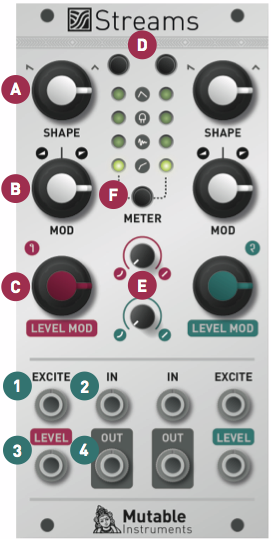
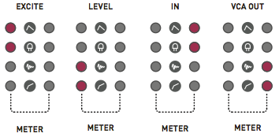
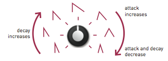

## Overview

Streams provides two channels of extremely flexible signal dynamics manipulation.

When we perceive a sound as "loud", or conversely "soft", amplitude is not the only factor at play - the spectral content itself should be taken into account. A "dull" timbre, as obtained with a low-pass filter removing high harmonics, will sound softer than a "bright" timbre. This intuition inspired Don Buchla to design the so-called "Low-pass gate" - a circuit combining the effects of an amplifier and low-pass filter - as an electronic mean of reproducing the concept of dynamics in music.

This very same motivation explains why the core circuit in Streams is an analogue, voltage-controlled filter and amplifier (VCFA). More accurately: two of them since Streams is a dual module! What is very specific to Streams is the way the cutoff frequency and gain of the VCFAs are controlled: a multi-purpose control signal input, called **EXCITE**, is analyzed by a microcontroller to generate and emulate various gain and frequency control schemes:

-   Envelope generation: the gain and frequency are controlled by an internal envelope generator tuned to produce the natural attack/decay curve of acoustic instruments. The envelope is triggered by a pulse on the **EXCITE** input.
-   Vactrol emulation: the **EXCITE** input is fed into a digital model of a resistive opto-isolator (vactrol). This generates a slow, moody, non-linear response.
-   Envelope and filter follower: the signal on the **EXCITE** input is analyzed, and its envelope and cutoff frequency are extracted and applied to the signal on the audio input.
-   Dynamics compression: the signal on the **EXCITE** input is used as a side-chain to limit the gain of the input signal, just as a sidechain compressor would do. In the absence of a signal on the **EXCITE** input, the module operates like a compressor/limiter.

It is of course possible to bypass the digital control section and directly drive the amplitude through a dedicated analog CV input - but by doing so you'll be missing some of the fun!

## Installation

Streams is designed for Eurorack synthesizer systems and occupies 12 HP of space. It requires a **-12V/+12V** supply (2x5 connector), consuming 30mA from the -12V rail and 100mA from the +12V rail. The red stripe of the ribbon cable must be oriented on the same side as the "Red stripe" marking on the printed circuit board.

## Controls, inputs and outputs

**A. Channel envelope shape.** This knob controls the overall attack and decay characteristics of the selected function - for example envelope times, and vactrol or envelope followers reaction time.

**B. Channel modulation amount.** This knob adjusts the amount of brightness (cutoff frequency) modulation applied to the signal, in addition to amplitude modulation.

**C. Channel amplitude modulation CV.** This is an attenuator for the **LEVEL** CV input, which is directly routed to the amplitude control port of the VCFA.

**D. Channel function selector.** Press the button to display the current function of a channel, and press again to cycle through the four functions.

**E. Channel amplitude response curve.** This adjusts the response of the VCA, from exponential to linear.

**F. Metering button.** Press the button to show the bargraphs. Press again to select which signal is to be monitored.

**1. EXCITE input.** Audio or CV are accepted. This is a multi-purpose control port, its function depends on the selected mode!

**2. Signal input.** Audio and CV are accepted. When no jack is inserted in this input, a +3.3V signal is internally routed to the VCFA. This allows the module to be used for CV generation - for example to generate an AD envelope or for envelope following.

**3. Level input.** This input is directly wired to the amplitude control section of the VCFA, allowing the channel to be used as a VCA in the most straightforward way. This signal is attenuated by the **LEVEL MOD** knob. When no jack is inserted in this input, a +8V signal is internally generated. The **LEVEL MOD** knob will thus work like an offset control.

**4. Signal output.**

## Metering

The 2-channel LED bargraph can be used to monitor the level of the inputs and outputs.

If the display is not showing the bargraph - for example if it is showing the current function of one of the two channels - press the **METER** button to bring it back.

When the bargraph is active, press the **METER** button to cycle between the 4 visualization modes: 

Note that the arrangement of the LEDs mirrors the arrangement of the physical inputs/outputs of the channel 1 of the module.

The module detects whether an input signal is a CV or an audio signal. When the signal is a CV, the length of the bar is proportional to the CV level. The 4 bars are lit for a CV of 8V. The LEDs are green or red depending on the polarity of the signal. When the signal is an audio signal the maximum level corresponds to 16V pp, and then each LED represents a level change of 6dB, with the lower two LEDs lit in green and the upper two lit in orange and red.

When the compressor mode is active, when monitoring the output level, the bargraph will display the amount of gain reduction rather than the final output level.

## Changing channel functions.

Press channel 1 or 2's function selection button to disable the bargraph display, and then to cycle through the four functions.

The next section explain in details how each function operates.

In this mode, amplitude and brightness are controlled by an internal envelope generator. The envelope is triggered by sending a trigger pulse to the **EXCITE** input. Properties of the trigger pulse - such as its amplitude, duration, and slew rate are taken into account to bring variations to the envelope shape. 

The **SHAPE** knob controls the envelope shape. Over the first half of the course of the knob, envelopes with immediate attacks and increasingly long decay times are available. Over the second half, the attack progressively increases as decay shortens, producing envelopes more typical of brass instruments. 

The **MOD** knob controls how the brightness (filter cutoff frequency) is affected by the envelope. Starting from the minimum setting, turning the knob clockwise will progressively increase the amount of envelope modulation on the brightness - with the maximum amount reached when the knob is at noon. Then, turning the knob will reduce the envelope amount, but will compensate by adding an offset. Thus, at 7 o'clock, there is no modulation and the filter is fully closed; and at 5 o'clock, there is no modulation and the filter is fully opened.

Tip: adjust the VCA response curve, from exponential to linear, for more variations.

Tip: unplug the IN jack. This will patch a constant +3.3V source to the IN input, and the module will directly output the internal envelope. Adjust the MOD knob for subtle variations in slew-rate; and of course the exponential/linear control!

This mode emulates the mysterious response of a resistive opto-isolator (vactrol).

The **SHAPE** knob controls the slowness of the vactrol. Over the first half of the course of the knob, the decay time of the vactrol increases, with a relatively small, proportional increase of the attack time. Over the second half of the course of the knob, stranger contours are produced, in which the vactrol responds "backwards".

The **MOD** knob controls how much the brightness (filter cutoff frequency) follows the amplitude change to further damp the sound. Starting from the minimum setting, turning the knob clockwise will progressively increase the amount of filter damping - with the maximum amount reached when the knob is at noon. Then, turning the knob will reduce the damping, but will compensate by adding an offset. Thus, at 7 o'clock, there is no modulation and the filter is fully closed; and at 5 o'clock, there is no modulation and the filter is fully opened.

Tip: the model is correct when the VCA response curve is set to linear - but who cares about correctness?

Tip: unplug the IN jack. A "vactrolized" version of the signal on the **EXCITE** input will be produced on the **OUT** output.

In this mode, the signal on the **EXCITE** input is analyzed to extract two pieces of information: its amplitude envelope, and its spectral centroid. The spectral centroid is a number indicating how "bright" a sound is. With a bit of hand-waving, we could say that if the sound had been made with a low-pass filter, this would be its cutoff frequency! The spectral centroid will be low for "dark" sounds, and high for "bright" sounds.

The two extracted parameters - envelope and centroid - are routed to the amplitude and frequency CV of the VCFA. As a result, the signal routed to the IN input is modulated in amplitude and brightness to mimic the signal on the EXCITE input. This gives a totally new dimension to the concept of an envelope follower!

The **SHAPE** knob controls the reaction time of the envelope follower. Over the first half of the course of the knob, the detector goes from fast to muddy. Over the second half ot the course of the knob, the detector goes from muddy to wobbly.

The **MOD** knob controls how much the brightness (filter cutoff frequency) follows the EXCITE audio signal. Starting from the minimum setting, turning the knob clockwise will progressively increase the amount of cutoff modulation - with the maximum amount reached when the knob is at noon. Then, turning the knob will reduce the damping, but will compensate by adding an offset. Thus, at 7 o'clock, there is no modulation and the filter is fully closed; and at 5 o'clock, there is no modulation and the filter is fully opened.

This mode is crazy and we have plenty of tips!

-   Send the same signal to both the IN and **EXCITE** input to get a strange gating/expansion effect.
-   Play with the log/lin response knob or with the **LEVEL** knob (used as an offset) to get gating effects.
-   Set the **MOD** knob to its maximum setting, unplug the IN jack, and get an envelope follower signal on the **OUT**.

Now some technical details... The module does more than extracting the envelope of the EXCITE signal. It splits it into 3 frequency bands (bass - 100 Hz, mids - 1kHz, and highs - 8kHz) and detects the envelope in each band - with different attack and release times tailored for each band. These envelopes are then recombined to produce a single envelope. This detection process makes the envelope more representative of the events contained in the audio stream. For example, consider a signal with crisp drums playing on top of a loud drone. A traditional envelope follower wouldn't show much variation, because the waveform is dominated by the drone. Band-wise processing makes the detection process more sensitive to the drums.

The spectral centroid is approximated by weighting the signal RMS level in each of these 3 bands.

This mode operates as a dynamics compressor. It requires the channel VCA response curve to be set to exponential (full counter-clockwise position) - otherwise the linear VCA won't be able to create the extreme gains required for compression; and the **LEVEL MOD** knob to be set to its minimal position (unless you want weird things to happen!).

The **EXCITE** input works as a sidechain - when a signal is detected on the **EXCITE** input, its level determines the amount of gain reduction applied to **IN**. Do not plug anything in the **EXCITE** input, and the module will work like a normal compressor on the **IN** signal. Please note that it takes about ten seconds for the module to detect that the **EXCITE** input has gone AWOL.

The attack and release times are 0.2ms and 150ms respectively. 

The **MOD** knob does something quite interesting. At 12 o'clock, no compression is applied. From 12 o'clock, turning the knob counter-clockwise, will progressively increase the compression ratio, until a ratio of 25:1 is reached. Since no make-up gain is applied, this has the effect of taming the loudest parts of the signal. From 12 o'clock, tuning the knob clockwise, will progressively increase the compression ratio and will apply a matching amount of make-up gain. This has the effect of pumping the quietest parts of the signal, while leaving peaks untouched.

## (You really asked for it)

### Five more things

Hold channel 1 or 2's function selection button to access a bank of 5 alternate functions. The function indicator LED is lit in red to indicate that the second bank is active. The 5 functions are:

-   AR Envelope. This is a variant of the envelope mode in which the envelope has a sustain and release phase, rather than just an attack and decay.
-   Plucked vactrol. An alternate vactrol model in which the **EXCITE** input acts as a trigger input, pinging the virtual vactrol.
-   Cutoff controller. This variant of the follower only tracks the cutoff level of the input signal, and maps it onto the amplitude of the IN signal. By leaving the IN input unpatched, you can generate a cutoff CV on OUT - and route it to the filter of your choice.
-   Softer, slower compressor. This variant has a softer attack and release time, and a soft knee.
-   Direct VCF control (all LEDs lit). In this mode, **EXCITE** works as a CV input routed to the VCF section of the VCFA. **SHAPE** behaves as a cutoff frequency control; and **MOD** behaves as an attenuverter for the **EXCITE** CV input.

### Siamese twins mode

Hold channel 1 and 2 function selection button simultaneously to link the two channels. In this mode the two channel LEDs will alternately blink. The two channels will operate in the same mode and will share the same attack/release time - which can now be independently controlled. The attack time is set by channel 1's **SHAPE** knob ; and the decay/release time by channel 2's **SHAPE** knob.

In compressor mode, you gain complete control over all parameters:

-   Channel 1 **SHAPE** -&gt; Attack time.
-   Channel 2 **SHAPE** -&gt; Release time.
-   Channel 1 **MOD** -&gt; Threshold.
-   Channel 2 **MOD** -&gt; Ratio & Makeup.

###  Firmware update procedure

Connect the output of your audio interface/sound card to channel 1's **EXCITE** input. Power on your modular system with channel 1's function selection button pressed. The four LEDs on the left side of the bargraph will blink in orange. Set the channel 1's **SHAPE** knob in its middle position.

Make sure that no additional sound (such as email notification sounds, background music etc.) from your computer will be played during the procedure. Make sure that your speakers/monitors are not connected to your audio interface - the noises emitted during the procedure are aggressive and can harm your hearing. On non-studio audio equipment (for example the line output from a Desktop computer), you might have to turn up the gain to the maximum.

When you are all set, play the firmware update file into the module. The LEDs show a cyclic pattern and periodically flash upon receiving a valid block of data. The right side of the bargraph shows the signal level. When the end of the audio file is reached, the module automatically restarts - if it is not the case, please retry the procedure.

In case the signal level is inadequate or too high, the procedure will stop and the LEDs will blink in RED. Press channel 1's function selection button to retry. The input gain can be adjusted with channel 1's **SHAPE** knob. The upgrade procedure works optimally when 2 green LEDs and 1 orange LED are lit on the right side of the bargraph.

## Calibration procedure

The symptoms of a miscalibration are the following:

-   The bagraphs display inaccurate values - for example a LED is lit when you monitor a silent channel.
-   There is some faint signal ("bleed") even if the level of a channel ought to be null.

If this happens, please follow this procedure:

### Step 1: Inputs calibration.

Set the response curve **(E)** of both channels to linear.

Plug 6 patch cables into all inputs, while leaving the other end of the cable unconnected. Hold the METER button for 1s. The bargraphs show a "C" letter. The bargraphs are now calibrated.

### Step 2: Channel 1 offset calibration.

(The bargraphs are still showing a "C" letter)

Connect the output of an oscillator to channel 1 input. Monitor the signal on channel 1 output and adjust channel 1's shape potentiometer until you reach a point where the faint signal you can hear (bleed) disappears. The ideal position is the point at which the bleed just starts disappearing.

### Step 3: Channel 2 offset calibration.

(The bargraphs still showing a "C" letter)

Same as step 2, but for channel 2. Once you are done, press any button to write the settings and leave the calibration mode.
