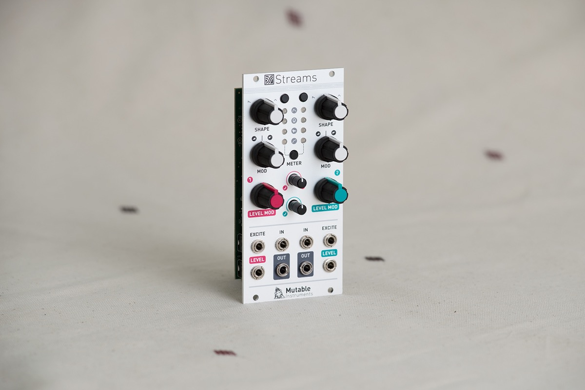
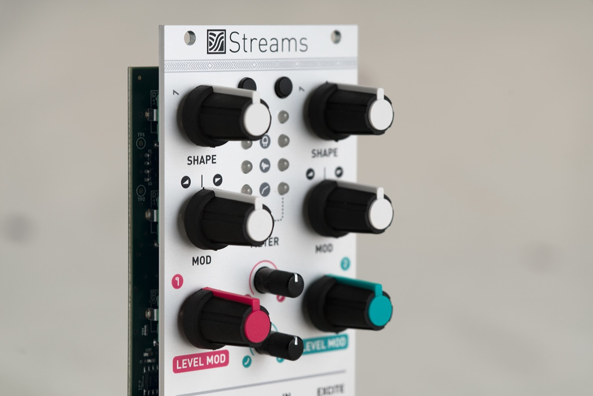

## A VC(F)A with a brain

Streams provides two channels of extremely flexible signal dynamics manipulation.

Each channel consists of an analog voltage-controlled filter and amplifier (VCFA). The response curve of the amplifier section is continuously variable from exponential to linear. The amplifier gain is directly controllable from a CV input, through an attenuator. But what makes Streams truly unique is the multi-purpose **EXCITE** input.

The signal routed to this input is analyzed by a micro-controller and translated into internal control voltages for the VCFA, turning Streams into a very versatile signal contouring tool.

