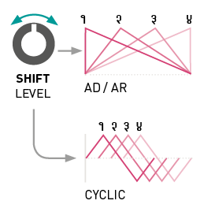

## About Tides

**Flow**: a voltage goes up.

**Ebb**: a voltage goes back down to its initial level.

All the functions performed by Tides are variations on this theme. Make ebb and flow cyclic and you have an LFO or VCO. Do it just once in reaction to a trigger and you have an attack/decay or attack(/sustain)/release envelope.

## Installation

Tides requires a **-12V/+12V** power supply (2x5 pin connector). The red stripe of the ribbon cable (-12V side) must be oriented on the same side as the “Red stripe” marking on the module and on your power distribution board.
The module draws **50mA** from the **+12V** rail, and **20mA** from the **-12V** rail.

## Front panel

### Controls

**A. Frequency range.** Selects the central value of the **FREQUENCY** knob: 1/8 Hz (movements), 2 Hz (rhythms and modulations), or 130.8 Hz (audible tones).

**B. Output mode.** Selects the relationship between the four signals generated on Tides’ four outputs. Refer to the next section for more details.

**C. Ramp mode.**

 One-shot unipolar AD envelope generation.

 Cyclic bipolar oscillations.

 One-shot unipolar AR envelope generation.

**D. Frequency.** Spans a range of ±4 octaves around the central value set by the frequency range button **[A]**. The direction of this knob is reversed compared to the rate control you would find on classic envelope generators: when the one-shot AD or AR mode is selected, turn clockwise for faster envelopes, and counter-clockwise for slower envelopes.

**E. Shape** of the ascending and descending segments.

**F. Ratio** between the durations of the ascending and descending segments. Classic envelope generators have separate attack and decay controls. With Tides, one first adjusts how fast the whole envelope will complete (with **FREQUENCY**), then adjusts how much of this time is spent on the decay or release relatively to the attack (with **SLOPE**).

**G. Waveshape transformation.** From 12 o’clock to 7 o’clock (counter-clockwise), a 2-pole low-pass filter is applied to smooth the edges of the waveform. From 12 o’clock to 5 o’clock (clockwise), a wavefolder adds kinks and bumps along the slope.

**H. Output polarization and shifting.** Depending on the output mode selected by **[B]**, this knob either adjusts the amplitude and polarity of the first output (LED B off), or the shift in amplitude/time/frequency between each of the four outputs (LED B lit).

**I. Attenuverters** for the CV inputs.

### Inputs and outputs

**1. CV inputs** for Slope, Frequency, Smoothness, Shape and Shift. Two inputs affect the frequency: the frequency modulation CV input, which applies exponential FM with an amount set by the attenuverter, and V/OCT, which follows the Volt/octave scale.

**2. Trigger/Gate input.** In AD mode, a trigger will reset the envelope to 0V and initiate an attack/decay cycle. No matter how short the trigger is, the attack/decay cycle will always complete.

In cyclic mode, a trigger will reset the oscillator so that it starts a new ascending phase.

In AR mode, the rising edge of the gate will cause the envelope to raise to +8V from its current value, and the falling edge of the gate will cause the envelope to fall to 0V from its current value – the same way an ADSR envelope with a null decay time and a 100% sustain level would behave.

**3. Clock input** for tempo or frequency-locked operation. When this input is patched, the **FREQUENCY** knob controls the ratio between the frequency of the signal sent to this input, and the frequency of the signals generated by Tides.

**4. Outputs.** Refer to the next section.

## Output modes

In this mode, the four outputs produce four different waveshapes taken throughout Tides’ signal processing chain.
**SHIFT/LEVEL** acts as an attenuverter on the main signal.

In this mode, the **SHIFT/LEVEL** knob selects to which output the signal is sent, with smooth crossfading between adjacent outputs. It is thus possible to route Tides’ signal to different destinations.

In this mode, the **SHIFT/LEVEL** knob shifts in time the apex of the waveform. This effect is achieved by applying a different **SLOPE** setting to each output (in **AD** or **AR** mode), or by applying a phase shift between each output (in cyclic mode).

In this mode, the **SHIFT/LEVEL** knob adjusts the frequency ratio between each output. At 12 o’clock, all outputs are locked to the same frequency. Turn clockwise, and outputs 2, 3, 4 will have an increasing frequency. Turn counter-clockwise and outputs 2, 3, 4 will have a decreasing frequency.

At low frequencies, this generates poly-rhythmic LFOs: try using a low **SLOPE** to generate signals whose edges are sharp enough to trigger other modules.

At audio frequencies, this creates just intonation chords.

## External clocking

Patch a clock or a clean and pure oscillator signal to Tides’ **CLOCK** input **(3)**, and Tides will follow the frequency of this clock/oscillator, multiplied by a ratio set by the **FREQUENCY** knob **[D]**. A ratio of 1:1 is used when this knob is at 12 o’clock.

If the trigger input **(2)** is left unpatched, an AD or AR envelope will be generated at each tick of the clock, and the oscillations will be in phase with the clock. Remember that the **FREQUENCY** knob multiplies or divides the clock!

It is also possible to patch both the **CLOCK (3)** and **TRIG (2)** inputs. In this case, Tides needs to receive a trigger on the trigger input to generate an envelope, but adjusts the envelope duration so that it matches the external clock rate.

Tempo-synchronized LFOs, generation of just-intonation chords or overtones, and clock division/multiplication/phase-shifting are all possible with this feature.

## Audio rate operation

Because we do not perceive the trajectory of a 1 Hz LFO the same way we hear the waveform of a 100 Hz oscillator, Tides adapts its behavior when the frequency range selector **[A]** is set to the audio range setting:

* The SHAPE control **[E]** offers a different palette of waveshapes – chosen so that there is a more striking timbral difference between them.
* The SLOPE control **[F]** uses a linear scale (instead of exponential) for smooth pulse-width modulation effects.
* In order to prevent aliasing, the range of the **SHAPE [E]** and **SMOOTHNESS [G]** knobs is narrowed down when high frequency tones are generated.
* When using the frequency multiplication/division output mode, a different set of frequency ratios is chosen for each output, corresponding to musical intervals.
* A different algorithm favoring pitch accuracy and lack of jitter is used to track the **CLOCK (3)** input. This algorithm makes the assumption that a periodic waveform is present on the clock input, and does not offer any guarantee that the phase of Tides’ signal will match the phase of the external clock.

Conversely, if the frequency range selector **[A]** is set to the lower or intermediate frequency setting, Tides accurately locks onto the phase of the clock and can follow irregular (but repetitive) rhythmic pattern or clocks with shuffle/swing.

## Advanced topics

### Calibration procedure

To calibrate the unit:

1.  Disconnect all CV inputs.
2.  Connect the note CV output of a well-calibrated keyboard interface or MIDI-CV converter to the **V/OCT** input. Leave all the other CV inputs unpatched.
3.  Press both buttons **[A]** and **[B]** simultaneously. The first LED slowly blinks in orange.
4.  Send a voltage of 1.000V to the **V/OCT** input.
5.  Press any button. The second LED blinks in orange.
6.  Send a voltage of 3.000V to the **V/OCT** input.
7.  Press any button.

###  Firmware update procedure

Unplug all CV inputs/outputs from the module. Connect the output of your audio interface/sound card to the **SLOPE** CV input **(1)**. Set the **SLOPE** knob **[F]** to an intermediate position. Power on your modular system with the frequency range selection button **[A]** pressed.

Make sure that no additional sound (such as email notification sounds, background music etc.) from your computer will be played during the procedure. Make sure that your speakers/monitors are not connected to your audio interface - the noises emitted during the procedure are aggressive and can harm your hearing. On non-studio audio equipment (for example the line output from a desktop computer), you might have to turn up the gain to the maximum.

When you are all set, play the firmware update file into the module. While the module receives data, the frequency range LED will act as vu-meter (lit in orange when the signal level is optimal). Try adjusting the **SLOPE** knob to adjust gain. When the end of the audio file is reached, the module automatically restarts - if it is not the case, please retry the procedure from the beginning.

In case the signal level is inadequate, all LEDs will blink in red. Press the button **[C]** and retry with a higher gain. If this does not help, please retry the procedure from another computer/audio interface, and make sure that no piece of equipment or software effect (equalizer, automatic gain control, FX processor) is inserted in the signal chain.
