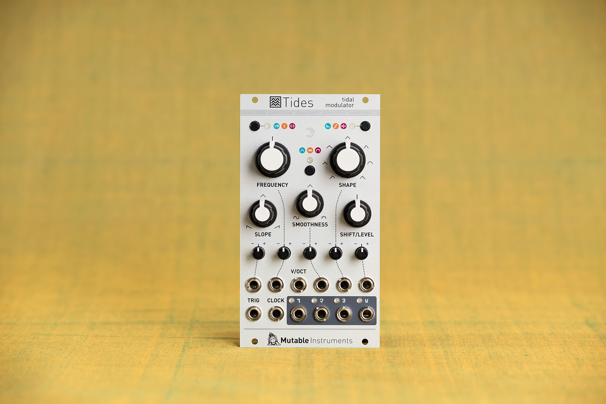
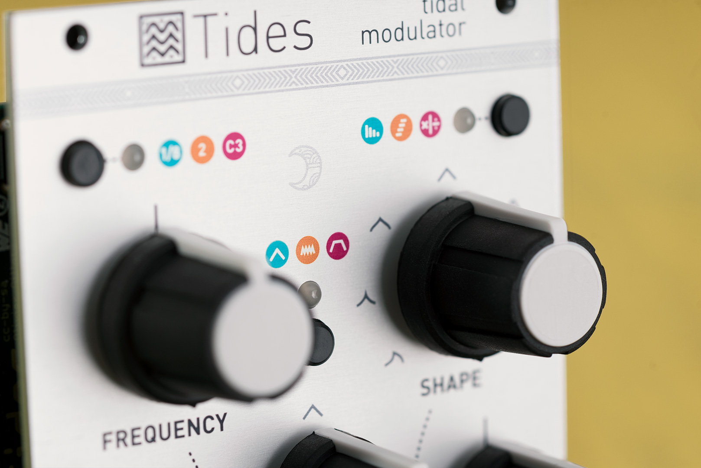
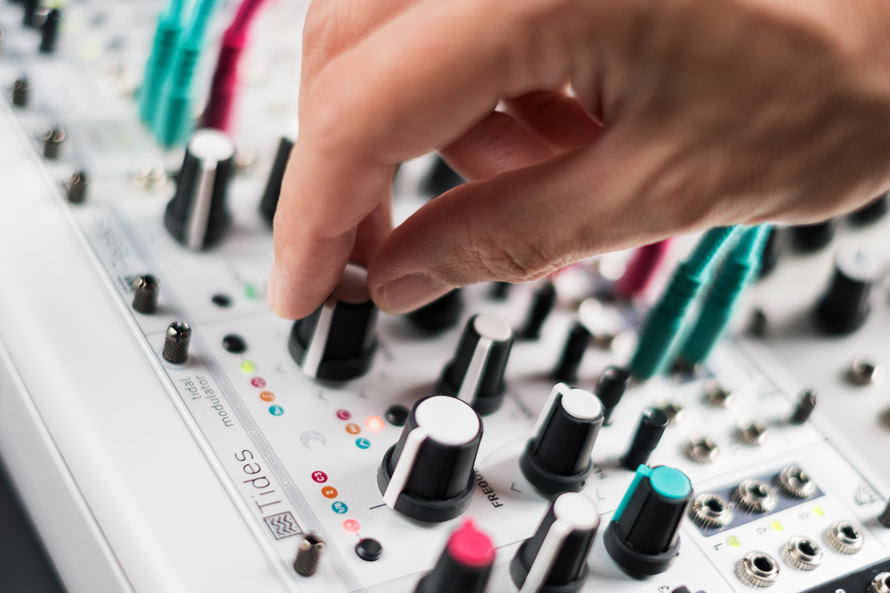

## Up, down. Once, forever. Slow, fast. Sober or drunken

Tides is all about waves that go up and down, from minute-long cycles to audio rates... This module is Mutable Instruments’ unique take on the looping AD envelope generator – pushing this well-known trope to unknown territories.

The core of the module is a digital asymmetric triangle function generator, which can be used in AD and AR modes (for envelope generation), or looping (as a VC-LFO or VC-DO).

The triangle generator is followed by a wavetable waveshaper providing linear, exponential, logarithmic, sinusoidal, or arc-sinusoidal shapes for the A and D segments. Then, a second processor applies either a 2-pole low-pass filter to the waveform, smoothing its sharp edges; or a rubbery wavefolder, adding kinks and bounces to the waveform.

## Polyrhythmic variations

What sets this 2018 revision apart from its [predecessor](../tides_original/) is the introduction of additional output modes, producing variations (shifted in amplitude, time, phase or frequency) of the main signal.

And of course, a redesign from scratch focused on accuracy and audio quality.

