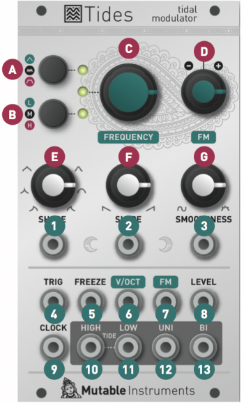

## Download

[Latest version (1.1)](downloads/tides_1.1.wav)

Please read [this section](../manual#firmware) of the user manual to learn more about the upgrade procedure.

## Revisions

### v1.1

A new synthesis technique (polyBlep) is used for generating an alias-free, variable slope triangle at audio rates.

### v1.0

Initial release.

## Sheep

### Overview

Sheep is an unofficial firmware for Mutable Instruments' Tides which implements wavetable synthesis. This update completely replaces the stock firmware and turns Tides into a new module. It is not possible to run this firmware side by side with the original version - so it's an either-or affair.

Sheep provides three banks of waveforms laid out in a 2D grid, with continuous interpolation between waves - think of it as the director's cut (or dub version?) of Braids' `WMAP`. The filter/wavefolder control is still available, for further filtering or distorting the sound of the raw waveforms. And obviously, you won't need a VCA because of the **LEVEL** CV input!

[Latest version (1.0)](downloads/sheep_1.0.wav)

### Differences with the original firmware

**A.** The **mode switch** is used to cycle through the 3 banks of waves. Green: additive harmonics (no phasing effect, little aliasing). Off: PWMish (that one can alias a bit more). Red: waves from Braids' `WMAP` mode. Sheep does not provide any single cycle modes. Are sheep and wavetable oscillators an Agambenian *form-of-life*, caught, like the benedictine monk, in the cyclicity engendered by the rule?

**E. F.** The **SHAPE/SLOPE** knobs and CV inputs control the X and Y coordinates in the wave map.

**9.** By default, the **CLOCK** trigger input cycles through the 3 banks of waves. Hold the range selector button **(B)** until the range LED blinks to use it for synchronization/PLL just like in Tides' original firmware (Check the **Clocked/PLL mode** section of the [manual](../manual)).

**10.** The **HIGH TIDE** output contains a low-fidelity (1-bit) version of the signal. Crrbrbrbshshsh!

**11.** The **LOW TIDE** output contains a -1 octave square sub oscillator.

**12.** The **UNI and BI** outputs contain the same signal, but UNI oscillates between 0V and 8V ; and BI between -5V and +5V.
