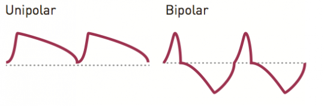

## Overview

Tides is a digital waveform generator providing both single-shot and cyclic operation modes, and covering a very wide range of frequencies from 0.5mHz to 10kHz. As such, it can serve as an AD or AR envelope generator, a LFO, or an audio oscillator. Its unique design allows the waveform to be controlled along 3 dimensions: curvature of the rise and fall segments (shape), relative timing of the rise and fall segments (slope), and harmonic content (smoothness).

## Installation

Tides is designed for Eurorack synthesizer systems and occupies 14 HP of space. It requires a **-12V/+12V** supply (2x5 connector), drawing 5mA from the -12V rail and 55mA from the +12V rail. The red stripe of the ribbon cable must be oriented on the same side as the "Red stripe" marking on the printed circuit board.

## Controls, inputs and outputs

**A. Mode switch**. This button cycles back and forth between Tides' 3 operation modes: AD envelope (green LED), cyclic (LED off) and AR envelope (red LED). Note that a trigger pulse (or gate) must be sent to the TRIG input for the AD envelope (or AR envelope) to be triggered!

**B. Range switch**. This button cycles back and forth between Tides' 3 frequency ranges: low (20 minutes to 5 Hz - green LED), medium (0.05 Hz to 300 Hz - LED off), and high (8 Hz to 10kHz - red LED). Note that the "high" mode is optimized for audio frequencies and that the shape/slope settings have a different response curve optimized for this. Read the "Time domain vs frequency domain" section for some enlightenment!

**C. Main frequency control**. This knob has a range of +/- 4 octaves. The output bicolor LED next to this knob reflects the amplitude of the generated waveform. The LED is green in the attack phase, and red in the decay, sustain and release phases.

**D. FM input attenuverter**. This knob controls the polarity and amount of frequency modulation from the FM input (7). When no patch cable is connected to this input, a 0.1V constant signal is internally switched there, causing this knob to behave like a fine frequency control.

**E. Shape control**. This knob adjusts the shape of the wave - providing different combinations of curvatures for the rise and fall segments.

**F. Slope control**. This knob adjusts the balance between the rise and fall time. When turned fully counter-clockwise, the rise time is null and the decay segment takes up the whole duration of the cycle (decaying envelope). When turned fully clockwise, the attack segment takes the whole duration of the cycle and the fall is immediate. Both phases have equal duration when the knob is at 12 o'clock.

**G. Smoothness control**. When set at 12 o'clock, the waveform produced by the waveshaper is output without any modification. Turn the knob counter-clockwise, from 12 o'clock to 7 o'clock to progressively attenuate the high-frequency content of the signal (2-pole low-pass filtering). Turn the knob clockwise, from 12 o'clock to 5 o'clock to progressively enrich its high-frequency content through wavefolding.

**1. 2. 3. Shape, Slope, Smoothness CV inputs**. The Shape/Slope/Smoothness knobs act as offsets added to these inputs.

**4. Gate/Trigger input**. In cyclic mode, sending a pulse to this input simply resets the phase of the oscillator. In AD and AR modes, this signal is the trigger/gate driving the envelope. The detection threshold is 0.7V.

**5. Freeze input**. Whenever the signal on this input is high, the oscillator or envelope stops in its tracks - until the input is back to 0V. The detection threshold is 0.7V.

**6. V/Oct frequency input**. Tides is digital and tracks well. If it does not, head to the "Calibration" section to fix this!

**7. FM input**. The signal on this input is attenuverted by (D).

**8. LEVEL input**. This input acts as a VCA to scale the UNI and BI outputs (input range: 0V to 8V - higher voltages tolerated and clipped). This input is normalled to a constant 8V signal - causing the UNI and BI outputs to have a full amplitude when no patch-cord is connected to this input.

**9. CLOCK input**. The oscillator frequency or AD/AR cycle time can be synchronized to an external digital signal (detection threshold of 0.7V). More about this in the "Clocked/PLL mode" section.

**10. High-tide output**. This output goes high (+5V approx.) at the end of the attack phase, and stays at this level until the cycle restarts or the envelope is retriggered.

**11. Low-tide output**. This output goes high (+5V approx.) at the end of the decay/release phase, and stays at this level until the envelope is retriggered. Both High-tide and Low-tide outputs can be used to chain envelopes.

**12. 13.Unipolar and bipolar outputs**. The unipolar output has a 0..8V range, and the bipolar output a +/- 5V range. Beware! These outputs have a very different shape - it is not simply a matter of scale and offset - after all, there are CV-processor utility modules for getting an unipolar wave from a bipolar wave and vice-versa!

The unipolar output is what you would expect - signal going up to 8V, then down to 0V. The bipolar output has two bumps, a positive (up to +5V) and a negative one (down to -5V). The Slope parameter controls the duration ratio between the "up" and "down" bumps rather than their rise and fall time. In other words, the bipolar output won't give you "A D", but "A D -A -D"; and instead or an "A R" you will get an "A D ... -A -D". This is quite unusual for an envelope/LFO, and provides delicious sounding results in the audio range - where it is reminiscent of a PWM/waveshaping mashup! Interesting timbral variations can actually be obtained by crossfading between the unipolar and bipolar outputs, providing a fourth dimension of modulation.

## Clocked/PLL mode

To lock the signal frequency to an external clock source, press the Range switch (B) for one second. The Range LED blinks to indicate that the module is operating in clocked/PLL mode. In this mode, the frequency knob no longer controls the frequency of the signal, but instead the ratio between the output frequency and the clock input frequency - allowing both clock division and multiplication.

The available ratios are :

1/16 ; 1/12 ; 1/8 ; 1/6 ; 1/4 ; 1/3 ; 1/2 ; 3/5 ; 2/3 ; 3/4 ; 4/5

1

5/4 ; 4/3 ; 3/2 ; 5/3 ; 2 ; 3 ; 4 ; 5 ; 6 ; 8 ; 12 : 16

To exit the clocked/PLL mode, hold the Range switch (B) for one second.

## Time domain vs frequency domain

Have you ever wondered why LFOs commonly provide both an ascending and descending sawtooth wave, while there is no pure VCO providing both ascending and descending sawtooth outputs? The reason is the following: when a signal enters the audio frequencies, we stop perceiving it in terms of its variations in time (the waveform graph), and we start perceiving it in terms of frequencies. What is transmitted to your brain does not look like a waveform, but more like the (heavily processed) output of a filterbank. If you look at the output of a resonant filter, you'll see wiggles near the sharp edges of the waveform. Do we hear each of them? Does it make the waveform sound "wiggly"? Certainly not! Unless of course we sample this signal and play it back at insanely low speed, so that the cutoff frequency gets transposed below the 10 Hz threshold!

Indeed, some parameters and settings which are totally relevant for slow modulations (envelopes/LFO), actually have little impact on the way a sound is perceived when the signal enters the audio territory. Some subtle changes like adding a discontinuity in the waveform have little impact at LFO rates, but drastic effects in the audio range; and reversely, there are many ways of messing with a waveform (such as shifting the phase of its harmonics) that are totally undetectable once it is played at audio rates. This fact explains how frustrating all those "draw the waveform with a stylus/touchscreen" tools can be!

Why are we telling you all this? To tell you that we conned you... When Tides is set to the high frequency mode (covering the audio range), it works differently from the low and medium ranges:

-   The Shape control offers a different set of waveshapes, chosen so that they are perceptually different from each other when played at audio rates.
-   The Slope control behaves in a more linear way, producing a sound reminiscent of PWM when modulated. In the low and medium frequency ranges, it has an exponential-like behavior allowing the creation of curves with very short attacks and very long decays (or vice-versa).
-   Amplitude scale/offset errors are more likely to occur in the high range - the reason being that smoothing has to be applied to some sections of the waveform to prevent aliasing.

## Calibration

### CV input calibration

This automatic procedure calibrates the V/Oct input (scale and offset), the FM input (offset), and the level input (offset).

1.  Set the **FREQUENCY** knob to its center position.
2.  Connect a patch cable to the **FM input**. Leave the other end of the cable unplugged (this prevents the normalling to \~1 semitone to be activated).
3.  Connect a patch cable to the **Level** input. Leave the other end of the cable unplugged (this prevents the normalling to full scale to be activated).
4.  Connect a MIDI&gt;CV interface or precision voltage source to the **V/Oct input**.
5.  Hold the Mode switch (A) for one second. All LEDs are lit in yellow.
6.  Play a C2 note, or send a 1V voltage from your CV source.
7.  Press the mode switch (A). All LEDs are lit in green.
8.  Play a C4 note, or send a 3V voltage from your CV source.
9.  Press the mode switch (A).

The module is now calibrated for accurate V/Oct operation!

### Bipolar output offset calibration

1.  Remove any patch cable from the trigger input.
2.  Set the mode to AD or AR (mode LED is red or green).
3.  Set the range to medium (range LED is off).
4.  Measure the voltage on the bipolar output. Adjust the trimmer on the back of the board so that this voltage reaches 0V.

##  Firmware update procedure

Unplug all CV inputs/outputs from the module. Connect the output of your audio interface/sound card to the FM input **(7)**. Power on your modular system with Tides' mode switch **(A)** pressed. The 3 LEDs will blink, with a yellow color.

Make sure that no additional sound (such as email notification sounds, background music etc.) from your computer will be played during the procedure. Make sure that your speakers/monitors are not connected to your audio interface - the noises emitted during the procedure are aggressive and can harm your hearing. On non-studio audio equipment (for example the line output from a Desktop computer), you might have to turn up the gain to the maximum.

When you are all set, play the firmware update file into the module. The LEDs show a cyclic pattern and periodically flash green upon receiving a valid block of data. The unit reboots after the last packet has been received.

In case the signal level is inadequate or too high, the procedure will stop and all 3 LEDs will be lit in red. Try adjusting the output level, press the mode button and retry from the start of the update file.
