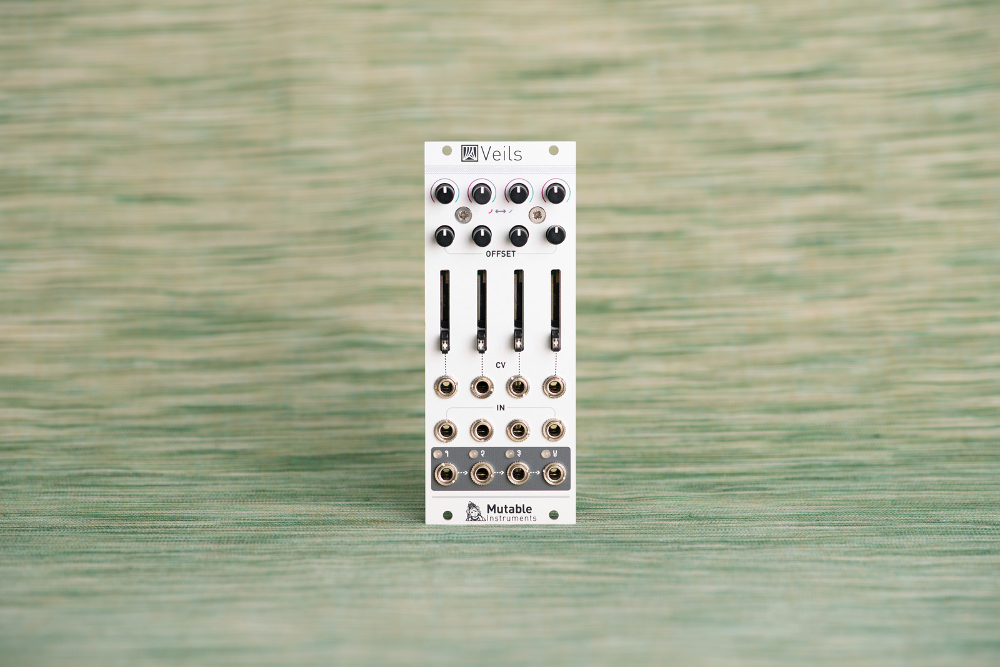
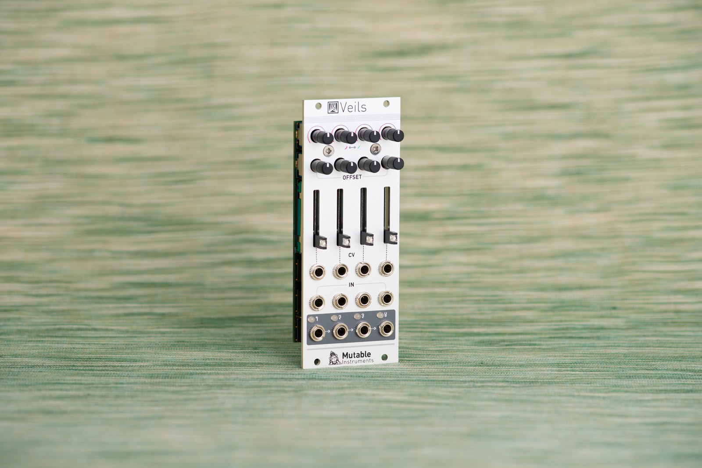
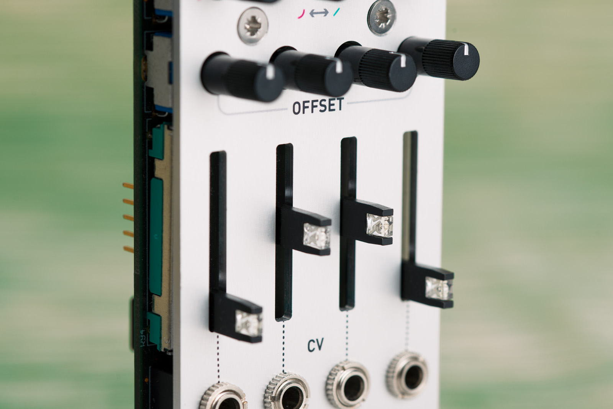

## Who said you never have enough VCAs?

Veils provides four VCAs with an adjustable response curve and offset control.

Veils' outputs are daisy-chained, allowing adjacent groups of 2, 3, or all 4 channels to be mixed together.

