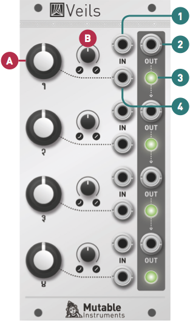

## Installation

Veils requires a **-12V/+12V** power supply (2x5 pin connector). The red stripe of the ribbon cable (-12V side) must be oriented on the same side as the "Red stripe" marking on the board. The module draws 50mA from the -12V rail and 50mA from the +12V rail. Current consumption can reach 70mA on either rail depending on the color and brightness of the LEDs.

## Overview

Veils provides four VCAs with an adjustable response curve. Veils' outputs are daisy-chained, allowing adjacent groups of 2, 3, or all 4 channels, to be mixed together.

## Controls, inputs and outputs

**A. Gain CV amount.** Amount of gain (amplitude) modulation from the CV input (4), or direct gain control when no cable is patched in the CV input. When this knob is turned fully clockwise, a CV of +5V yields a gain of 1 (0dB), and a CV above +5V might cause distortion. Veils does not provide any offset control - a module like Shades or Blinds can be used to pre-process the gain CV to offset it.

**B. Response curve.** Continuously variable between exponential and linear. Because the exponential function grows rapidly, very high gains (above 10) can be achieved with an exponential response curve. Beware of clipping!

**1. DC-coupled signal input.** Accepts audio or CV signals.

**2. Signal output.** When no patch cable is plugged into an output, the signal from this channel is routed to the next channel. For example, when no patch cable is patched into output 1, output 2 will contain the sum of channel 2 and channel 1. If nothing is patched into outputs 1, 2 and 3, output 4 will contain the sum of all four channels.

**3. Indicator LED.** Brightness represents signal level, and color represents signal polarity (green = positive).

**4. Gain CV input.** Normalized to a constant +8V.
